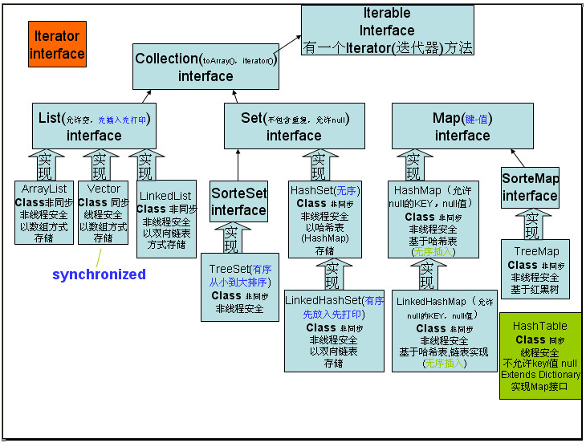
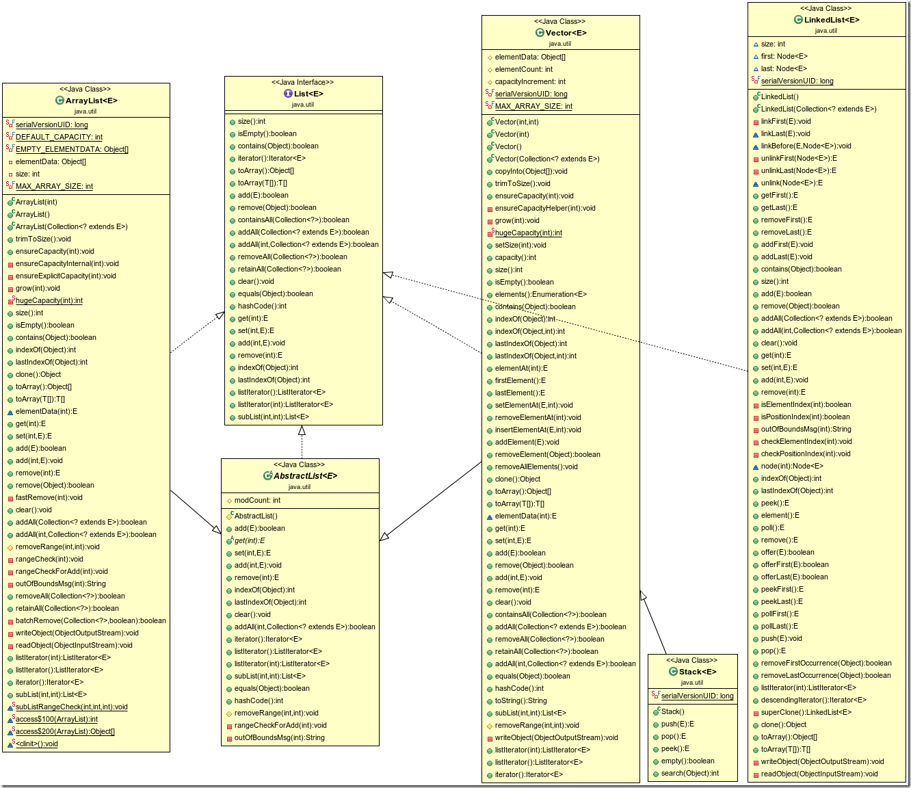
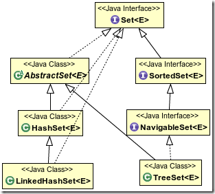

# Java集合框架预览图
<div align="center">  </div><br>
## 1. 概述
Java集合框架(Java collections framework, JCF)是一组实现集合数据结构的类和接口。Collection接口是一组允许重复的对象，有3个接口继承了该接口。值得注意的是，Map接口不由Collection派生。上面的集合框架图可以看到，Java集合框架主要包括两种类型的容器，一种是集合（Collection），存储一个元素集合，另一种是图（Map），存储键/值对映射。Collection接口又有3种子类型，List、Set和Queue，再下面是一些抽象类，最后是具体实现类，常用的有ArrayList、LinkedList、HashSet、LinkedHashSet、HashMap、LinkedHashMap等等。

- Set，不允许重复，使用自己内部的一个排列机制。
- List，允许重复，以元素安插的次序来放置元素，不会重新排列。
- Queue，先进先出。
- Map，一组成对的键－值对象(key-value pairs)。不能有重复的key，但value可以相同。

## 2. Collection接口
Collection接口相关的UML详细类图如下：
<div align="center">  </div><br>

所有实现Collection接口的类都必须提供两个标准的构造函数：**其一，无参数的构造函数用于创建一个空的Collection；其二，有一个 Collection参数的构造函数用于创建一个新的Collection，这个新的Collection与传入的Collection有相同的元素**。后一种构造函数允许用户复制一个Collection。

如何遍历Collection中的每一个元素？**不论Collection的实际类型如何，它都支持一个iterator()的方法，该方法返回一个迭代子，使用该迭代子即可逐一访问Collection中每一个元素**。典型的用法如下：
```Java
Iterator it = collection.iterator(); //获得一个迭代器
while(it.next()){
    Object obj = it.next(); //遍历元素
}
```
### 2.1 List接口
List是有序，元素可重复的Collection，实现List接口的常用类有：
- **LinkedList**
- **ArrayList**
- **Vector**
- **Stack**

List接口相关的部分UML类图如下：
<div align="center">  </div><br>
操作过程中，LinkedList，ArrayList，Vector鲜明特点如下：

> **ArrayList：数组实现，查询快，增删慢，线程不安全，轻量级**
> **LinkedList：链表实现，增删快，查询慢**
> **Vector：数组实现，线程安全，重量级**

List是有序的Collection，使用此接口能够精确的控制每个元素插入的位置。用户能够使用索引（元素在List中的位置，类似于数组下标）来访问List中的元素，这类似于Java的数组。

除了具有Collection接口必备的iterator()方法外，List还提供一个listIterator()方法，返回一个 ListIterator接口，和标准的Iterator接口相比，ListIterator多了一些add()之类的方法，允许添加，删除，设定元素， 还能向前或向后遍历。

详细UML类图如下:
<div align="center">  </div><br>

### 2.2 Queue接口
Queue接口定义了**队列数据结构，元素是有序的(按插入顺序)，先进先出**。Queue接口相关的部分UML类图如下：
<div align="center">  </div><br>
实际操作过程中特点如下：

- **LinkedList：实现了Dequeue和List接口，用链表实现，可以用它来支持双向队列。ArrayDeque用数组实现。**
- **PriorityQueue：基于堆结构实现，不同于Queue在于其排序是按优先级而不是先进先出。优先级取决于compareTo方法或者构造函数(a method given in the constructor)。**

详细的UML如下：
<div align="center">  </div><br>

### 2.3 Set接口
Set**接口无序(意味着不能通过下标读取)并且不允许重复元素**。与Set接口相关的部分UML类图如下：
<div align="center">  </div><br>

Set是一种**不包含重复的元素的Collection，即任意的两个元素e1和e2都有e1.equals(e2)=false，Set最多有一个null元素。很明显，Set的构造函数有一个约束条件，传入的Collection参数不能包含重复的元素。**

实际操作过程中特点如下：
- **HashSet：基于哈希实现，支持快速查找，但不支持有序性操作，例如根据一个范围查找元素的操作。并且失去了元素的插入顺序信息，也就是说使用 Iterator 遍历 HashSet 得到的结果是不确定的。**
- **TreeSet：基于红黑树实现，支持有序性操作，但是查找效率不如 HashSet，HashSet 查找时间复杂度为 O(1)，TreeSet 则为 O(logN)；**
- **LinkedHashSet：具有 HashSet 的查找效率，且内部使用链表维护元素的插入顺序。**
<div align="center">  </div><br>
## 3. Map接口
Map不由Collection接口派生，与Map接口相关的部分UML类图如下：
<div align="center">  </div><br>

请注意，**Map没有继承Collection接口**，Map提供key到value的映射。一个Map中不能包含相同的key，**每个key只能映射一个 value**。Map接口提供**3种集合的视图**，Map的内容可以被当作一组**key集合**，一组**value集合**，或者一组**key-value映射**。
实际操作过程中特定如下：
- **HashMap：和Hashtable类似，不同之处在于HashMap是非同步的，并且允许null，即null value和null key。**
- **HashTable：和 HashMap 类似，但它是线程安全的，这意味着同一时刻多个线程可以同时写入 HashTable 并且不会导致数据不一致。它是遗留类，不应该去使用它。现在可以使用 ConcurrentHashMap 来支持线程安全，并且 ConcurrentHashMap 的效率会更高，因为 ConcurrentHashMap 引入了分段锁**。
- **LinkedHashMap：此实现与 HashMap 的不同之处在于，后者维护着一个运行于所有条目的双重链接列表。存储的数据是有序的。**
- **TreeMap：对key排好序的Map; key 就是TreeSet, value对应每个key; key要实现Comparable接口或TreeMap有自己的构造器。**
- **Hashtable继承Map接口，实现一个key-value映射的哈希表。任何非空（non-null）的对象都可作为key或者value。**
- **Properties：key和value都是String类型，用来读配置文件。**
<div align="center">  </div><br>

## 4. 各集合类型对比
|  集合名称  |   类型   |   结构   | 排列顺序 | 线程安全 |         能否包含Null          | 其他特点       |
|:----------:|:--------:|:--------:|:--------:|:--------:|:-----------------------------:| :--------------: |
|    List    |   接口   |          |   有序   |          |                               |                |
| LinkedList |  实现类  | 双向链表 |   有序   |          |              能               | 插入快、查询慢 |
| ArrayList  |  实现类  | 数据结构 |   有序   |  不安全  |              能               | 插入慢、查询快 |
|   Vector   |  实现类  | 数组结构 |   有序   | 线程安全 |              能               | 插入慢、查询慢 |
|    Set     |   接口   |          |          |          |                               | 元素唯一       |
|  HashSet   |  实现类  |  哈希表  |   无序   |          |        能有一个Null值         | 元素唯一       |
|  TreeSet   |  二叉树  |   有序   |          |          |         不能有Null值          | 元素唯一       |
|    Map     |   接口   |  键值对  |          |          |                               | 键唯一         |
|  HashMap   |  实现类  |  哈希表  |   无序   |  不安全  | 键只能一个Null，Value可以Null |                |
| HashTable  |  实现类  |  哈希表  |   无序   |   安全   | 键只能一个Null，Value可以Null |                |
|  TreeMap   | 实现类 |   树状结构   |    有序      | 键只能一个Null，Value可以Null         |                               |                |


## 5. 如何选择Collection?
参考流程图如下：
> ### 这个流程图不涵盖诸如同步访问,线程安全等或遗留的集合,但它涵盖了3标准集,3标准地图和2标准列表。
<div align="center">  </div><br>

## 6. 集合常见问题
- ## Collection和Collections区别?
    - > **java.util.Collection接口**：是集合类的上级接口，继承他的接口主要有Set和List。**java.util.Collections类**：是针对集合类的一个帮助类，它提供一系列静态方法实现对各种集合的搜索、排序、线程安全化等操作。

- ## Collection框架实现比较要实现什么接口?
    - >Comparable 和 Comparator 都是用来实现集合中元素的比较、排序的。只是 Comparable 是在集合内部定义的方法实现的排序，而Comparator 是在集合外部实现的排序。所以，如想实现排序，就需要在**集合外定义 Comparator 接口的方法**或**在集合内实现 Comparable 接口的方法**。
    - 实现java.lang.Comparable接口（集合本身实现该接口）
    ```Java
    //重写该接口的唯一方法 int compareTo(T o)方法
    public class User implements Comparable{}//是User类继承该接口
    使用时Arrays.sort(users);
    ```
    - 实现java.util.Comparator接口（集合外定义一个类实现该接口）
    ```Java
    //重写该接口的两个方法：int compare(T o1, T o2)和boolean equals(Object obj)
    public class SampleComparator implements Comparator{}//不是User类继承该接口
    使用时Arrays.sort(array, new SampleComparator()); //需传入该接口的实例化对象
    ```
    - ## HashMap和Hashtable区别?
        > - HashMap实现Map接口，Hashtable实现Map接口，同时也继承陈旧的Dictionary类。
        > - HashMap非线程安全，效率高；Hashtable线程安全。
        > - HashMap允许有一个null key；Hashtable不允许null key。
        > - 迭代 HashMap 采用快速失败机制,而 Hashtable 不是,所以这是设计的考虑点。
    - ## ArrayList,Vector,LinkedList的存储性能和特点
        > 三者都实现List接口，其中ArrayList和Vector继承AbstractList，LinkedList继承AbstractSequentialList。
            （1）ArrayList和Vector都是使用数组方式存储元素，查找快，插入慢；LinkedList使用双向链表实现存储，查找慢，插入快。LinkedList提供了一些方法，它可以被当做堆栈和队列使用。
            （2）ArrayList和LinkedList线程不安全；Vector线程安全。
    - ## 去掉Vector集合中的重复元素?
        > HashSet set = new HashSet(vector);
    - ## 两个对象值相同（x.equals(y)==true），但有不同的hashcode。这句话对吗？
        > 对！
            如果对象保存在HashSet或HashMap中，那么如果x.equals(y)==true，则hashcode必须相等。
            如果对象不是保存在HashSet或HashMap中，则hashcode可以不等。例如ArrayList中的对象可以不重写hashcode()，当然，我们建议重写，因为关于hashcode的常规规定是：如果根据 equals(Object) 方法，两个对象是相等的，那么对这两个对象中的每个对象调用 hashCode 方法都必须生成相同的整数结果。

### 参考资料
- [Java集合框架概述：Collection(List, Set, Queue)和Map](http://sparkandshine.net/java-collections-framework-overview-collection-list-set-queue-map/)
- [Java 集合知识整合](http://leewf.xyz/Java/2018/03/java-collection-summary.html)
- [容器考点](http://www.cnblogs.com/seven7seven/p/3940171.html)
