<h1>大纲内容<span class="tocSkip"></span></h1>
<div class="toc"><ul class="toc-item"><li><span><a href="#监督学习" data-toc-modified-id="监督学习-1"><span class="toc-item-num">1&nbsp;&nbsp;</span>监督学习</a></span></li><li><span><a href="#一些样本数据集" data-toc-modified-id="一些样本数据集-2"><span class="toc-item-num">2&nbsp;&nbsp;</span>一些样本数据集</a></span><ul class="toc-item"><li><span><a href="#K近邻" data-toc-modified-id="K近邻-2.1"><span class="toc-item-num">2.1&nbsp;&nbsp;</span>K近邻</a></span><ul class="toc-item"><li><span><a href="#K近邻分类" data-toc-modified-id="K近邻分类-2.1.1"><span class="toc-item-num">2.1.1&nbsp;&nbsp;</span>K近邻分类</a></span></li><li><span><a href="#分析KNeighborsClassifier" data-toc-modified-id="分析KNeighborsClassifier-2.1.2"><span class="toc-item-num">2.1.2&nbsp;&nbsp;</span>分析KNeighborsClassifier</a></span></li><li><span><a href="#K近邻回归" data-toc-modified-id="K近邻回归-2.1.3"><span class="toc-item-num">2.1.3&nbsp;&nbsp;</span>K近邻回归</a></span></li><li><span><a href="#优点、缺点和参数" data-toc-modified-id="优点、缺点和参数-2.1.4"><span class="toc-item-num">2.1.4&nbsp;&nbsp;</span>优点、缺点和参数</a></span></li></ul></li><li><span><a href="#线性回归" data-toc-modified-id="线性回归-2.2"><span class="toc-item-num">2.2&nbsp;&nbsp;</span>线性回归</a></span><ul class="toc-item"><li><span><a href="#Ordinary-Least-Squares-线性回归（又名普通最小二乘法，OLS）" data-toc-modified-id="Ordinary-Least-Squares-线性回归（又名普通最小二乘法，OLS）-2.2.1"><span class="toc-item-num">2.2.1&nbsp;&nbsp;</span>Ordinary Least Squares-线性回归（又名普通最小二乘法，OLS）</a></span></li><li><span><a href="#Ridge-Regression-岭回归" data-toc-modified-id="Ridge-Regression-岭回归-2.2.2"><span class="toc-item-num">2.2.2&nbsp;&nbsp;</span>Ridge Regression-岭回归</a></span></li><li><span><a href="#Lasso" data-toc-modified-id="Lasso-2.2.3"><span class="toc-item-num">2.2.3&nbsp;&nbsp;</span>Lasso</a></span></li><li><span><a href="#Elastic-Net-弹性网" data-toc-modified-id="Elastic-Net-弹性网-2.2.4"><span class="toc-item-num">2.2.4&nbsp;&nbsp;</span>Elastic Net-弹性网</a></span></li></ul></li><li><span><a href="#决策树" data-toc-modified-id="决策树-2.3"><span class="toc-item-num">2.3&nbsp;&nbsp;</span>决策树</a></span><ul class="toc-item"><li><span><a href="#构造决策树" data-toc-modified-id="构造决策树-2.3.1"><span class="toc-item-num">2.3.1&nbsp;&nbsp;</span>构造决策树</a></span></li><li><span><a href="#控制决策树的复杂度" data-toc-modified-id="控制决策树的复杂度-2.3.2"><span class="toc-item-num">2.3.2&nbsp;&nbsp;</span>控制决策树的复杂度</a></span></li><li><span><a href="#分析决策树" data-toc-modified-id="分析决策树-2.3.3"><span class="toc-item-num">2.3.3&nbsp;&nbsp;</span>分析决策树</a></span></li><li><span><a href="#树的特征重要性" data-toc-modified-id="树的特征重要性-2.3.4"><span class="toc-item-num">2.3.4&nbsp;&nbsp;</span>树的特征重要性</a></span></li><li><span><a href="#总结" data-toc-modified-id="总结-2.3.5"><span class="toc-item-num">2.3.5&nbsp;&nbsp;</span>总结</a></span></li><li><span><a href="#决策树集成" data-toc-modified-id="决策树集成-2.3.6"><span class="toc-item-num">2.3.6&nbsp;&nbsp;</span>决策树集成</a></span></li><li><span><a href="#随机森林总结" data-toc-modified-id="随机森林总结-2.3.7"><span class="toc-item-num">2.3.7&nbsp;&nbsp;</span>随机森林总结</a></span></li><li><span><a href="#梯度提升回归树（梯度提升机）" data-toc-modified-id="梯度提升回归树（梯度提升机）-2.3.8"><span class="toc-item-num">2.3.8&nbsp;&nbsp;</span>梯度提升回归树（梯度提升机）</a></span></li><li><span><a href="#梯度提升总结" data-toc-modified-id="梯度提升总结-2.3.9"><span class="toc-item-num">2.3.9&nbsp;&nbsp;</span>梯度提升总结</a></span></li></ul></li><li><span><a href="#核支持向量机" data-toc-modified-id="核支持向量机-2.4"><span class="toc-item-num">2.4&nbsp;&nbsp;</span>核支持向量机</a></span><ul class="toc-item"><li><span><a href="#线性模型与非线性特征" data-toc-modified-id="线性模型与非线性特征-2.4.1"><span class="toc-item-num">2.4.1&nbsp;&nbsp;</span>线性模型与非线性特征</a></span></li><li><span><a href="#核技巧" data-toc-modified-id="核技巧-2.4.2"><span class="toc-item-num">2.4.2&nbsp;&nbsp;</span>核技巧</a></span></li><li><span><a href="#理解SVM" data-toc-modified-id="理解SVM-2.4.3"><span class="toc-item-num">2.4.3&nbsp;&nbsp;</span>理解SVM</a></span></li><li><span><a href="#SVM调参" data-toc-modified-id="SVM调参-2.4.4"><span class="toc-item-num">2.4.4&nbsp;&nbsp;</span>SVM调参</a></span></li><li><span><a href="#为SVM预处理数据" data-toc-modified-id="为SVM预处理数据-2.4.5"><span class="toc-item-num">2.4.5&nbsp;&nbsp;</span>为SVM预处理数据</a></span></li><li><span><a href="#优点、缺点和参数" data-toc-modified-id="优点、缺点和参数-2.4.6"><span class="toc-item-num">2.4.6&nbsp;&nbsp;</span>优点、缺点和参数</a></span></li></ul></li><li><span><a href="#神经网络（深度学习）" data-toc-modified-id="神经网络（深度学习）-2.5"><span class="toc-item-num">2.5&nbsp;&nbsp;</span>神经网络（深度学习）</a></span><ul class="toc-item"><li><span><a href="#神经网络模型" data-toc-modified-id="神经网络模型-2.5.1"><span class="toc-item-num">2.5.1&nbsp;&nbsp;</span>神经网络模型</a></span></li><li><span><a href="#神经网络调参" data-toc-modified-id="神经网络调参-2.5.2"><span class="toc-item-num">2.5.2&nbsp;&nbsp;</span>神经网络调参</a></span></li><li><span><a href="#优点、缺点和参数" data-toc-modified-id="优点、缺点和参数-2.5.3"><span class="toc-item-num">2.5.3&nbsp;&nbsp;</span>优点、缺点和参数</a></span></li><li><span><a href="#分类器的不确定估计" data-toc-modified-id="分类器的不确定估计-2.5.4"><span class="toc-item-num">2.5.4&nbsp;&nbsp;</span>分类器的不确定估计</a></span></li><li><span><a href="#决策函数" data-toc-modified-id="决策函数-2.5.5"><span class="toc-item-num">2.5.5&nbsp;&nbsp;</span>决策函数</a></span></li><li><span><a href="#预测的概率" data-toc-modified-id="预测的概率-2.5.6"><span class="toc-item-num">2.5.6&nbsp;&nbsp;</span>预测的概率</a></span></li><li><span><a href="#多分类问题的不确定度" data-toc-modified-id="多分类问题的不确定度-2.5.7"><span class="toc-item-num">2.5.7&nbsp;&nbsp;</span>多分类问题的不确定度</a></span></li></ul></li><li><span><a href="#小结与展望" data-toc-modified-id="小结与展望-2.6"><span class="toc-item-num">2.6&nbsp;&nbsp;</span>小结与展望</a></span></li></ul></li><li><span><a href="#无监督学习与预处理" data-toc-modified-id="无监督学习与预处理-3"><span class="toc-item-num">3&nbsp;&nbsp;</span>无监督学习与预处理</a></span><ul class="toc-item"><li><span><a href="#无监督学习的类型" data-toc-modified-id="无监督学习的类型-3.1"><span class="toc-item-num">3.1&nbsp;&nbsp;</span>无监督学习的类型</a></span></li><li><span><a href="#无监督学习的挑战" data-toc-modified-id="无监督学习的挑战-3.2"><span class="toc-item-num">3.2&nbsp;&nbsp;</span>无监督学习的挑战</a></span></li><li><span><a href="#预处理与缩放" data-toc-modified-id="预处理与缩放-3.3"><span class="toc-item-num">3.3&nbsp;&nbsp;</span>预处理与缩放</a></span><ul class="toc-item"><li><span><a href="#不同类型的预处理" data-toc-modified-id="不同类型的预处理-3.3.1"><span class="toc-item-num">3.3.1&nbsp;&nbsp;</span>不同类型的预处理</a></span></li><li><span><a href="#预处理对监督学习的作用" data-toc-modified-id="预处理对监督学习的作用-3.3.2"><span class="toc-item-num">3.3.2&nbsp;&nbsp;</span>预处理对监督学习的作用</a></span></li></ul></li><li><span><a href="#降维、特征提取与流行学习" data-toc-modified-id="降维、特征提取与流行学习-3.4"><span class="toc-item-num">3.4&nbsp;&nbsp;</span>降维、特征提取与流行学习</a></span><ul class="toc-item"><li><span><a href="#主成分分析" data-toc-modified-id="主成分分析-3.4.1"><span class="toc-item-num">3.4.1&nbsp;&nbsp;</span>主成分分析</a></span></li><li><span><a href="#非负矩阵分解" data-toc-modified-id="非负矩阵分解-3.4.2"><span class="toc-item-num">3.4.2&nbsp;&nbsp;</span>非负矩阵分解</a></span></li><li><span><a href="#用t-SNE进行流形学习" data-toc-modified-id="用t-SNE进行流形学习-3.4.3"><span class="toc-item-num">3.4.3&nbsp;&nbsp;</span>用t-SNE进行流形学习</a></span></li></ul></li><li><span><a href="#聚类" data-toc-modified-id="聚类-3.5"><span class="toc-item-num">3.5&nbsp;&nbsp;</span>聚类</a></span><ul class="toc-item"><li><span><a href="#k均值聚类" data-toc-modified-id="k均值聚类-3.5.1"><span class="toc-item-num">3.5.1&nbsp;&nbsp;</span>k均值聚类</a></span></li><li><span><a href="#凝聚聚类" data-toc-modified-id="凝聚聚类-3.5.2"><span class="toc-item-num">3.5.2&nbsp;&nbsp;</span>凝聚聚类</a></span></li><li><span><a href="#DBSCAN" data-toc-modified-id="DBSCAN-3.5.3"><span class="toc-item-num">3.5.3&nbsp;&nbsp;</span>DBSCAN</a></span></li><li><span><a href="#聚类算法的对比与评估" data-toc-modified-id="聚类算法的对比与评估-3.5.4"><span class="toc-item-num">3.5.4&nbsp;&nbsp;</span>聚类算法的对比与评估</a></span></li></ul></li><li><span><a href="#聚类方法小结" data-toc-modified-id="聚类方法小结-3.6"><span class="toc-item-num">3.6&nbsp;&nbsp;</span>聚类方法小结</a></span></li></ul></li><li><span><a href="#数据表示与特征工程" data-toc-modified-id="数据表示与特征工程-4"><span class="toc-item-num">4&nbsp;&nbsp;</span>数据表示与特征工程</a></span><ul class="toc-item"><li><span><a href="#分类变量" data-toc-modified-id="分类变量-4.1"><span class="toc-item-num">4.1&nbsp;&nbsp;</span>分类变量</a></span><ul class="toc-item"><li><span><a href="#One-Hot编码（虚拟变量，哑变量）" data-toc-modified-id="One-Hot编码（虚拟变量，哑变量）-4.1.1"><span class="toc-item-num">4.1.1&nbsp;&nbsp;</span>One-Hot编码（虚拟变量，哑变量）</a></span></li><li><span><a href="#数字可以编码分类变量" data-toc-modified-id="数字可以编码分类变量-4.1.2"><span class="toc-item-num">4.1.2&nbsp;&nbsp;</span>数字可以编码分类变量</a></span></li></ul></li><li><span><a href="#分箱、离散化、模型与树" data-toc-modified-id="分箱、离散化、模型与树-4.2"><span class="toc-item-num">4.2&nbsp;&nbsp;</span>分箱、离散化、模型与树</a></span></li><li><span><a href="#交互特征与多项式特征" data-toc-modified-id="交互特征与多项式特征-4.3"><span class="toc-item-num">4.3&nbsp;&nbsp;</span>交互特征与多项式特征</a></span></li><li><span><a href="#单变量非线性变换" data-toc-modified-id="单变量非线性变换-4.4"><span class="toc-item-num">4.4&nbsp;&nbsp;</span>单变量非线性变换</a></span></li><li><span><a href="#自动化特征选择" data-toc-modified-id="自动化特征选择-4.5"><span class="toc-item-num">4.5&nbsp;&nbsp;</span>自动化特征选择</a></span><ul class="toc-item"><li><span><a href="#单变量统计" data-toc-modified-id="单变量统计-4.5.1"><span class="toc-item-num">4.5.1&nbsp;&nbsp;</span>单变量统计</a></span></li><li><span><a href="#基于模型的特征选择" data-toc-modified-id="基于模型的特征选择-4.5.2"><span class="toc-item-num">4.5.2&nbsp;&nbsp;</span>基于模型的特征选择</a></span></li><li><span><a href="#迭代特征选择" data-toc-modified-id="迭代特征选择-4.5.3"><span class="toc-item-num">4.5.3&nbsp;&nbsp;</span>迭代特征选择</a></span></li></ul></li><li><span><a href="#利用专家知识" data-toc-modified-id="利用专家知识-4.6"><span class="toc-item-num">4.6&nbsp;&nbsp;</span>利用专家知识</a></span></li><li><span><a href="#小结与展望" data-toc-modified-id="小结与展望-4.7"><span class="toc-item-num">4.7&nbsp;&nbsp;</span>小结与展望</a></span></li></ul></li><li><span><a href="#模型评估与改进" data-toc-modified-id="模型评估与改进-5"><span class="toc-item-num">5&nbsp;&nbsp;</span>模型评估与改进</a></span><ul class="toc-item"><li><span><a href="#交叉验证" data-toc-modified-id="交叉验证-5.1"><span class="toc-item-num">5.1&nbsp;&nbsp;</span>交叉验证</a></span><ul class="toc-item"><li><span><a href="#scikit-learn中的交叉验证" data-toc-modified-id="scikit-learn中的交叉验证-5.1.1"><span class="toc-item-num">5.1.1&nbsp;&nbsp;</span>scikit-learn中的交叉验证</a></span></li><li><span><a href="#交叉验证的优点" data-toc-modified-id="交叉验证的优点-5.1.2"><span class="toc-item-num">5.1.2&nbsp;&nbsp;</span>交叉验证的优点</a></span></li><li><span><a href="#分层k折交叉验证和其他策略" data-toc-modified-id="分层k折交叉验证和其他策略-5.1.3"><span class="toc-item-num">5.1.3&nbsp;&nbsp;</span>分层k折交叉验证和其他策略</a></span></li></ul></li><li><span><a href="#网格搜索" data-toc-modified-id="网格搜索-5.2"><span class="toc-item-num">5.2&nbsp;&nbsp;</span>网格搜索</a></span><ul class="toc-item"><li><span><a href="#简单网格搜索" data-toc-modified-id="简单网格搜索-5.2.1"><span class="toc-item-num">5.2.1&nbsp;&nbsp;</span>简单网格搜索</a></span></li><li><span><a href="#参数过拟合的风险与验证集" data-toc-modified-id="参数过拟合的风险与验证集-5.2.2"><span class="toc-item-num">5.2.2&nbsp;&nbsp;</span>参数过拟合的风险与验证集</a></span></li><li><span><a href="#带交叉验证的网格搜索" data-toc-modified-id="带交叉验证的网格搜索-5.2.3"><span class="toc-item-num">5.2.3&nbsp;&nbsp;</span>带交叉验证的网格搜索</a></span></li></ul></li><li><span><a href="#评估指标与评分" data-toc-modified-id="评估指标与评分-5.3"><span class="toc-item-num">5.3&nbsp;&nbsp;</span>评估指标与评分</a></span><ul class="toc-item"><li><span><a href="#牢记最终目标" data-toc-modified-id="牢记最终目标-5.3.1"><span class="toc-item-num">5.3.1&nbsp;&nbsp;</span>牢记最终目标</a></span></li><li><span><a href="#二分类指标" data-toc-modified-id="二分类指标-5.3.2"><span class="toc-item-num">5.3.2&nbsp;&nbsp;</span>二分类指标</a></span></li><li><span><a href="#多分类指标" data-toc-modified-id="多分类指标-5.3.3"><span class="toc-item-num">5.3.3&nbsp;&nbsp;</span>多分类指标</a></span></li><li><span><a href="#回归指标" data-toc-modified-id="回归指标-5.3.4"><span class="toc-item-num">5.3.4&nbsp;&nbsp;</span>回归指标</a></span></li><li><span><a href="#在模型选择中使用评估指标" data-toc-modified-id="在模型选择中使用评估指标-5.3.5"><span class="toc-item-num">5.3.5&nbsp;&nbsp;</span>在模型选择中使用评估指标</a></span></li></ul></li><li><span><a href="#小结与展望" data-toc-modified-id="小结与展望-5.4"><span class="toc-item-num">5.4&nbsp;&nbsp;</span>小结与展望</a></span></li></ul></li><li><span><a href="#算法链与管道" data-toc-modified-id="算法链与管道-6"><span class="toc-item-num">6&nbsp;&nbsp;</span>算法链与管道</a></span><ul class="toc-item"><li><span><a href="#用预处理进行参数选择" data-toc-modified-id="用预处理进行参数选择-6.1"><span class="toc-item-num">6.1&nbsp;&nbsp;</span>用预处理进行参数选择</a></span></li><li><span><a href="#构建管道" data-toc-modified-id="构建管道-6.2"><span class="toc-item-num">6.2&nbsp;&nbsp;</span>构建管道</a></span></li><li><span><a href="#在网格搜索中使用管道" data-toc-modified-id="在网格搜索中使用管道-6.3"><span class="toc-item-num">6.3&nbsp;&nbsp;</span>在网格搜索中使用管道</a></span></li><li><span><a href="#通用的管道接口" data-toc-modified-id="通用的管道接口-6.4"><span class="toc-item-num">6.4&nbsp;&nbsp;</span>通用的管道接口</a></span><ul class="toc-item"><li><span><a href="#用make_pipeline方便地创建管道" data-toc-modified-id="用make_pipeline方便地创建管道-6.4.1"><span class="toc-item-num">6.4.1&nbsp;&nbsp;</span>用make_pipeline方便地创建管道</a></span></li></ul></li><li><span><a href="#小结" data-toc-modified-id="小结-6.5"><span class="toc-item-num">6.5&nbsp;&nbsp;</span>小结</a></span></li></ul></li></ul></div>

# 监督学习
**监督机器学习问题主要有两种问题，分别为叫作：分类（classification）和回归（regression）**
- 泛化：在测试集上成功预测的能力。
- 过拟合和欠拟合：过于拟合训练集上的数据，过于选择简单的数据，最佳的模型应该是两者中间，才会使泛化能力最强。
- 模型复杂的与数据集大小的关系：数据集中包含的数据点的变化范围越大，在不发生过拟合的前提下你可以使用的模型就越复杂。
收集更多数据，适当构建更复杂的模型，对监督学习任务往往特别有用。

# 一些样本数据集
一个模拟的二分类数据集示例forge数据集，它有两个特征。下列代码将绘制一个散点图，将此数据集的所有数据点可视化。


```python
import mglearn
import matplotlib.pyplot as plt
plt.rcParams['font.sans-serif']=['SimHei']
plt.rcParams['axes.unicode_minus']=False
```


```python
#生成数据集
x, y = mglearn.datasets.make_forge()
```


```python
#数据集绘制
mglearn.discrete_scatter(x[:,0],x[:,1],y)
plt.legend(["Class 0","Class 1"],loc=4)
plt.xlabel('First feature')
plt.ylabel('Second feature')
plt.title('forge数据集的散点图')
print("forge数据的样本数和特征维度:",x.shape)
```

    forge数据的样本数和特征维度: (26, 2)


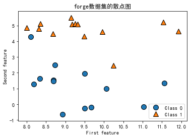


```python
#回归数据集
X,y = mglearn.datasets.make_wave(n_samples=40)
```


```python
plt.plot(X,y,'o')
plt.ylim(-3,3)
plt.xlabel('特征')
plt.ylabel('目标值')
```


    Text(0,0.5,'目标值')


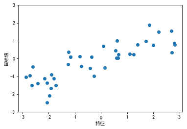


```python
#cancer数据集
from sklearn.datasets import load_breast_cancer
```


```python
cancer = load_breast_cancer()
```


```python
print(cancer.DESCR)
```

    Breast Cancer Wisconsin (Diagnostic) Database
    =============================================

    Notes
    -----
    Data Set Characteristics:
        :Number of Instances: 569

        :Number of Attributes: 30 numeric, predictive attributes and the class

        :Attribute Information:
            - radius (mean of distances from center to points on the perimeter)
            - texture (standard deviation of gray-scale values)
            - perimeter
            - area
            - smoothness (local variation in radius lengths)
            - compactness (perimeter^2 / area - 1.0)
            - concavity (severity of concave portions of the contour)
            - concave points (number of concave portions of the contour)
            - symmetry
            - fractal dimension ("coastline approximation" - 1)

            The mean, standard error, and "worst" or largest (mean of the three
            largest values) of these features were computed for each image,
            resulting in 30 features.  For instance, field 3 is Mean Radius, field
            13 is Radius SE, field 23 is Worst Radius.

            - class:
                    - WDBC-Malignant
                    - WDBC-Benign

        :Summary Statistics:

        ===================================== ====== ======
                                               Min    Max
        ===================================== ====== ======
        radius (mean):                        6.981  28.11
        texture (mean):                       9.71   39.28
        perimeter (mean):                     43.79  188.5
        area (mean):                          143.5  2501.0
        smoothness (mean):                    0.053  0.163
        compactness (mean):                   0.019  0.345
        concavity (mean):                     0.0    0.427
        concave points (mean):                0.0    0.201
        symmetry (mean):                      0.106  0.304
        fractal dimension (mean):             0.05   0.097
        radius (standard error):              0.112  2.873
        texture (standard error):             0.36   4.885
        perimeter (standard error):           0.757  21.98
        area (standard error):                6.802  542.2
        smoothness (standard error):          0.002  0.031
        compactness (standard error):         0.002  0.135
        concavity (standard error):           0.0    0.396
        concave points (standard error):      0.0    0.053
        symmetry (standard error):            0.008  0.079
        fractal dimension (standard error):   0.001  0.03
        radius (worst):                       7.93   36.04
        texture (worst):                      12.02  49.54
        perimeter (worst):                    50.41  251.2
        area (worst):                         185.2  4254.0
        smoothness (worst):                   0.071  0.223
        compactness (worst):                  0.027  1.058
        concavity (worst):                    0.0    1.252
        concave points (worst):               0.0    0.291
        symmetry (worst):                     0.156  0.664
        fractal dimension (worst):            0.055  0.208
        ===================================== ====== ======

        :Missing Attribute Values: None

        :Class Distribution: 212 - Malignant, 357 - Benign

        :Creator:  Dr. William H. Wolberg, W. Nick Street, Olvi L. Mangasarian

        :Donor: Nick Street

        :Date: November, 1995

    This is a copy of UCI ML Breast Cancer Wisconsin (Diagnostic) datasets.
    https://goo.gl/U2Uwz2

    Features are computed from a digitized image of a fine needle
    aspirate (FNA) of a breast mass.  They describe
    characteristics of the cell nuclei present in the image.

    Separating plane described above was obtained using
    Multisurface Method-Tree (MSM-T) [K. P. Bennett, "Decision Tree
    Construction Via Linear Programming." Proceedings of the 4th
    Midwest Artificial Intelligence and Cognitive Science Society,
    pp. 97-101, 1992], a classification method which uses linear
    programming to construct a decision tree.  Relevant features
    were selected using an exhaustive search in the space of 1-4
    features and 1-3 separating planes.

    The actual linear program used to obtain the separating plane
    in the 3-dimensional space is that described in:
    [K. P. Bennett and O. L. Mangasarian: "Robust Linear
    Programming Discrimination of Two Linearly Inseparable Sets",
    Optimization Methods and Software 1, 1992, 23-34].

    This database is also available through the UW CS ftp server:

    ftp ftp.cs.wisc.edu
    cd math-prog/cpo-dataset/machine-learn/WDBC/

    References
    ----------
       - W.N. Street, W.H. Wolberg and O.L. Mangasarian. Nuclear feature extraction
         for breast tumor diagnosis. IS&T/SPIE 1993 International Symposium on
         Electronic Imaging: Science and Technology, volume 1905, pages 861-870,
         San Jose, CA, 1993.
       - O.L. Mangasarian, W.N. Street and W.H. Wolberg. Breast cancer diagnosis and
         prognosis via linear programming. Operations Research, 43(4), pages 570-577,
         July-August 1995.
       - W.H. Wolberg, W.N. Street, and O.L. Mangasarian. Machine learning techniques
         to diagnose breast cancer from fine-needle aspirates. Cancer Letters 77 (1994)
         163-171.


```python
print(cancer.keys(),cancer['data'].shape,cancer['target_names'],set(cancer['target']),cancer['feature_names'],sep='\n')
```

    dict_keys(['data', 'target', 'target_names', 'DESCR', 'feature_names'])
    (569, 30)
    ['malignant' 'benign']
    {0, 1}
    ['mean radius' 'mean texture' 'mean perimeter' 'mean area'
     'mean smoothness' 'mean compactness' 'mean concavity'
     'mean concave points' 'mean symmetry' 'mean fractal dimension'
     'radius error' 'texture error' 'perimeter error' 'area error'
     'smoothness error' 'compactness error' 'concavity error'
     'concave points error' 'symmetry error' 'fractal dimension error'
     'worst radius' 'worst texture' 'worst perimeter' 'worst area'
     'worst smoothness' 'worst compactness' 'worst concavity'
     'worst concave points' 'worst symmetry' 'worst fractal dimension']


```python
import numpy as np
```


```python
{n:v for n,v in zip(cancer.target_names,np.bincount(cancer.target))}
```


    {'benign': 357, 'malignant': 212}


```python
# 波士顿房价数据集
from sklearn.datasets import load_boston
```


```python
boston = load_boston()
```


```python
print(boston.DESCR)
```

    Boston House Prices dataset
    ===========================

    Notes
    ------
    Data Set Characteristics:  

        :Number of Instances: 506

        :Number of Attributes: 13 numeric/categorical predictive

        :Median Value (attribute 14) is usually the target

        :Attribute Information (in order):
            - CRIM     per capita crime rate by town
            - ZN       proportion of residential land zoned for lots over 25,000 sq.ft.
            - INDUS    proportion of non-retail business acres per town
            - CHAS     Charles River dummy variable (= 1 if tract bounds river; 0 otherwise)
            - NOX      nitric oxides concentration (parts per 10 million)
            - RM       average number of rooms per dwelling
            - AGE      proportion of owner-occupied units built prior to 1940
            - DIS      weighted distances to five Boston employment centres
            - RAD      index of accessibility to radial highways
            - TAX      full-value property-tax rate per $10,000
            - PTRATIO  pupil-teacher ratio by town
            - B        1000(Bk - 0.63)^2 where Bk is the proportion of blacks by town
            - LSTAT    % lower status of the population
            - MEDV     Median value of owner-occupied homes in $1000's

        :Missing Attribute Values: None

        :Creator: Harrison, D. and Rubinfeld, D.L.

    This is a copy of UCI ML housing dataset.
    http://archive.ics.uci.edu/ml/datasets/Housing


    This dataset was taken from the StatLib library which is maintained at Carnegie Mellon University.

    The Boston house-price data of Harrison, D. and Rubinfeld, D.L. 'Hedonic
    prices and the demand for clean air', J. Environ. Economics & Management,
    vol.5, 81-102, 1978.   Used in Belsley, Kuh & Welsch, 'Regression diagnostics
    ...', Wiley, 1980.   N.B. Various transformations are used in the table on
    pages 244-261 of the latter.

    The Boston house-price data has been used in many machine learning papers that address regression
    problems.   

    **References**

       - Belsley, Kuh & Welsch, 'Regression diagnostics: Identifying Influential Data and Sources of Collinearity', Wiley, 1980. 244-261.
       - Quinlan,R. (1993). Combining Instance-Based and Model-Based Learning. In Proceedings on the Tenth International Conference of Machine Learning, 236-243, University of Massachusetts, Amherst. Morgan Kaufmann.
       - many more! (see http://archive.ics.uci.edu/ml/datasets/Housing)


## K近邻
**K-NN算法可以说是最简单的机器学习算法。构建模型只需要保存训练数据集即可。想要对新数据点做出预测，算法会在训练数据集中找到最近的数据点，也就是它的“最近邻”**
### K近邻分类


```python
from sklearn.model_selection import train_test_split
from sklearn.neighbors import KNeighborsClassifier
```


```python
#模型的训练
X,y = mglearn.datasets.make_forge()
X_train, X_test, y_train, y_test = train_test_split(X, y, random_state=0)
clf = KNeighborsClassifier(n_neighbors=3)
#模型的训练
clf.fit(X_train, y_train)
```


    KNeighborsClassifier(algorithm='auto', leaf_size=30, metric='minkowski',
               metric_params=None, n_jobs=1, n_neighbors=3, p=2,
               weights='uniform')


```python
#模型的评估
print('正确率:{:2.2f}%'.format(100*clf.score(X_test,y_test)))
```

    正确率:85.71%


### 分析KNeighborsClassifier
对于二维数据集，还可以在xy平面上画出所有可能的测试点的预测结果。我们根据平面中每个点所属的类别对平面进行着色。这样可以查看**决策边界（decision boundary）**，即算法对类别0和类别1的分界线


```python
fig,axes = plt.subplots(1,3,figsize=(15,4))
for n_neighbors,ax in zip([1,3,9],axes):
    clf = KNeighborsClassifier(n_neighbors=n_neighbors).fit(X,y)
    mglearn.plots.plot_2d_separator(clf,X,fill=True,eps=0.5,ax=ax,alpha=0.4)
    mglearn.discrete_scatter(X[:,0],X[:,1],y,ax=ax)
    ax.set_title('{} neighbors(s)'.format(n_neighbors))
    ax.set_xlabel('feature 0')
    ax.set_ylabel('feature 1')
axes[0].legend(loc=3)
```


    <matplotlib.legend.Legend at 0x240820c0fd0>


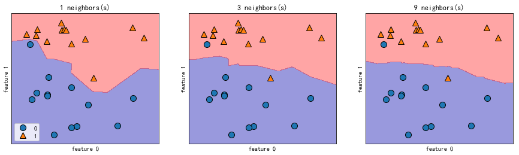


从上图可以看出，使用单一邻居绘制的的决策边界紧跟着训练数据。**随着邻居个数越来越多，决策边界也越来越平滑。**更平滑的边界对应更简单的模型，复杂度越低。


```python
train_test_split?
```


```python
from sklearn.datasets import load_breast_cancer
```


```python
cancer = load_breast_cancer()
```


```python
X_train,X_test,y_train,y_test = train_test_split(cancer.data, cancer.target,stratify=cancer.target,random_state=66)
```


```python
training_accuracy=[]
test_accuracy=[]
neighbors_settings = range(1,11)
```


```python
for n_neighbors in neighbors_settings:
    clf = KNeighborsClassifier(n_neighbors=n_neighbors).fit(X_train,y_train)
    training_accuracy.append(clf.score(X_train,y_train))
    test_accuracy.append(clf.score(X_test,y_test))
```


```python
plt.plot(neighbors_settings,training_accuracy,label='training accuracy')
plt.plot(neighbors_settings,test_accuracy,label = 'test accuracy',linestyle = '-.')
plt.ylabel('Accuracy')
plt.xlabel('n_neighbors')
plt.legend()
```


    <matplotlib.legend.Legend at 0x24084117f28>


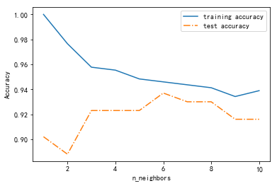


### K近邻回归
k近邻算法还可以用于回归。还是从单一近邻开始，这次使用wave数据集。添加了3个测试 数据点，在x轴上用绿色五角星表示。利用单一邻居的预测结果就是最近邻的目标值。


```python
import mglearn
```


```python
mglearn.plots.plot_knn_regression(n_neighbors=1)
```


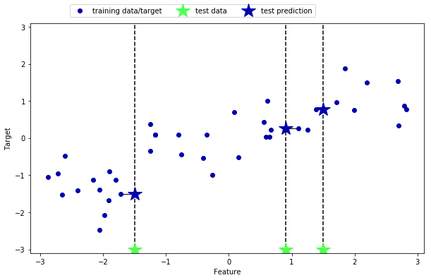


```python
mglearn.plots.plot_knn_regression(n_neighbors=3)
```


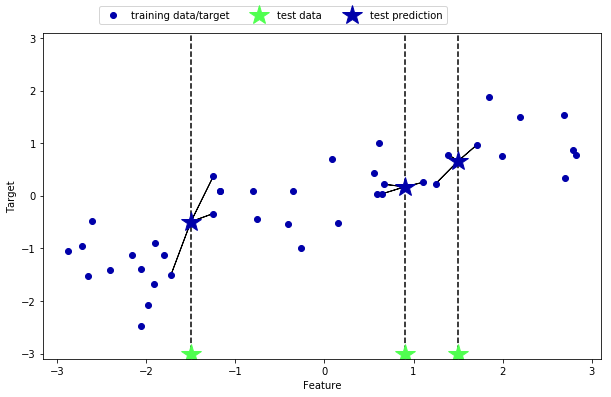


```python
from sklearn.neighbors import KNeighborsRegressor
from sklearn.model_selection import train_test_split
```


```python
X,y = mglearn.datasets.make_wave(n_samples=40)
```


```python
#数据划分
X_train,X_test,y_train,y_test = train_test_split(X,y,random_state = 0)
```


```python
#模型实例化，并将邻居个数设为3
reg = KNeighborsRegressor(n_neighbors=3)
```


```python
#利用训练数据和训练目标来拟合模型
reg.fit(X_train,y_train)
```


    KNeighborsRegressor(algorithm='auto', leaf_size=30, metric='minkowski',
              metric_params=None, n_jobs=1, n_neighbors=3, p=2,
              weights='uniform')


```python
pre = reg.predict(X_test)
```


```python
pre
```


    array([-0.05396539,  0.35686046,  1.13671923, -1.89415682, -1.13881398,
           -1.63113382,  0.35686046,  0.91241374, -0.44680446, -1.13881398])


```python
y_test
```


    array([ 0.37299129,  0.21778193,  0.96695428, -1.38773632, -1.05979555,
           -0.90496988,  0.43655826,  0.7789638 , -0.54114599, -0.95652133])


```python
import matplotlib.pyplot as plt
```


```python
plt.plot(range(1,len(y_test)+1),pre,label='predict')
plt.plot(range(1,len(y_test)+1),y_test,label = 'real')
plt.ylabel('Accuracy')
plt.xlabel('numbers')
plt.legend()
```


    <matplotlib.legend.Legend at 0x1c012cb07f0>


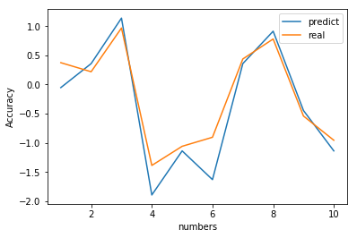


```python
reg.score(X_test,y_test)
```


    0.8344172446249604


```python
import numpy as np
```


```python
fig,axes = plt.subplots(1,3,figsize = (15,4))
# 创建1000个数据点，均匀分布在[-3,3]
line = np.linspace(-3,3,1000).reshape(-1,1)
for n_neighbors,ax in zip([1,3,9],axes):
    #利用1,3,9个邻居分别进行预测
    reg = KNeighborsRegressor(n_neighbors=n_neighbors)
    reg.fit(X_train,y_train)
    ax.plot(line,reg.predict(line))
    ax.plot(X_train,y_train,'^',c=mglearn.cm2(0),markersize = 8)
    ax.plot(X_test,y_test,'v',c=mglearn.cm2(1),markersize=8)
    ax.set_title("{} neighbor(s) \n train_score :{:.2f}  test_score:{:.2f}".format(n_neighbors,reg.score(X_train,y_train),reg.score(X_test,y_test)))
    ax.set_xlabel("Feature")
    ax.set_ylabel("Target")
axes[0].legend(["Model predictions","Training data/targrt","Test data/target"],loc = "best")
```


    <matplotlib.legend.Legend at 0x1c013a1a2e8>


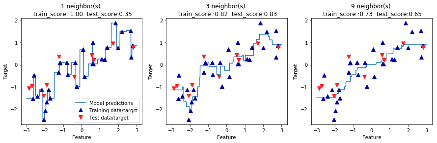


从图中可以看出，仅使用单一邻居，训练集中的每个点都对预测结果有显著影响，预测结果的图像经过所有数据点。这导致预测结果非常不稳定。考虑更多的邻居之后，预测结果变得更加平滑，但对训练集数据拟合不是很好。

### 优点、缺点和参数
- 优点
    - 模型很容易理解,通常不需要经过过多的调节就可以得到不错的性能。
    - 构建最近邻模型的速度通常很快，但如果训练集过大（特征数很多或者样本数很大）,预测速度可能会比较慢。
- 缺点
    - 虽然k近邻算法很容易理解，但由于预测速度慢且不能处理具有很多特征的数据集，所有在实践中往往不会用到。
- 参数
    - 邻居的个数：K
    - 数据点之间的距离的度量方法：欧式距离
    - 归类的选择方法：投票法（少数服从多数）

## 线性回归
线性模型是在实践中广泛使用的一类模型，几十年来被广泛研究。线性模型利用输入特征的**线性函数**进行预测。
线性回归模型的主要类别：
- **Ordinary Least Squares-线性回归（又名普通最小二乘法，OLS）**
- **Ridge Regression-岭回归**
- **Lasso**
- **Elastic Net-弹性网**
- **Least Angle Regression-最小角回归**


### Ordinary Least Squares-线性回归（又名普通最小二乘法，OLS）
是回归问题最简单也是经典的线性方法，。线性回归寻找参数w和b，使得对训练集的预测值与真实值的回归目标值y之间的**均方误差**最小。均方误差是
（mean squared error）是预测值和真实值之间的平方和除以样本数。线性回归不需要要手动给定参数（**即没有调参**），这是一个优点，但也因此无法
控制模型的复杂度。并且普通最小二乘估计系数依赖于模型的独立。当条件相关,设计矩阵的列有近似线性关系,设计矩阵接近奇异和结果,随机误差的最小二乘估计变得高度敏感的观察到的反应,产生很大差异。这种情况下可能出现多重共线性的,例如,当数据收集没有实验设计。


```python
from sklearn.linear_model import LinearRegression
import mglearn
from sklearn.model_selection import train_test_split
```


```python
#构造数据集
X,y = mglearn.datasets.make_wave(n_samples=60)
```


```python
X_train,X_text,y_train,y_test = train_test_split(X,y)
lr = LinearRegression().fit(X_train,y_train)
pre = lr.predict(X_text)
score = lr.score(X_text,y_test)
print('拟合直线:y={0:.3f}*x{1:.3f}\n的斜率:{0:.3f},\n截距为:{1:.3f},R方值：{2:.2f}'.format(lr.coef_[0],lr.intercept_,score))
```

    拟合直线:y=0.396*x-0.088
    的斜率:0.396,
    截距为:-0.088,R方值：0.72


```python
import matplotlib.pyplot as plt
plt.rcParams['font.sans-serif']=['SimHei']
plt.rcParams['axes.unicode_minus']=False
```


```python
plt.scatter(X_train,y_train,color='black')
plt.plot(X_text,pre)
plt.xlabel('Feature')
plt.ylabel('Target')
plt.title('简单线性回归图\n 训练集拟合得分:{:.3f},测试集拟合得分:{:.3f}'.format(lr.score(X_train,y_train),score))
plt.legend(["数据点","拟合直线"],loc = 'best')
```


    <matplotlib.legend.Legend at 0x2576d4db668>


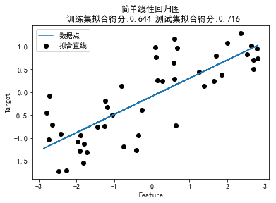


测试集上的得分为0.716，而且训练集和测试集的分数非常接近，这说明可能存在欠拟合，而不是过拟合。对于一维数据来说，过拟合的风险很小，因为模型非常简单（或受限）。然而，对于高维度的数据集（即有大量的特征的数据集），线性模型将变得更加强大，过拟合的可能性也会变大。


```python
from sklearn.datasets import load_boston
```


```python
# 查看数据
datas = load_boston()
```


```python
print(datas.DESCR)
```

    Boston House Prices dataset
    ===========================

    Notes
    ------
    Data Set Characteristics:  

        :Number of Instances: 506

        :Number of Attributes: 13 numeric/categorical predictive

        :Median Value (attribute 14) is usually the target

        :Attribute Information (in order):
            - CRIM     per capita crime rate by town
            - ZN       proportion of residential land zoned for lots over 25,000 sq.ft.
            - INDUS    proportion of non-retail business acres per town
            - CHAS     Charles River dummy variable (= 1 if tract bounds river; 0 otherwise)
            - NOX      nitric oxides concentration (parts per 10 million)
            - RM       average number of rooms per dwelling
            - AGE      proportion of owner-occupied units built prior to 1940
            - DIS      weighted distances to five Boston employment centres
            - RAD      index of accessibility to radial highways
            - TAX      full-value property-tax rate per $10,000
            - PTRATIO  pupil-teacher ratio by town
            - B        1000(Bk - 0.63)^2 where Bk is the proportion of blacks by town
            - LSTAT    % lower status of the population
            - MEDV     Median value of owner-occupied homes in $1000's

        :Missing Attribute Values: None

        :Creator: Harrison, D. and Rubinfeld, D.L.

    This is a copy of UCI ML housing dataset.
    http://archive.ics.uci.edu/ml/datasets/Housing


    This dataset was taken from the StatLib library which is maintained at Carnegie Mellon University.

    The Boston house-price data of Harrison, D. and Rubinfeld, D.L. 'Hedonic
    prices and the demand for clean air', J. Environ. Economics & Management,
    vol.5, 81-102, 1978.   Used in Belsley, Kuh & Welsch, 'Regression diagnostics
    ...', Wiley, 1980.   N.B. Various transformations are used in the table on
    pages 244-261 of the latter.

    The Boston house-price data has been used in many machine learning papers that address regression
    problems.   

    **References**

       - Belsley, Kuh & Welsch, 'Regression diagnostics: Identifying Influential Data and Sources of Collinearity', Wiley, 1980. 244-261.
       - Quinlan,R. (1993). Combining Instance-Based and Model-Based Learning. In Proceedings on the Tenth International Conference of Machine Learning, 236-243, University of Massachusetts, Amherst. Morgan Kaufmann.
       - many more! (see http://archive.ics.uci.edu/ml/datasets/Housing)


```python
#划分训练集和测试集
X_train,X_test,y_train,y_test = train_test_split(datas.data,datas.target,random_state=0)
print('训练集样本数:',len(X_train),',目标值个数:',len(y_train))
```

    训练集样本数: 379 ,目标值个数: 379


```python
#建立模型并进行训练
lr = LinearRegression().fit(X_train,y_train)
print(lr.coef_,lr.intercept_)
```

    [-1.16869578e-01  4.39939421e-02 -5.34808462e-03  2.39455391e+00
     -1.56298371e+01  3.76145473e+00 -6.95007160e-03 -1.43520477e+00
      2.39755946e-01 -1.12937318e-02 -9.86626289e-01  8.55687565e-03
     -5.00029440e-01] 36.98045533762024


```python
#结果输入
print('训练集得分{:.2f},测试集得分:{:.2f}'.format(lr.score(X_train,y_train),lr.score(X_test,y_test)))
```

    训练集得分0.77,测试集得分:0.64


如果训练集和测试集之间的性能差异过大是过拟合的明显标志，因此我们应该试图找到一个可以控制复杂度的模型。标注线性回归最常用的替代方法之一就是岭回归（ridge regression）

### Ridge Regression-岭回归
Ridge回归通过对系数的大小施加惩罚来解决普通最小二乘的一些问题 。
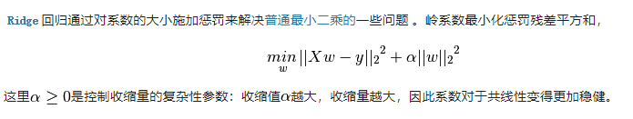


```python
from sklearn.linear_model import  RidgeCV
```


```python
RlrCV = RidgeCV(alphas=[a/10 for a in range(1,11)]).fit(X_train,y_train)
```


```python
pre = RlrCV.predict(X_test)
```


```python
'训练集得分:{:.2f},测试集得分:{:.2f},正则化参数{}'.format(RlrCV.score(X_train,y_train),RlrCV.score(X_test,y_test),RlrCV.alpha_)
```


    '训练集得分:0.77,测试集得分:0.63,正则化参数0.1'


```python
Rlr.coef_
```


    array([-1.14800388e-01,  4.48854707e-02, -2.49113266e-02,  2.35025027e+00,
           -1.07096752e+01,  3.79227215e+00, -1.17800878e-02, -1.37038928e+00,
            2.24039660e-01, -1.15836405e-02, -9.32419484e-01,  8.79786724e-03,
           -5.05077028e-01])


```python
Rlr.intercept_
```


    33.577957038260564


### Lasso
除了Ridge,还有一种正则化的线性回归是Lasso。与岭回归相同，使用lasso也是约束系数使其接近于0，但用到的方法不同，叫作**L1正则化**
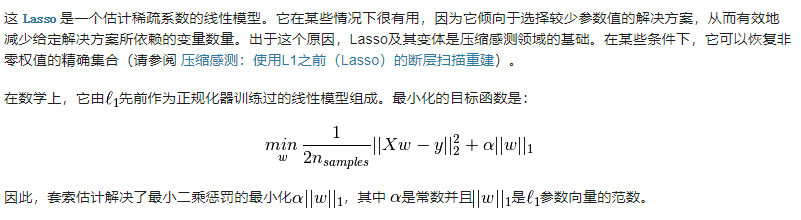


```python
from sklearn.linear_model import Lasso
```


```python
lasso = Lasso(alpha=0.01,max_iter=10000).fit(X_train,y_train)
```


```python
print(lasso.score(X_train,y_train),lasso.score(X_test,y_test))
```

    0.769304356071975 0.6315913583895181


```python
print(lasso.coef_!=0)
```

    [ True  True  True  True  True  True  True  True  True  True  True  True
      True]


### Elastic Net-弹性网
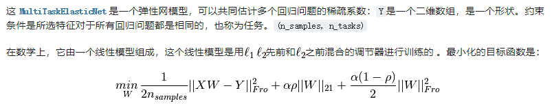


```python
from sklearn.linear_model import ElasticNet
```


```python
en = ElasticNet(alpha=0.01,l1_ratio=0.4).fit(X_train,y_train)
```


```python
print(en.score(X_train,y_train),en.score(X_test,y_test))
```

    0.7655774760174687 0.620339161352674


在实践中，在两个模型中一般**首选岭回归**。但如果特征很多，你认为只有其中几个是重要的，那么选择**Lasso可能会更**好。同样，如果你想要一个容易解释的模型，Lasso可以给出更容易理解的模型，因为它只选择一部分输入特征。弹性网，是两种回归的结合，这种结合效果最好，不过代价是调节两个参数：一个用于L1正则化，一个用于L2正则化。

## 决策树
**决策树**是广泛用于分类和回归任务的模型。本质上，它从一层层的**if/else**问题中进行学习，并得出结论。

### 构造决策树
学习决策树，就是学习一系列if/else问题，使我们能够以最快的速度得到正确的答案。在机器学习中，这些问题叫作测试(不要与测试集弄混，测试集是用来测试模型泛化性能的数据)。为了构造决策树，算法搜遍所有可能的测试，**找出对目标变量来说信息量最大的那一个**。

### 控制决策树的复杂度
通常来说，构造决策树知道所有叶节点都是纯的叶节点，这会导致模型非常复杂，并且对训练数据高度拟合。纯叶节点的存在说明这棵树在训练集上的精度是100%。训练集中的每个数据点都位于分类正确的叶节点中。防止过拟合有两种常见的策略：
- 预剪枝：及早停止树的生长，限制树的最大深度、限制叶节点的最大数目或者规定一个节点中数据点的最小数目来防止继续划分。
- 后剪枝(剪枝)：先构造树，随后删除或折叠信息量很少的节点


```python
from sklearn.tree import DecisionTreeClassifier
from sklearn.model_selection import train_test_split
from sklearn.datasets import load_breast_cancer
```


```python
print(load_breast_cancer().DESCR)
```

    Breast Cancer Wisconsin (Diagnostic) Database
    =============================================

    Notes
    -----
    Data Set Characteristics:
        :Number of Instances: 569

        :Number of Attributes: 30 numeric, predictive attributes and the class

        :Attribute Information:
            - radius (mean of distances from center to points on the perimeter)
            - texture (standard deviation of gray-scale values)
            - perimeter
            - area
            - smoothness (local variation in radius lengths)
            - compactness (perimeter^2 / area - 1.0)
            - concavity (severity of concave portions of the contour)
            - concave points (number of concave portions of the contour)
            - symmetry
            - fractal dimension ("coastline approximation" - 1)

            The mean, standard error, and "worst" or largest (mean of the three
            largest values) of these features were computed for each image,
            resulting in 30 features.  For instance, field 3 is Mean Radius, field
            13 is Radius SE, field 23 is Worst Radius.

            - class:
                    - WDBC-Malignant
                    - WDBC-Benign

        :Summary Statistics:

        ===================================== ====== ======
                                               Min    Max
        ===================================== ====== ======
        radius (mean):                        6.981  28.11
        texture (mean):                       9.71   39.28
        perimeter (mean):                     43.79  188.5
        area (mean):                          143.5  2501.0
        smoothness (mean):                    0.053  0.163
        compactness (mean):                   0.019  0.345
        concavity (mean):                     0.0    0.427
        concave points (mean):                0.0    0.201
        symmetry (mean):                      0.106  0.304
        fractal dimension (mean):             0.05   0.097
        radius (standard error):              0.112  2.873
        texture (standard error):             0.36   4.885
        perimeter (standard error):           0.757  21.98
        area (standard error):                6.802  542.2
        smoothness (standard error):          0.002  0.031
        compactness (standard error):         0.002  0.135
        concavity (standard error):           0.0    0.396
        concave points (standard error):      0.0    0.053
        symmetry (standard error):            0.008  0.079
        fractal dimension (standard error):   0.001  0.03
        radius (worst):                       7.93   36.04
        texture (worst):                      12.02  49.54
        perimeter (worst):                    50.41  251.2
        area (worst):                         185.2  4254.0
        smoothness (worst):                   0.071  0.223
        compactness (worst):                  0.027  1.058
        concavity (worst):                    0.0    1.252
        concave points (worst):               0.0    0.291
        symmetry (worst):                     0.156  0.664
        fractal dimension (worst):            0.055  0.208
        ===================================== ====== ======

        :Missing Attribute Values: None

        :Class Distribution: 212 - Malignant, 357 - Benign

        :Creator:  Dr. William H. Wolberg, W. Nick Street, Olvi L. Mangasarian

        :Donor: Nick Street

        :Date: November, 1995

    This is a copy of UCI ML Breast Cancer Wisconsin (Diagnostic) datasets.
    https://goo.gl/U2Uwz2

    Features are computed from a digitized image of a fine needle
    aspirate (FNA) of a breast mass.  They describe
    characteristics of the cell nuclei present in the image.

    Separating plane described above was obtained using
    Multisurface Method-Tree (MSM-T) [K. P. Bennett, "Decision Tree
    Construction Via Linear Programming." Proceedings of the 4th
    Midwest Artificial Intelligence and Cognitive Science Society,
    pp. 97-101, 1992], a classification method which uses linear
    programming to construct a decision tree.  Relevant features
    were selected using an exhaustive search in the space of 1-4
    features and 1-3 separating planes.

    The actual linear program used to obtain the separating plane
    in the 3-dimensional space is that described in:
    [K. P. Bennett and O. L. Mangasarian: "Robust Linear
    Programming Discrimination of Two Linearly Inseparable Sets",
    Optimization Methods and Software 1, 1992, 23-34].

    This database is also available through the UW CS ftp server:

    ftp ftp.cs.wisc.edu
    cd math-prog/cpo-dataset/machine-learn/WDBC/

    References
    ----------
       - W.N. Street, W.H. Wolberg and O.L. Mangasarian. Nuclear feature extraction
         for breast tumor diagnosis. IS&T/SPIE 1993 International Symposium on
         Electronic Imaging: Science and Technology, volume 1905, pages 861-870,
         San Jose, CA, 1993.
       - O.L. Mangasarian, W.N. Street and W.H. Wolberg. Breast cancer diagnosis and
         prognosis via linear programming. Operations Research, 43(4), pages 570-577,
         July-August 1995.
       - W.H. Wolberg, W.N. Street, and O.L. Mangasarian. Machine learning techniques
         to diagnose breast cancer from fine-needle aspirates. Cancer Letters 77 (1994)
         163-171.


```python
cancer = load_breast_cancer()
X_train,X_test,y_train,y_test= train_test_split(cancer.data,cancer.target,stratify=cancer.target,random_state=42)
detree = DecisionTreeClassifier(random_state=0).fit(X_train,y_train)
print('测试集精度{:.2f},训练集精度{:.2f}'.format(detree.score(X_train,y_train),detree.score(X_test,y_test)))
```

    测试集精度1.00,训练集精度0.94


训练集上的精度是100%，这是**因为叶节点都是纯的，树的深度很大，足以完美地记住训练数据的所有标签**。测试集精度比之前讲过的线性模型略低，线性模型的精度约为95%。如果我们不限制决策树的深度，它的深度和复杂度都可以变得特别大。因此，未剪枝的树容易过拟合，对新数据的泛化性能不佳。可以在完美拟合训练数据之前树的展开。一种选择是达到一定深度后停止树的展开。**可以通过设置max_depth=4，不然默认值是max_depth=None，会自动的扩大到纯节点。**

Init signature: DecisionTreeClassifier(criterion='gini', splitter='best', max_depth=None, min_samples_split=2, min_samples_leaf=1, min_weight_fraction_leaf=0.0, max_features=None, random_state=None, max_leaf_nodes=None, min_impurity_decrease=0.0, min_impurity_split=None, class_weight=None, presort=False)
Docstring:     
A decision tree classifier.

- criterion : string, optional (default="gini")
    The function to measure the quality of a split. Supported criteria are
    "gini" for the Gini impurity and "entropy" for the information gain.

- splitter : string, optional (default="best")
    The strategy used to choose the split at each node. Supported
    strategies are "best" to choose the best split and "random" to choose
    the best random split.

- max_depth : int or None, optional (default=None)
    The maximum depth of the tree. If None, then nodes are expanded until
    all leaves are pure or until all leaves contain less than
    min_samples_split samples.


```python
tree = DecisionTreeClassifier(max_depth=4,random_state=0).fit(X_train,y_train)
```

### 分析决策树
可以利用tree模块的export_graphviz函数来将树可视化。这个函数会生成一个.dot格式的文件，这是一种用于保存图形的文本文件格式。


```python
from sklearn.tree import export_graphviz
dot_grap = export_graphviz(tree,out_file=None,class_names=['maligant','benign'],feature_names=cancer.feature_names,filled=True,rounded=True,special_characters=True)
```

利用graphviz模块读取这个文件并将其可视化（可以使用任何能够读取.dot文件的程序）
- **使用conda install python-graphviz进行安装**


```python
import graphviz
graphviz.Source(dot_grap)
```


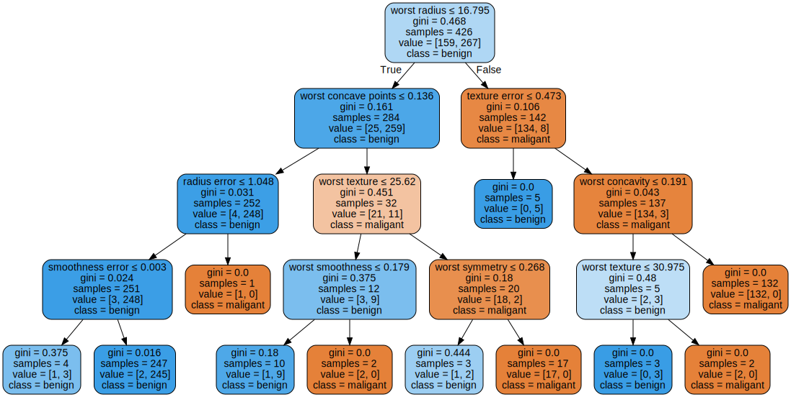


树的可视化有助于深入理解算法是如何进行预测的，也是易于向非专家解释的机器学习算法的优秀示例。
- **gini：gini基数**
- **samples：给出了该节点的样本个数**
- **values：给出的是每个类别的样本个数，['maligant','benign']**
- **worst radius <= 16.795：每个节点基于gini系数进行划分**
- **class：此节点的类别**

### 树的特征重要性
查看整个树可能非常费劲，除此之外，还可以利用一些有用的属性来总结树的工作原理。其中最常用的是**特征重要性**，它为每个特征对树的决策的重要性进行排序。对于特征来说，是一个介于0和1之间的数字，其中0表示“根本没有用到”，1表示“完美预测目标值”。特征值重要性求和始终为1。


```python
import matplotlib.pyplot as plt
import numpy as np
def plot_feature_importances_cancer(model):
    n_features = cancer.data.shape[1]
    plt.barh(range(n_features),model.feature_importances_,align = 'center')
    plt.yticks(np.arange(n_features),cancer.feature_names)
    plt.xlabel('Feature importance')
    plt.ylabel('Feature')
plot_feature_importances_cancer(tree)
```


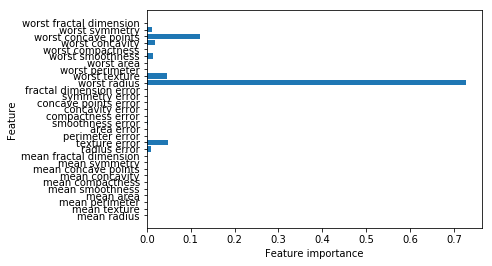


这里可以看出，顶部划分用到的特征（“worst radius”）是最重要的特征，即第一层划分已经将两个类别区分得很好。但是，如果某个特征的feature_importance_很小，并不能说明这个特征没有提供任何信息。这只能说明咩有被树选中，可能是因为另一特征也包含了同样的信息。

### 总结
决策树的一些优点是：

- 很容易理解和解释。树可以被可视化。
- 需要很少的数据准备。其他技术通常需要数据标准化，需要创建虚拟变量并删除空白值。但请注意，此模块不支持缺少的值。
- 使用树的成本（即预测数据）是用于训练树的数据点的数量的对数。
- 能够处理数字和分类数据。其他技术通常专门用于分析只有一种类型变量的数据集。查看更多信息的算法。
- 能够处理多输出问题。
- 使用白盒模型。如果给定的情况在模型中是可观察的，则条件的解释很容易通过布尔逻辑来解释。相比之下，在黑盒模型（例如，在人工神经网络中），结果可能更难以解释。
- 可以使用统计测试来验证模型。这可以说明模型的可靠性。
- 即使其假设受到数据生成的真实模型的某种程度的侵犯，也能很好地执行。

决策树的缺点包括：

- 决策树学习者可以创建过于复杂的树，不能很好地概括数据。这被称为过度拟合。修剪（目前不支持）等机制，设置叶节点所需的最小样本数或设置树的最大深度是避免此问题所必需的。
- 决策树可能不稳定，因为数据中的小变化可能会导致生成完全不同的树。通过在集合中使用决策树可以缓解这个问题。
- 学习最优决策树的问题在最优化的几个方面甚至简单的概念下被认为是NP完全的。因此，实际决策树学习算法基于启发式算法，例如在每个节点进行局部最优决策的贪心算法。这样的算法不能保证返回全局最优决策树。这可以通过在集合学习器中训练多棵树来缓解，其中特征和样本随机地用替换采样。
- 有些概念很难学，因为决策树不能很容易地表达它们，例如XOR，奇偶校验或多路复用器问题。
- 如果某些类占主导地位，决策树学习者会创建偏向性树。因此，建议在拟合决策树之前平衡数据集。


### 决策树集成
**集成（ensemble）是合并多个机器学习模型来构建更强大模型的方法。**
- 随机森林：许多决策树的集合，其中每棵树之间希望相互独立。其中随机体现在以下两个方法：
    - **构造数据的随机（n_estimators参数设置）**：对数据进行自助采样，也就是说从n_samples个数据点中有放回地（即同一个样本可以被多次抽取）重复随机抽取一个样本，共抽取n_samples次。这样会创建一个与原数据集大小相同的数据集，但有些数据点会缺失（大约三分之一），有些会重复。
    - **特征的选择随机（max_features参数设置）**：在每个节点处，算法随机选择特征的一个子集，并对其中一个特征寻找最佳测试，而不是对每个节点都寻找最佳测试，选择特征的个数由max_features参数来控制。每个节点中的特征子集的选择是相互独立的，这样树的每个结点可以使用特征的不同子集来做出决策。
    - **使用方法**：利用随机森林进行预测，算法首先对森林中的每棵树进行预测。对于回归问题，可对这些结果取平均值作为最终预测。对于分类问题，则用到了“软投票”（soft voting）策略。也就是说，每个算法做出“软”预测，给出每个可能的输出标签的概率。对所有树的预测概率去平均值，然后将概率最大的类别作为预测结果。


```python
from sklearn.ensemble import RandomForestClassifier
from sklearn.datasets import make_moons
from sklearn.model_selection import train_test_split
```


```python
#构造数据集及训练模型
X,y = make_moons(n_samples=100,noise=0.25,random_state=3)
X_train,X_test,y_train,y_test =train_test_split(X,y,random_state=42)
forest = RandomForestClassifier(n_estimators=5,random_state=2).fit(X_train,y_train)
```

作为随即森林的一部分，树被保存在estimator_属性中。我们将每棵树学到的决策边界可视化，也将它们的总预测（即整个森林做出的预测）可视化。


```python
import matplotlib.pyplot as plt
import mglearn
#结果的可视化
fig,axes = plt.subplots(2,3,figsize = (20,10))
for i,(ax,tree) in enumerate(zip(axes.ravel(),forest.estimators_)):
    ax.set_title('Tree{}'.format(i))
    mglearn.plots.plot_tree_partition(X_train,y_train,tree,ax=ax)
mglearn.plots.plot_2d_separator(forest,X_train,fill=True,ax=axes[-1,-1],alpha=0.4)
axes[-1,-1].set_title('Random Forest')
mglearn.discrete_scatter(X_train[:,0],X_train[:,1],y_train)
```


    [<matplotlib.lines.Line2D at 0x20c4a0a5358>,
     <matplotlib.lines.Line2D at 0x20c4a09a8d0>]


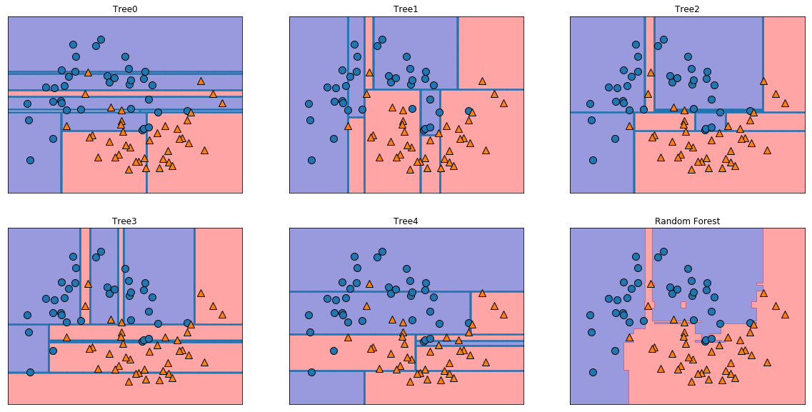


```python
print('训练集精确度{:2.2f}% \n测试集精确度{:2.2f}%'.format(100*forest.score(X_train,y_train),100*forest.score(X_test,y_test)))
```

    训练集精确度97.33%
    测试集精确度84.00%


```python
from sklearn.datasets import load_breast_cancer
#100棵树的随机森林应用在乳腺癌数据集上的应用
cancer = load_breast_cancer()
X_train,X_test,y_train,y_test = train_test_split(cancer.data,cancer.target,random_state=0)
forest = RandomForestClassifier(n_estimators=100,random_state=0).fit(X_train,y_train)
print('训练集精确度:{:.2f},测试集精确度:{:.2f}'.format(forest.score(X_train,y_train),forest.score(X_test,y_test)))
```

    训练集精确度:1.00,测试集精确度:0.97


```python
#随机深林的特征重要性
plot_feature_importances_cancer(forest)
```


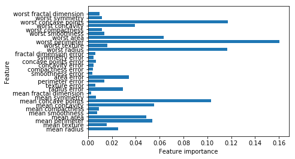


与单棵树相比，随机森林中有更多特征的重要性不为零。与单棵决策树类似，随机森林也给了“worst radius”（最大半径）特征很大的重要，单从总体来看，它实际上却选择“worst permeter”（最大周长）作为信息量最大的特征。由于构造随机森林过程中的随机性，算法需要考虑多种可能的解释，**结果就是随机森林比单棵树更能从总体把握数据特征。**

### 随机森林总结
用于**回归**和**分类**的随机森林是目前运用最广泛的机器学习方法之一。这种方法非常强大，通常不需要反复调节参数就可以给出很好的结果，也不需要对数据进行缩放。
- 随机森林拥有决策树的所有优点，同时弥补了决策树的一些缺陷。
    - 仍然使用决策树的原因：
        - 单棵树可以进行可视化展示，易解释。
        - 如果树过多，耗时过长，可以对n_jobs对cpu进行调用使用
- 随机森林本质是上是随机的，设置不同的随机状态可以彻底改变构建的模型。——**参数random_state=None**,默认设置，如果设置成整数，可以保证每次运行的结果相同。
- 对于**维度非常高的稀疏数据**（比如文本数据），随机森林的表现往往不是很好。对于这种数据，使用**线性模型**可能更合适。
- 需要调节的参数
    - **n_estimators:确定决策树的个数，经验法则“在你的时间/内存允许的情况下尽量多”。**
    - **max_features:特征的子集个数，决定每棵树的随机性，对于分类：max_features=sqrt(n_features)；对于回归，max_features=n_features。**
    - **n_jobs:使用更多cpu进行训练，n_jobs=-1为使用计算机所有内核进行训练。**|

### 梯度提升回归树（梯度提升机）
  梯度提升回归树是另一种集成方法，通过合并多个决策树来构建一个更为强大的模型。虽然名字中含有“回归”，但这个模型既可以用于回归也可以用于分类。
  - 与随机森林方法不同，**梯度提升采用连续的方式构造树，每棵树都试图纠正前一棵树的错误**。默认情况下，梯度提升回归树中没有随机化，二十用到了强预剪枝。梯度提升树通常使用深度很小（1到5之间）的树，这样模型占用的内存更少，预测速度也更快。
  - 主要思想是合并许多简单的模型（若学习器），比如深度较小的树。每棵树只能对部分数据做出好的预测，因此，添加的树越来越多，可以不断迭代提高性能。
  - 除了**预剪枝**与**集成树中的数量**之外，梯度提升的另一个重要参数是**learning_rate（学习率）**，用于控制每棵树纠正前一棵树的错误的强度。较高的学习率意味着每棵树都可以做出较强的修正，这样模型更为复杂。通过增大n_estimators来向集成中添加更多树，也可以增加模型复杂度，因为模型有更多机会纠正训练集上的错误。


```python
from sklearn.ensemble import GradientBoostingClassifier
from sklearn.model_selection import train_test_split
from sklearn.datasets import load_breast_cancer
```


```python
data = load_breast_cancer()
X_train,X_test,y_train,y_test = train_test_split(data.data,data.target,random_state=0)
gbrt = GradientBoostingClassifier(random_state=0).fit(X_train,y_train)
print('测试集精确度{},训练集精确度{}。'.format(gbrt.score(X_train,y_train),gbrt.score(X_test,y_test)))
```

    测试集精确度1.0,训练集精确度0.958041958041958。


由于训练精度达到100%，所以很可能存在过拟合。为了降低过拟合，我们可以限制最大深度来加强预剪纸，也可以降低学习率：


```python
gbrt = GradientBoostingClassifier(random_state=0,max_depth=1).fit(X_train,y_train)
print('测试集精确度{},训练集精确度{}。'.format(gbrt.score(X_train,y_train),gbrt.score(X_test,y_test)))
```

    测试集精确度0.9906103286384976,训练集精确度0.972027972027972。


```python
gbrt = GradientBoostingClassifier(random_state=0,learning_rate=0.01).fit(X_train,y_train)
print('测试集精确度{},训练集精确度{}。'.format(gbrt.score(X_train,y_train),gbrt.score(X_test,y_test)))
```

    测试集精确度0.9882629107981221,训练集精确度0.965034965034965。


降低模型复杂度的两种方法：**减小树的最大深度**和**减小学习率**，减小树的最大深度显著提升了模型性能，而降低学习率仅稍稍提高了泛化性能。


```python
gbrt = GradientBoostingClassifier(random_state=0,max_depth=1).fit(X_train,y_train)
```


```python
import matplotlib.pyplot as plt
import numpy as np
def plot_feature_importances_cancer(model):
    n_features = cancer.data.shape[1]
    plt.barh(range(n_features),model.feature_importances_,align = 'center')
    plt.yticks(np.arange(n_features),cancer.feature_names)
    plt.xlabel('Feature importance')
    plt.ylabel('Feature')
```


```python
import matplotlib.pyplot as plt
import numpy as np
def plot_feature_importances_cancer(model):
    n_features = data.data.shape[1]
    plt.barh(range(n_features),model.feature_importances_,align = 'center')
    plt.yticks(np.arange(n_features),data.feature_names)
    plt.xlabel('Feature importance')
    plt.ylabel('Feature')
```


```python
plot_feature_importances_cancer(gbrt)
```


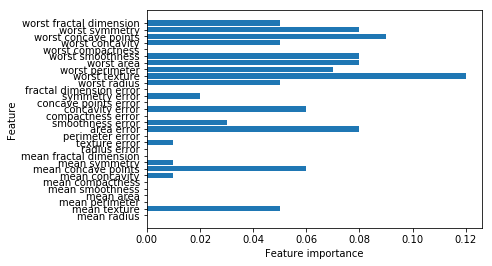


梯度提升树的特征重要性与随机森林的特征重要性有些类似，**不过梯度提升完全忽略了某些特征**。由于梯度提升和随机森林两种方法在类似的数据上表现得都很好，因此一种常用的方法就是**先尝试随机森林**，它的鲁棒性很好。如果随机森林效果很好，**但预测时间很长，或者机器学习模型精度小数点后第二位的提高也很重要，那么切换成梯度提升通常会有用。**

### 梯度提升总结
- 其主要缺点是需要仔细调参，而且训练时间可能会比较长。但是这一算法不需要对数据进行缩放就可以表现得很好，而且也适用于二元特征与连续特征同时存在的数据集。与其他基于树的模型相同，它也通常不适用于高维稀疏数据。
- 梯度提升树的模型的主要参数如下：
    - 树的数量（n_estimators）:树的数量增大导致模型复杂度更加复杂，进而可能导致过拟合。
    - 学习率（learning_rate）:学习率越低，就需要更多的树来构建具有相似复杂度的模型。
    - 树的最大深度（max_depth）:降低每棵树的复杂度。


```python
GradientBoostingClassifier?
```

GradientBoostingClassifier(loss='deviance', learning_rate=0.1, n_estimators=100, subsample=1.0, criterion='friedman_mse', min_samples_split=2, min_samples_leaf=1, min_weight_fraction_leaf=0.0, max_depth=3, min_impurity_decrease=0.0, min_impurity_split=None, init=None, random_state=None, max_features=None, verbose=0, max_leaf_nodes=None, warm_start=False, presort='auto')

## 核支持向量机
**核支持向量机（通常简称SVM）是可以推广到更复杂模型的扩展，这些模型无法被输入空间的超平面定义。**

### 线性模型与非线性特征
线性模型在低维空间中可能非常受限，因为**线和平面的灵活性有限**。有一种方法可以让线性模型更加灵活，就是**添加更多的特征**，添加输入特征的**交互项或多项式。**


```python
import mglearn
from sklearn.datasets import make_blobs
import matplotlib.pyplot as plt
X,y = make_blobs(centers=4,random_state=8)
y= y%2
mglearn.discrete_scatter(X[:,0],X[:,1],y)
plt.xlabel("Feature 0")
plt.ylabel("Feature 1")
```


    Text(0,0.5,'Feature 1')


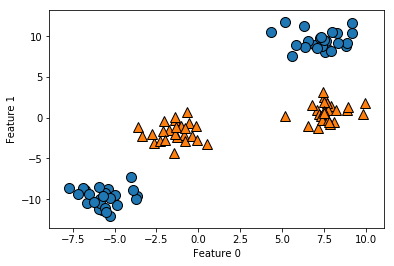


**线性不可分——用于分类的线性模型只能用一条直线来划分数据点，对这个数据集无法给出较好的结果。**


```python
from sklearn.svm import LinearSVC
linear_svm = LinearSVC().fit(X,y)
mglearn.plots.plot_2d_separator(linear_svm,X)
mglearn.discrete_scatter(X[:,0],X[:,1],y)
plt.xlabel("Feature 0")
plt.ylabel("Feature 1")
```


    Text(0,0.5,'Feature 1')


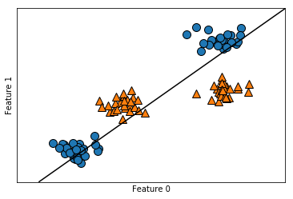


添加第三个特征的平方（feature1^2）作为一个新特征。现在我们将每个数据点表示为三位点（feature0，feature1，feature1^2）,而不是二维点（feature0，feature1）。


```python
import numpy as np
from  mpl_toolkits.mplot3d import Axes3D,axes3d
#添加第三维度
X_new  = np.hstack([X,X[:,1:]**2])
figure = plt.figure()
#3d可视化
ax= Axes3D(figure,elev=-152,azim=-26)
mask = y == 0
ax.scatter(X_new[mask,0],X_new[mask,1],X_new[mask,2],c= 'b',cmap = mglearn.cm2,s=60)
ax.scatter(X_new[~mask,0],X_new[~mask,1],X_new[~mask,2],c='r',marker = '^',cmap = mglearn.cm2,s=60)
ax.set_xlabel('feature 0')
ax.set_ylabel('feature 1')
ax.set_zlabel('feature1 **2')
```


    Text(0.5,0,'feature1 **2')


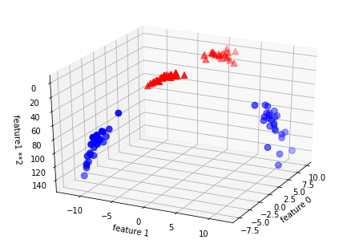


在数据的的新表示，现在可以用线性模型（三维空间的平面）将两个类别分开。可以用线性模型你和扩扩展后的数据来验证这一点。


```python
linear_svm_3d = LinearSVC().fit(X_new,y)
coef,intercept = linear_svm_3d.coef_.ravel(),linear_svm_3d.intercept_

#显示线性决策边框
figure = plt.figure()
ax= Axes3D(figure,elev=-152,azim=-26)
xx =  np.linspace(X_new[:,0].min()-2,X_new[:,0].max()+2,50)
yy =  np.linspace(X_new[:,1].min()-2,X_new[:,1].max()+2,50)

XX,YY = np.meshgrid(xx,yy)
ZZ = (coef[0]*XX+coef[1]*YY+intercept)/-coef[2]
ax.plot_surface(XX,YY,ZZ,rstride=8,cstride=8,alpha=0.3)
ax.scatter(X_new[mask,0],X_new[mask,1],X_new[mask,2],c= 'b',cmap = mglearn.cm2,s=60)
ax.scatter(X_new[~mask,0],X_new[~mask,1],X_new[~mask,2],c='r',marker = '^',cmap = mglearn.cm2,s=60)
ax.set_xlabel('feature 0')
ax.set_ylabel('feature 1')
ax.set_zlabel('feature1 **2')
```


    Text(0.5,0,'feature1 **2')


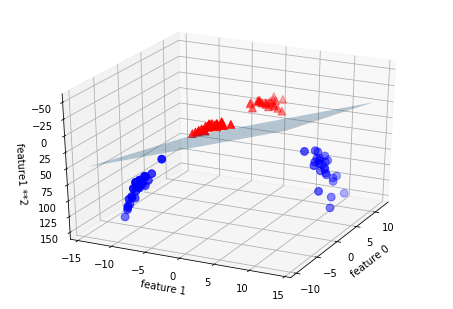


**分割的已经不是线性的了，它不是一条直线，二十一个椭圆。**


```python
ZZ=YY**2
dec = linear_svm_3d.decision_function(np.c_[XX.ravel(),YY.ravel(),ZZ.ravel()])
plt.contour(XX,YY,dec.reshape(XX.shape),levels=[dec.min(),0,dec.max()],cmap = mglearn.cm2,alpha=0.5)
mglearn.discrete_scatter(X[:,0],X[:,1])
plt.xlabel('Feature 0')
plt.ylabel('Fearure 1')
```


    Text(0,0.5,'Fearure 1')


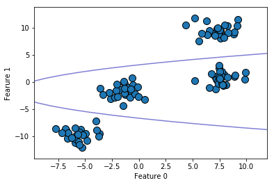


###  核技巧
**向数据表示中添加非线性特征，可以让线性模型变得更强大**。但是，通常来说我们并不知道要添加哪些特征，而且添加许多特征（比如100特征空间所有可能的交互项）的计算开销可能会很大。幸运的是，**有一种巧妙的数学技巧，让我们可以在更高维空间中学习分类器**，而不用实际就散可能非常大的新的数据表示。这种技巧叫作**核技巧**，它的原理是**直接计算扩展特征表示中数据点之间的距离（更准确地说是内积），而不用实际对扩展进行计算**。
**将数据映射到更高维空间中有两种常用的方法：**
- 多项式核：在一定阶数内计算原始特征所有可能的多项式。
- 径向基函数（RBF）,也叫高斯核：对应无限维的特征空间，它考虑所有阶数的所有可能的多项式，但阶数越高，特征的重要性越小。

### 理解SVM
SVM学习每个训练数据点对于表示两个类别之间的决策边界的重要性。通常只有一部分训练数据点对于定义决策边界来说很重要：位于类别之间边界上的那些点。这些点叫作**支持向量（support vector）**，支持向量机正式由此得名。
对新样本进行预测，需要测量与它每个支持向量之间的距离。分类决策是基于它与支持向量之间的距离以及在训练过程中学到的支持向量的重要性（保存在svc的dual_coef_属性中）来做出的。


```python
from sklearn.svm import SVC
X,y = mglearn.tools.make_handcrafted_dataset()
svm = SVC(kernel='rbf',C=10,gamma=0.1).fit(X,y)
mglearn.plots.plot_2d_separator(svm,X,eps=.5)
mglearn.discrete_scatter(X[:,0],X[:,1],y)
#画出支持向量机
sv= svm.support_vectors_
# 支持向量的类别标签由dual_coef_的正负号给出
sv_labels = svm.dual_coef_.ravel()>0
mglearn.discrete_scatter(sv[:,0],sv[:,1],sv_labels,s=15,markeredgewidth=3)
plt.xlabel('Feature 0')
plt.ylabel('Feature 1')
```


    Text(0,0.5,'Feature 1')


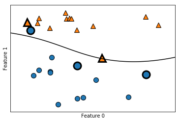


SVM给出了非常平滑且非线性（不是直线）的边界，这里我们调用两个参数：
- **C参数**
- **gamma参数**

### SVM调参
- gamma参数是公式中的参数，用于**控制高斯核的宽度。它决定了点与点之间“靠近”是指多大的距离**。
- **C参数是正则化参数**，与线性模型中用到的类似，**它限制每个点的重要性（或者更确切地说，每个点的dual_coef）。**


```python
import matplotlib.pyplot as plt
import mglearn
fig,axes = plt.subplots(3,3,figsize =(15,10))
for ax,C in zip(axes,[-1,0,3]):
    for a,gamma in zip(ax,range(-1,2)):
        mglearn.plots.plot_svm(log_C=C,log_gamma=gamma,ax=a)
axes[0,0].legend(["class 0","class 1","sv class 0","sv class 1"],ncol = 4,loc=(.9,1.2))
```


    <matplotlib.legend.Legend at 0x1f780808588>


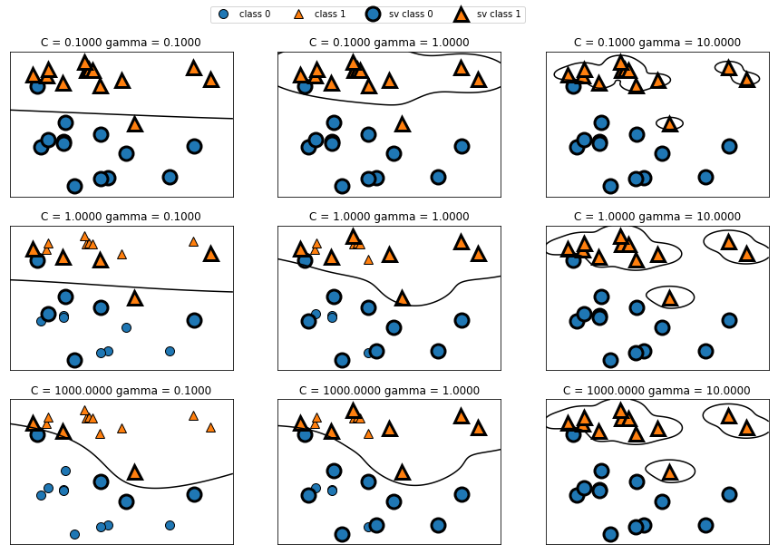


- 从左到右，将参数gamma的值从0.1增加到10。gamma较小，说明高斯核的半径较大，许多点都被看作比较靠近。可以从图看出：左侧的图决策边界非常平滑，越向右的图决策边界更关注单个点。小的gamma值表示决策边界变化很慢，生成的是复杂度较低的模型，而大的gamma值则会生成更为复杂的模型。
- 从上到下，参数C的值从0.1增加到1000。与线性模型相同，C值相同，C值很小，说明模型非常受限，每个数据点的影响范围都有限。可以看到，左上角的图中，决策边界看起来几乎是线性的，误分类的点对边界几乎没有任何影响。左下角的图，增大C之后这些点对模型的影响变大，使得决策边界发生弯曲了将这些点正确分类。


```python
from sklearn.model_selection import train_test_split
from sklearn.datasets import load_breast_cancer
from sklearn.svm import SVC
cancer = load_breast_cancer()
X_train,X_test,y_train,y_test = train_test_split(cancer.data,cancer.target,random_state=0)
svc = SVC()
svc.fit(X_train,y_train)
print('训练集的精度{:.2},测试集的精度{:.2}'.format(svc.score(X_train,y_train),svc.score(X_test,y_test)))
```

    训练集的精度1.0,测试集的精度0.63


 这个模型在训练集上的分数十分完美，但在测试集上的精度只有63%，存在相当严重的过拟合。虽然SVM的表现通常都很好，**但它对参数的设定和数据的缩放非常敏感**。特别地，它要求所有特征相似的变化范围。


```python
plt.plot(X_train.min(axis=0),'o',label = "min")
plt.plot(X_train.max(axis=0),'^',label="max")
plt.legend(loc=4)
plt.xlabel("Feature index")
plt.ylabel("Feature magnitude")
plt.yscale("log")
```


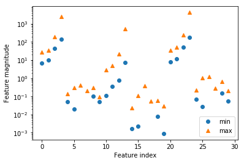


上图中，可以**确实数据集的特征具有完全不同的数量级**，这对其他模型来说（比如线性模型）可能是小问题但对核SVM却有极大影响。

### 为SVM预处理数据
解决这个问题的一种方法就是对每个特征进行缩放，使其大致都位于同一个范围，常用的缩放方法就是将所有的特征缩放到0和1之间。


```python
#计算训练集中每个特征的最小值
min_on_train = X_train.min(axis=0)
#计算训练集中每个特征的范围（最大值-最小值）
range_on_training = (X_train-min_on_train).max(axis=0)
#范围缩放
X_train_scaled = (X_train-min_on_train)/range_on_training
X_test_scaled = (X_test-min_on_train)/range_on_training
svc = SVC().fit(X_train_scaled,y_train)
print("训练集精度{:.4f},测试集精度{:.4f}".format(svc.score(X_train_scaled,y_train),svc.score(X_test_scaled,y_test)))
```

    训练集精度0.9484,测试集精度0.9510


数据缩放的作用对结果的提升有很大的作用，但是由于训练集的精度和测试集的精度差不多，而且测试集的精度略高于训练集，说明实际上模型现在处于欠拟合的状态，可以尝试增大参数C和gamma参数，增大模型的复杂度。


```python
svc = SVC(C=1000).fit(X_train_scaled,y_train)
print("训练集精度{:.4f},测试集精度{:.4f}".format(svc.score(X_train_scaled,y_train),svc.score(X_test_scaled,y_test)))
```

    训练集精度0.9883,测试集精度0.9720


### 优点、缺点和参数
- 优点：核支持向量机是非常强大的模型，在各种模型数据集上的表现都很好，SVM允许决策边界很复杂，即使数据只有几个特征。它在低维数据和高维谁（即很少特征和很多特征）上的表现都很好，但对样本个数的缩放表现不好，比如在样本数为10000的数据集上表现良好，但是如果数据增加到1000000甚至更大，在运行时间和内存使用方法可能会面临挑战。
- 缺点：预处理数据和调参都需要非常小心。这也是为什么如今很多应用中用的都是基于树的模型，比如随机森林或梯度提升（需要很少的预处理，甚至不需要预处理）。此外，SVM模型很难检查，可能很难理解为什么会这么预测，而且也难以将模型向非专家进行解释。
- 核SVM的参数：
    - 正则化参数C:默认C=1,参数是正则化参数，与线性模型中用到的类似，它限制每个点的重要性。
    - 核的选择：默认kernel='rbf',径向基函数。
    - gamma参数：默认gamma=1/n_features,用于控制高斯核的宽度。它决定了点与点之间“靠近”是指多大的距离。

## 神经网络（深度学习）
一类被称为神经网络的算法最近以“深度学习”的名字再度流行。虽然深度学习在许多机器学习应用中都有巨大的潜力，但**深度学习算法往往经过精确调整，只适用于特定的使用场景。**但是这里只讨论一些相对简单的方法，即用于分类和回归的**多层感知机（multilayer perceptron，MLP）**,它可以作为研究更复杂的深度学习方法的起点。**MLP也被称为（普通）前馈神经网络，有时也简称为神经网络。**

### 神经网络模型


```python
display(mglearn.plots.plot_logistic_regression_graph())
```


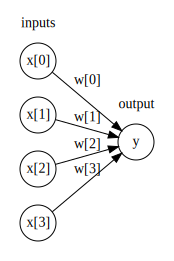


上图中，**左边**的每个节点代表一个**输入特征**，**连线**代表学到的**系数**，**右边**的节点代表**输出**，是输入的加权求和。


```python
display(mglearn.plots.plot_single_hidden_layer_graph())
```


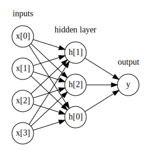


这个模型需要学习更多的系数（也叫作权重）：**在每个输入与每个隐单元（隐单元组成了隐层）之间有一个系数，在每个隐单元与输出之间也有一个系数。**

为了让这个模型真正比线性模型更为强大，还需要一个技巧。在计算完成每个隐单元的加权求和之后，对结果再应用一个非线性函数——通常是**校正非线性（rectifying nonlinearity，也叫校正线性单元或relu）**或**正切双曲线（tangens hyperbolicus，tanh）**。然后将这个函数的结果应用于加权求和，计算得到输出y。


```python
import numpy as np
line=np.linspace(-3,3,100)
plt.plot(line,np.tanh(line),label="tanh")
plt.plot(line,np.maximum(line,0),label="relu")
plt.legend(loc="best")
plt.xlabel("x")
plt.ylabel("relu(x),tanh(x)")
```


    Text(0,0.5,'relu(x),tanh(x)')


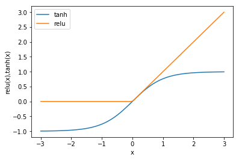


**需要用户设置对的一个重要的参数是隐层的一个重要参数是隐层中的节点个数**，对于非常小或非常简单的数据集，这个值可以小到10；对于非常复杂的数据，这个值可以大到1000，也可以添加多个隐层。


```python
mglearn.plots.plot_two_hidden_layer_graph()
```


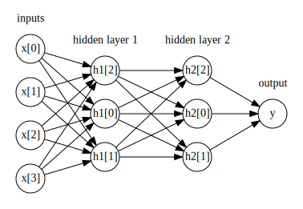


### 神经网络调参


```python
from sklearn.neural_network import MLPClassifier
from sklearn.datasets import make_moons
from sklearn.model_selection import train_test_split
X,y = make_moons(n_samples=100,noise=0.25,random_state=3)
X_train,X_test,y_train,y_test = train_test_split(X,y,random_state=42)
mlp = MLPClassifier(solver='lbfgs',random_state=0).fit(X_train,y_train)
mglearn.plots.plot_2d_separator(mlp,X_train,fill=True,alpha=.3)
mglearn.discrete_scatter(X_train[:,0],X_train[:,1],y_train)
plt.xlabel("Feature 0")
plt.ylabel("Feature 1")
```


    Text(0,0.5,'Feature 1')


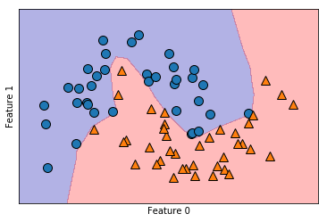


神经网络学到的决策边界完全是非线性的，但相对平滑。默认情况下，MLP使用了100个隐节点，这对于这个小型数据集来说已经相当多了。我们可以减少其数量（从而降低了模型复杂度），但仍然得到很好的结果。


```python
mlp = MLPClassifier(solver='lbfgs',random_state=0,hidden_layer_sizes=[10]).fit(X_train,y_train)
mglearn.plots.plot_2d_separator(mlp,X_train,fill=True,alpha=.3)
mglearn.discrete_scatter(X_train[:,0],X_train[:,1],y_train)
plt.xlabel("Feature 0")
plt.ylabel("Feature 1")
```


    Text(0,0.5,'Feature 1')


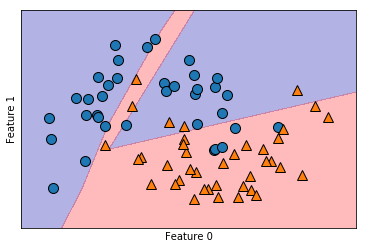


```python
#添加两个隐层单元，每层10个节点
mlp = MLPClassifier(solver='lbfgs',random_state=0,hidden_layer_sizes=[10,10]).fit(X_train,y_train)
mglearn.plots.plot_2d_separator(mlp,X_train,fill=True,alpha=.3)
mglearn.discrete_scatter(X_train[:,0],X_train[:,1],y_train)
plt.xlabel("Feature 0")
plt.ylabel("Feature 1")
```


    Text(0,0.5,'Feature 1')


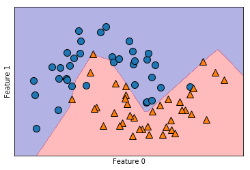


```python
#使用tanh非线性激活函数
mlp = MLPClassifier(solver='lbfgs',activation='tanh',random_state=0,hidden_layer_sizes=[10,10]).fit(X_train,y_train)
mglearn.plots.plot_2d_separator(mlp,X_train,fill=True,alpha=.3)
mglearn.discrete_scatter(X_train[:,0],X_train[:,1],y_train)
plt.xlabel("Feature 0")
plt.ylabel("Feature 1")
```


    Text(0,0.5,'Feature 1')


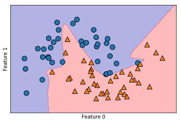


最后，我们可以利用L2惩罚使权重趋向于0，从而控制神经网络的复杂度，正如我们在岭回归和线性分类器中所做的那样。MLPClassifier中调节惩罚参数是alpha（与线性回归和线性分类器中模型相同），它的默认值很小（正则化）。
- **MLPClassifier(hidden_layer_sizes=(100,), activation='relu', solver='adam', alpha=0.0001, batch_size='auto', learning_rate='constant', learning_rate_init=0.001, power_t=0.5, max_iter=200, shuffle=True, random_state=None, tol=0.0001, verbose=False, warm_start=False, momentum=0.9, nesterovs_momentum=True, early_stopping=False, validation_fraction=0.1, beta_1=0.9, beta_2=0.999, epsilon=1e-08)**


```python
fig,axes = plt.subplots(2,4,figsize=(20,8))
for axx,n_hidden_nodes in zip(axes,[10,100]):
    for ax,alpha in zip(axx,[0.0001,0.01,0.1,1]):
        mlp = MLPClassifier(solver='lbfgs',random_state=0,hidden_layer_sizes=[n_hidden_nodes,n_hidden_nodes],alpha=alpha).fit(X_train,y_train)
        mglearn.plots.plot_2d_separator(mlp,X_train,fill=True,alpha=.3,ax=ax)
        mglearn.discrete_scatter(X_train[:,0],X_train[:,1],y_train,ax=ax)
        ax.set_title("n_hidden=[{},{}]\n alpha={:.4f}".format(n_hidden_nodes,n_hidden_nodes,alpha))
```


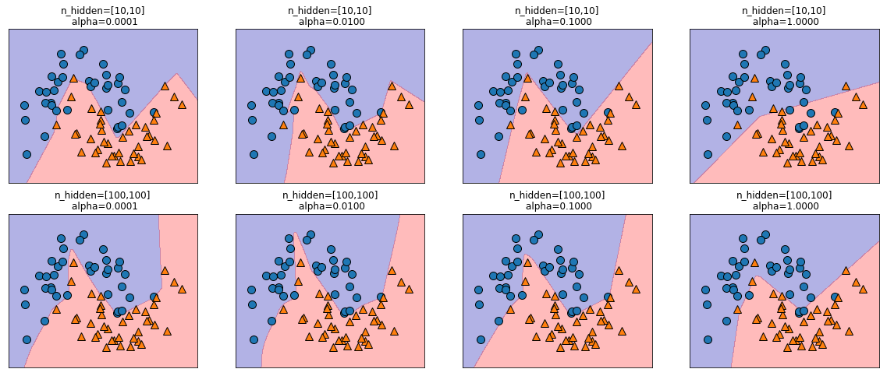


控制神经网络复杂度的方法有很多种：
- 隐层的个数
- 每个隐层中的单元个数
- 正则化（alpha）

神经网络的一个重要性质是，在开始学习之前其权重是随机设置的，这种随机初始化会影响学到的模型。也就是说，即使使用完全相同的参数，如果随机种子不同的话，我们也可能得到非常不一样的模型。如果网络很大，并且复杂度选择合理的话，那么这应该不会对精度有太大的影响，但应该记住这一点（特别是对于较小的网咯。）


```python
fig,axes = plt.subplots(2,4,figsize=(20,8))
for i,ax in enumerate(axes.ravel()):
    mlp = MLPClassifier(solver='lbfgs',random_state=i,hidden_layer_sizes=[100,100])
    mlp.fit(X_train,y_train)
    mglearn.plots.plot_2d_separator(mlp,X_train,fill=True,alpha=.3,ax=ax)
    mglearn.discrete_scatter(X_train[:,0],X_train[:,1],y_train,ax=ax)
```


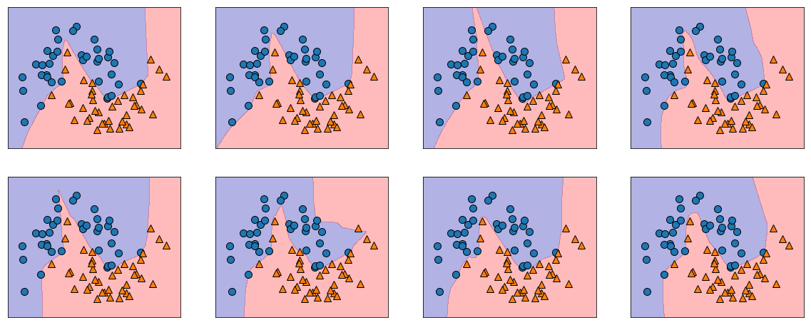


```python
mlp = MLPClassifier(random_state=42).fit(X_train,y_train)
print('训练集精度{:.2},测试集精度{:.2}'.format(mlp.score(X_train,y_train),mlp.score(X_test,y_test)))
```

    训练集精度0.85,测试集精度0.84


    D:\foreign\Python\py_version\Anaconda3.5\lib\site-packages\sklearn\neural_network\multilayer_perceptron.py:564: ConvergenceWarning: Stochastic Optimizer: Maximum iterations (200) reached and the optimization hasn't converged yet.
      % self.max_iter, ConvergenceWarning)


```python
# 计算训练集中的每个特征的平均值
mean_on_train = X_train.mean(axis=0)
#计算训练集中每个特征的标准差
std_on_train = X_train.std(axis=0)
#减去平均值，然后乘以标准差的倒数
X_train_scaled = (X_train-mean_on_train)/std_on_train
X_test_scaled = (X_test-mean_on_train)/std_on_train
mlp = MLPClassifier(random_state=0).fit(X_train_scaled,y_train)
print('训练集精度{:.2},测试集精度{:.2}'.format(mlp.score(X_train_scaled,y_train),mlp.score(X_test_scaled,y_test)))
```

    训练集精度0.85,测试集精度0.84


    D:\foreign\Python\py_version\Anaconda3.5\lib\site-packages\sklearn\neural_network\multilayer_perceptron.py:564: ConvergenceWarning: Stochastic Optimizer: Maximum iterations (200) reached and the optimization hasn't converged yet.
      % self.max_iter, ConvergenceWarning)


```python
mlp = MLPClassifier(max_iter=10000,random_state=0).fit(X_train_scaled,y_train)
print('训练集精度{},测试集精度{}'.format(mlp.score(X_train_scaled,y_train),mlp.score(X_test_scaled,y_test)))
```

    训练集精度0.96,测试集精度1.0


对于python用户来说，最为完善的是**keras、lasagna和tensor-flo**w，lasagna是基于theano库构建的，而**keras既可以用tensor-flow也可以用theano**。这些库提供了更为灵活的接口，可以用来构建神经网络并跟踪深度学习研究的快速发展。

### 优点、缺点和参数
**在机器学习的许多应用中，神经网络再次成为最先进的模型。**
- 优点：能够获取大量数据中包含的信息，并构建无比复杂的模型。给定足够的计算时间和数据，并且仔细调节参数，神经网络通常可以打败其他机器学习算法（无论是分类任务还是回归任务）
- 缺点：通常需要很长的训练时间，还需要仔细地预处理数据如果数据包含不同种类的特征，那么基于树的模型可能表现得更好。神经网络调参本身也是一门艺术。调节神经网络模型和训练模型的方法有很多种。
- 估计神经网络的复杂度：最重要的参数是层数和每层的隐单元个数。应该首先设置1个或2个隐层，然后可以逐步增加，每个隐层的节点个数通常与输入特征个数接近，但在几千个节点时很少会多于特征个数。
- 神经网络的调参的常用的方法时：首先创建一个大到足以过拟合的网络，确保这个网络可以对任务进行学习。知道训练数据可以被学习之后，要么缩小网络，要么增大alpha来增强正则化，可以提高泛化性能。
- 模型关注的参数：
    - 层数
    - 每层的节点个数
    - 正则化
    - 非线性
    - 求解参数，solver：默认选项是‘adam’，在大多数情况下效果都很好；‘lbfgs’的鲁棒性相当好，但在大型模型或大型数据集上的时间会比较长；‘sgd’许多深度学习研究人员都会用到，

### 分类器的不确定估计
一般来说，你感兴趣的不仅是分类器会预测一个测试点的属于哪个类别，还包括它对这个**预测的置信程度**。scikit-learn中有两个函数可用于获取分类器的不确定估计：
- **decision_function**
- **predict_proba**

大多数分类器（但不是全部）都至少有一个函数，很多分类器两个都有。


```python
from sklearn.ensemble import GradientBoostingClassifier
from sklearn.datasets import make_circles
import numpy as np
from sklearn.model_selection import train_test_split
X,y = make_circles(noise=0.25,factor=0.5)

#为了便于说明，将两个类别重命名为“blue”和“red”
y_named = np.array(["blue","red"])[y]

#我们可以对任意数组调用train_test_split
X_train,X_test,y_train_named,y_test_named ,y_train,y_test = train_test_split(X,y_named,y,random_state = 0)

#构建梯度提升模型
gbrt = GradientBoostingClassifier(random_state=0).fit(X_train,y_train_named)
```

### 决策函数
对于二分类的情况，**decision_function返回值的形状是（n_samples，），为每个样本都返回一个浮点数：**


```python
print("X_test.shape:{}".format(X_test.shape))
print('Decision function shape:{}'.format(gbrt.decision_function(X_test).shape))
```

    X_test.shape:(25, 2)
    Decision function shape:(25,)


```python
# 显示decision_function前几个元素
print("Decision function:{}".format(gbrt.decision_function(X_test)[:6]))
```

    Decision function:[-1.35041692  4.26214626 -3.93710237  0.00509282  3.80609676  3.26549305]


```python
#转化为正负号
print("Thresholded decision:{}".format(gbrt.decision_function(X_test)>0))
print("predictions:{}".format(gbrt.predict(X_test)))
```

    Thresholded decision:[False  True False  True  True  True  True False False  True False False
     False False False  True  True  True  True False  True False False False
     False]
    predictions:['blue' 'red' 'blue' 'red' 'red' 'red' 'red' 'blue' 'blue' 'red' 'blue'
     'blue' 'blue' 'blue' 'blue' 'red' 'red' 'red' 'red' 'blue' 'red' 'blue'
     'blue' 'blue' 'blue']


decision_function可以在**任意范围取值**，这取决于数据与模型参数，由于可以**任意缩放**，因此decision_function的输出往往**很难解释**。


```python
import mglearn
import matplotlib.pyplot as plt
fig,axes =plt.subplots(1,2,figsize =(13,5))
mglearn.tools.plot_2d_separator(gbrt,X,ax=axes[0],alpha=.4,fill=True,cm=mglearn.cm2)
scores_image = mglearn.tools.plot_2d_scores(gbrt,X,ax=axes[1],alpha=.4,cm=mglearn.ReBl)
for ax in axes:
    mglearn.discrete_scatter(X_test[:,0],X_test[:,1],y_test,markers='^',ax=ax)
    mglearn.discrete_scatter(X_train[:,0],X_train[:,1],y_train,markers='o',ax=ax)
    ax.set_title("Feature 0")
    ax.set_title("Feature 1")
cbar = plt.colorbar(scores_image,ax=axes.tolist())
axes[0].legend({"Test class 0 ","Test class 1","Train class 0","Train class 1"},ncol=4,loc=(.1,1.1))
```


    <matplotlib.legend.Legend at 0x1db64a350b8>


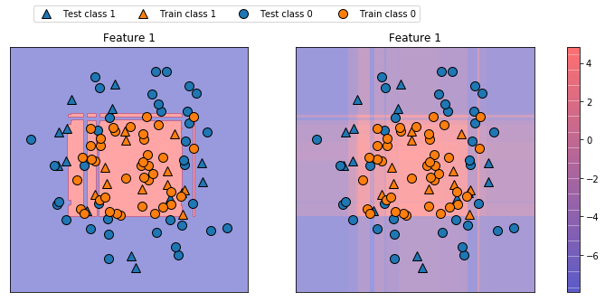


上面两图中，既给出预测结果，又给出分类器的置信程度，这样给出的信息量更大。但在上面的图像中，很难分辨出两个类别之间的边界。

### 预测的概率
.predict_proba的输出是**每.个类别的概率**，.通常比decision_function的输出更容易理解，**对.于二分类问题，它的形状始终是（n_samples,2）**。


```python
print("shape of probabilities:{}".format(gbrt.predict_proba(X_test).shape))
print("Predicted probabilities:\n{}".format(gbrt.predict_proba(X_train)[:11]))
```

    shape of probabilities:(25, 2)
    Predicted probabilities:
    [[0.01163371 0.98836629]
     [0.97144005 0.02855995]
     [0.02785793 0.97214207]
     [0.01163371 0.98836629]
     [0.98663291 0.01336709]
     [0.0125965  0.9874035 ]
     [0.01045788 0.98954212]
     [0.98876325 0.01123675]
     [0.97906531 0.02093469]
     [0.9734402  0.0265598 ]
     [0.01747954 0.98252046]]


由于两个类别的概率之和为1，因此只有一个类别的概率超过50%，这个类别就是模型的预测结果。

分类器对大部分点的置信程度都相对较高的。**不确定度大小实际上反映了数据依赖于模型和参数的不确定度**。**过拟合**更强的模型可能会做出**置信程度更高**的预测，即使可能是错的。**复杂度越低**的模型通常对预测的**不确定度越大**。**如果模型给出的不确定度符合实际情况，那么这个模型被称为校正（calibrated）模型。**在校正模型总，如果预测有70%的确定度，那么它在70%的情况下正确。


```python
import mglearn
import matplotlib.pyplot as plt
fig,axes =plt.subplots(1,2,figsize =(13,5))
mglearn.tools.plot_2d_separator(gbrt,X,ax=axes[0],alpha=.4,fill=True,cm=mglearn.cm2)
scores_image = mglearn.tools.plot_2d_scores(gbrt,X,ax=axes[1],alpha=.4,cm=mglearn.ReBl,function='predict_proba')
for ax in axes:
    mglearn.discrete_scatter(X_test[:,0],X_test[:,1],y_test,markers='^',ax=ax)
    mglearn.discrete_scatter(X_train[:,0],X_train[:,1],y_train,markers='o',ax=ax)
    ax.set_title("Feature 0")
    ax.set_title("Feature 1")
cbar = plt.colorbar(scores_image,ax=axes.tolist())
axes[0].legend({"Test class 0 ","Test class 1","Train class 0","Train class 1"},ncol=4,loc=(.1,1.1))
```


    <matplotlib.legend.Legend at 0x1db65de93c8>


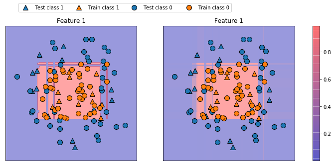


### 多分类问题的不确定度
**decision_function和predict_proba也适用于多分类问题。**


```python
from sklearn.datasets import load_iris
iris = load_iris()
X_train,X_test,y_train,y_test = train_test_split(iris.data,iris.target,random_state= 42)
gbrt= GradientBoostingClassifier(learning_rate=0.01,random_state=0).fit(X_train,y_train)
print("Decision function shape:{}".format(gbrt.decision_function(X_test).shape))
print("Decision function:\n{}".format(gbrt.decision_function(X_test)[:6,:]))
```

    Decision function shape:(38, 3)
    Decision function:
    [[-0.52931069  1.46560359 -0.50448467]
     [ 1.51154215 -0.49561142 -0.50310736]
     [-0.52379401 -0.4676268   1.51953786]
     [-0.52931069  1.46560359 -0.50448467]
     [-0.53107259  1.28190451  0.21510024]
     [ 1.51154215 -0.49561142 -0.50310736]]


多于多分类的情况，decision_function的形状为（n_samples,n_classes）,**每一列对应每个类别的“确定度分数”**，分数较高的**类别可能性更大**，得分较低的类别可能性较小。可以找出每个数据点的最大元素，从而利用这些分数再现预测结果：


```python
print("argmax of decision function:\n{}".format(np.argmax(gbrt.decision_function(X_test),axis=1)))
print("predictions\n{}".format(gbrt.predict(X_test)))
```

    argmax of decision function:
    [1 0 2 1 1 0 1 2 1 1 2 0 0 0 0 1 2 1 1 2 0 2 0 2 2 2 2 2 0 0 0 0 1 0 0 2 1
     0]
    predictions
    [1 0 2 1 1 0 1 2 1 1 2 0 0 0 0 1 2 1 1 2 0 2 0 2 2 2 2 2 0 0 0 0 1 0 0 2 1
     0]


predict_proba输出的形状相同，也是**（n_samples,n_classes）**,同样，每个数据点所有可能类别的概率之和为1。


```python
# 显示predict_proba的前几个元素
print("predicted probabilities:\n{}".format(gbrt.predict_proba(X_test)[:6]))
# 显示每行的和都是1
print("sums:{}".format(gbrt.predict_proba(X_test)[:6].sum(axis=1)))
```

    predicted probabilities:
    [[0.10664722 0.7840248  0.10932798]
     [0.78880668 0.10599243 0.10520089]
     [0.10231173 0.10822274 0.78946553]
     [0.10664722 0.7840248  0.10932798]
     [0.10825347 0.66344934 0.22829719]
     [0.78880668 0.10599243 0.10520089]]
    sums:[1. 1. 1. 1. 1. 1.]


## 小结与展望
- 最近邻
    - 适用于小型数据集，是很好的基准模型，很容解释。
- 线性模型
    - 非常可靠的首选算法，适用于非常大的数据集，也适用于高维数据。
- 决策树
    - 速度很快，不需要数据缩放，可以可视化，很容易解释
- 随机森林
    - 几乎总是比单棵决策树的表现要好，鲁棒性很好，非常强大。不适用于高维稀疏数据。
- 梯度提升决策树
    - 精度通常比随机森林略高。与随机森林相比，训练速度更慢，但预测速度更快，需要的内存也更少。比随机森林需要更多的参数调节。
- 支持向量机
    - 对于特征含义相似的中等大小的数据集很强大。需要数据缩放，对参数敏感。
- 神经网络
    - 可以构建非常复杂的模型，特别是对于大型数据集而言。对数据缩放敏感，对参数选取敏感，大型网络需要很长的训练时间。

面对新数据集，通常最好先从简单模型开始，比如线性模型、朴素贝叶斯或最近邻分类器，看能得到什么样的结果。对数据有了进一步了解之后，**可以考虑用于构建更复杂模型的算法，比如随机森林、梯度提升决策树、SVM或神经网络。**

# 无监督学习与预处理
无监督学习包括**没有已知输出**，**没有老师**指导学习算法的各种机器学习算法。在无监督学习中，学习算法**只有输入数据**，并需要从这些数据中**提取知识**。

## 无监督学习的类型
- **降维**：接受包含许多特征的数据高维表示，并找到表示该数据的一种新方法，用较少的特征就可以概括其重要特性。
- **主体提取**：找到每个文档中讨论的未知主题，并学习每个文档中出现了哪些主题。
- **聚类**：将数据划分成不同的组，每组包含相似的物项。

## 无监督学习的挑战
无监督学习的一个主要挑战就是**评估算法是否学到了有用的东西**。无监督学习算法一般用于不包含任何标签信息的数据，所以我们不知道正确的输出应该是什么。因此很难判断一个模型是否“表现很好”。**评估无监督算法结果的唯一方法就是人工检查。**

## 预处理与缩放
一些算法（神经网络和SVM）对**数据缩放非常敏感**。因此，通常的做法是对特征进行调节，使数据表示更适合于这些算法。通常来说，这是对数据的一种简单的按**特征的缩放和移动**。


```python
import mglearn
mglearn.plots.plot_scaling()
```


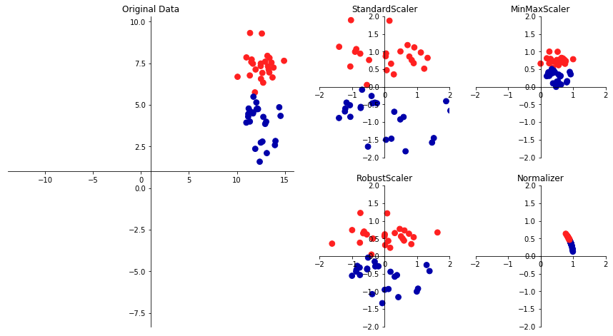


### 不同类型的预处理
- **StandardScaler**:确保每个特征的平均值为0、方差为1，使所有特征都位于同一量级。
- **RobustScaler**:确保每个特征的统计属性都位于同一范围，但RobustScaler使用的是中位数和四分位数，而不是平均值和方差。这样RobustScaler会忽略与其他点有很大不同的数据点（比如测量误差）。
- **MinMaxScaler**：使所有的特征刚好位于0到1之间。
- **Normalizer**：一种完全不同的缩放方法，它对每个数据点进行缩放，使得特征向量的欧式长度等于1。换句话说，它将一个数据点投射到半径为1的圆上（对于更高维的情况，是球面）。这意味着每个数据点的缩放比例都不相同（乘以其长度的倒数）。


```python
from sklearn.datasets import load_breast_cancer
from sklearn.model_selection import train_test_split
cancer = load_breast_cancer()
X_trian,X_test,y_train,y_test = train_test_split(cancer.data,cancer.target,random_state =1)
print(X_trian.shape)
print(X_test.shape)
```

    (426, 30)
    (143, 30)


```python
from sklearn.preprocessing import MinMaxScaler
scaler = MinMaxScaler()
scaler.fit(X_trian)
```


    MinMaxScaler(copy=True, feature_range=(0, 1))


使用fit方法拟合缩放器（scaler），并将其应用于训练数据。对于MinMaxScaler来说，**fit方法计算训练集中每个特征大最大值和最小值**。与第2章中的分类器和回归器不同，在对缩放器调用fit只提供了X_train，而不用y_train。


```python
#变换数据
X_train_scaled = scaler.transform(X_trian)
# 在缩放之前和之后分别打印数据集属性
print("transformed shape:{}".format(X_train_scaled.shape))
print("per-feature minimum before scaling:\n {}".format(X_trian.min(axis=0)))
print("per-feature maximum before scaling:\n {}".format(X_trian.max(axis=0)))
print("per-feature minimum after scaling:\n {}".format(X_train_scaled.min(axis=0)))
print("per-feature maximum after scaling:\n {}".format(X_train_scaled.max(axis=0)))
```

    transformed shape:(426, 30)
    per-feature minimum before scaling:
     [6.981e+00 9.710e+00 4.379e+01 1.435e+02 5.263e-02 1.938e-02 0.000e+00
     0.000e+00 1.060e-01 5.024e-02 1.153e-01 3.602e-01 7.570e-01 6.802e+00
     1.713e-03 2.252e-03 0.000e+00 0.000e+00 9.539e-03 8.948e-04 7.930e+00
     1.202e+01 5.041e+01 1.852e+02 7.117e-02 2.729e-02 0.000e+00 0.000e+00
     1.566e-01 5.521e-02]
    per-feature maximum before scaling:
     [2.811e+01 3.928e+01 1.885e+02 2.501e+03 1.634e-01 2.867e-01 4.268e-01
     2.012e-01 3.040e-01 9.575e-02 2.873e+00 4.885e+00 2.198e+01 5.422e+02
     3.113e-02 1.354e-01 3.960e-01 5.279e-02 6.146e-02 2.984e-02 3.604e+01
     4.954e+01 2.512e+02 4.254e+03 2.226e-01 9.379e-01 1.170e+00 2.910e-01
     5.774e-01 1.486e-01]
    per-feature minimum after scaling:
     [0. 0. 0. 0. 0. 0. 0. 0. 0. 0. 0. 0. 0. 0. 0. 0. 0. 0. 0. 0. 0. 0. 0. 0.
     0. 0. 0. 0. 0. 0.]
    per-feature maximum after scaling:
     [1. 1. 1. 1. 1. 1. 1. 1. 1. 1. 1. 1. 1. 1. 1. 1. 1. 1. 1. 1. 1. 1. 1. 1.
     1. 1. 1. 1. 1. 1.]


**变换后的数据形状与原始数据相同，特征只是发生了移动和缩放。**可以看到，现在所有特征都位于0到1之间，这也符合我们的预期。


```python
#对测试集进行变换
X_test_scaler = scaler.transform(X_test)
print("per-feature minimum after scaling:\n {}".format(X_test_scaler.min(axis=0)))
print("per-feature maximum after scaling:\n {}".format(X_test_scaler.max(axis=0)))
```

    per-feature minimum after scaling:
     [ 0.0336031   0.0226581   0.03144219  0.01141039  0.14128374  0.04406704
      0.          0.          0.1540404  -0.00615249 -0.00137796  0.00594501
      0.00430665  0.00079567  0.03919502  0.0112206   0.          0.
     -0.03191387  0.00664013  0.02660975  0.05810235  0.02031974  0.00943767
      0.1094235   0.02637792  0.          0.         -0.00023764 -0.00182032]
    per-feature maximum after scaling:
     [0.9578778  0.81501522 0.95577362 0.89353128 0.81132075 1.21958701
     0.87956888 0.9333996  0.93232323 1.0371347  0.42669616 0.49765736
     0.44117231 0.28371044 0.48703131 0.73863671 0.76717172 0.62928585
     1.33685792 0.39057253 0.89612238 0.79317697 0.84859804 0.74488793
     0.9154725  1.13188961 1.07008547 0.92371134 1.20532319 1.63068851]


可以发现缩放后的最大值和最小值不是1和0，有些特征甚至在0~1的范围之外！**MinMaxScaler(以及其他所有缩放器)总是对训练集和测试集应用完全相同的变换。**也就是说，**transform方法总是减去训练集的最小值，然后除以训练集的范围，而这两个值与测试集的最小值个范围并不相同。 **


```python
from sklearn.datasets import make_blobs
import matplotlib.pyplot as plt
import mglearn
#g构造数据
X,_ = make_blobs(n_samples=50,centers=5,random_state=4,cluster_std=2)
X_train,X_test=train_test_split(X,random_state=5,test_size=.1)

#绘制训练集和测试集
fig,axes = plt.subplots(1,3,figsize=(13,5))
axes[0].scatter(X_train[:,0],X_train[:,1],c=mglearn.cm2(0),label="Training Set",s=60)
axes[0].scatter(X_test[:,0],X_test[:,1],c=mglearn.cm2(1),label="Test Set",s=60,marker='^')
axes[0].legend(loc ="upper left")
axes[0].set_title("Origin Data")

# 利用MinMaxScaler正确缩放数据
scaler = MinMaxScaler()
scaler.fit(X_train)
X_train_scaled = scaler.transform(X_train)
X_test_scaled = scaler.transform(X_test)
axes[1].scatter(X_train_scaled[:,0],X_train_scaled[:,1],c=mglearn.cm2(0),label="Training Set",s=60)
axes[1].scatter(X_test_scaled[:,0],X_test_scaled[:,1],c=mglearn.cm2(1),label="Test Set",s=60,marker='^')
axes[1].set_title("Scaled Data")

## 利用MinMaxScaler错误缩放数据，对每个数据进行缩放
test_scaler = MinMaxScaler()
test_scaler.fit(X_test)
X_test_scaled_badly = test_scaler.transform(X_test)
axes[2].scatter(X_train_scaled[:,0],X_train_scaled[:,1],c=mglearn.cm2(0),label="Training Set",s=60)
axes[2].scatter(X_test_scaled_badly[:,0],X_test_scaled_badly[:,1],c=mglearn.cm2(1),label="Test Set",s=60,marker='^')
axes[2].set_title("Improperly Scaled Data")

for ax in axes:
    ax.set_xlabel("Feature 0")
    ax.set_ylabel("Feature 1")
```


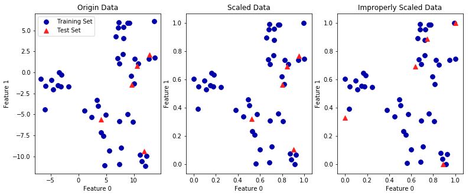


- 第一张图是未缩放的二维数据集，其中训练集用圆形表示，测试集用三角形表示。
- 第二张图中是同样的数据，但使用MinMaxScaler缩放。第二张图中的数据集看起来与第一张图中的完全相同，知识坐标轴刻度发生了变化。但是测试数据的特征最大值和最小值并不是0和1。
- 第三张展示了如果我们对训练集和测试集分别进行缩放会发生什么。在这种情况下，对训练集和测试集而言，特征的最大值和最小值都是1和0。但现在数据集看起来不一样。测试集相对训练集的移动不一致，因为它们分别做啦吧不同的缩放，随意改变了数据的排列，这显然是错误的。


```python
#快捷与高效的替代方法
from sklearn.preprocessing import StandardScaler
scaler = StandardScaler()
# 依次调用fit和transform（使用方法链）
X_scaled_m1 = scaler.fit(X_train).transform(X_train)
# 结果相同，但计算更加高效
X_scaled_m2 = scaler.fit_transform(X_train)
```

### 预处理对监督学习的作用


```python
from sklearn.svm import SVC
X_train,X_test,y_train,y_test=train_test_split(cancer.data,cancer.target,random_state=0)
svm = SVC(C=100)
svm.fit(X_train,y_train)
print("Nothong Test set accuracy:{:.2}".format(svm.score(X_test,y_test)))
```

    Nothong Test set accuracy:0.63


```python
scaler = MinMaxScaler()
X_train_scaled = scaler.fit_transform(X_train)
X_test_scaled = scaler.transform(X_test)
svm.fit(X_train_scaled,y_train)
print("MinMaxScaler Test set accuracy:{:.2}".format(svm.score(X_test_scaled,y_test)))
```

    MinMaxScaler Test set accuracy:0.97


```python
scaler = StandardScaler()
X_train_scaled = scaler.fit_transform(X_train)
X_test_scaled = scaler.transform(X_test)
svm.fit(X_train_scaled,y_train)
print("StandardScaler Test set accuracy:{:.2}".format(svm.score(X_test_scaled,y_test)))
```

    StandardScaler Test set accuracy:0.96


正如我们上面所见，数据缩放的作用非常显著。虽然数据缩放不涉及任何复杂的数学，但良好的做法仍然是使用scikit-learn提供的缩放机制，而不是自己重新实现它们，因为即使在这些简单的计算中也容易放错。

## 降维、特征提取与流行学习
利用无监督学习进行数据变换可能有很多种目的，最常见的目的就是可视化、压缩数据，以及寻找信息量更大的数据表示以用于进一步的处理。
- 主成分分析
- 非负矩阵分解（NMF）
- t-SNE
第一个通常用于特征提取，后面通常用于二维散点图的可视化

### 主成分分析
主成分分析（principal component analysis,PCA）是**一种旋转数据集的方法，旋转后的特征在统计上不相关。**在做完这种旋转之后，通常是根据新特征对解释数据的重要性来选择它的一个子集。


```python
mglearn.plots.plot_pca_illustration()
```


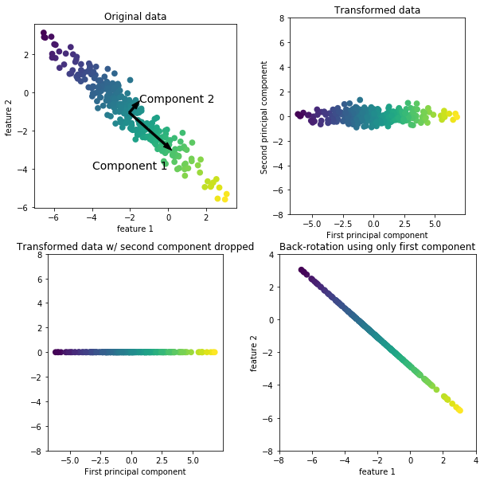


- 第一张图显示的是原始数据点，用不同颜色加以区分。
- 第二张图，显示的同样的数据，但现在将其旋转，使得第一主成分与x轴平行且第二主成分与y轴平行。在旋转之前，从数据中减去平均值。使得变换后的数据以零为中心。在PCA找到的旋转表示中，两个坐标轴是不相关的，也就是说，对于这种数据表示，除对角线，相关矩阵全部为零。
- 第三张图，将数据从二维数据集降为一维数据集。
- 第四张图，可以反向旋转并将平均值重新加到数据中。

**1、将PCA应用于cancer数据集并可视化**

PCA最常见的应用之一就是将高维数据可视化。不过有一种更简单的可视化方法——对每个特征分别计算两个类别。


```python
import numpy as np
import matplotlib.pyplot as plt
from sklearn.datasets import load_breast_cancer
import mglearn
cancer = load_breast_cancer()
fig,axes = plt.subplots(15,2,figsize=(10,20))
malignant = cancer.data[cancer.target==0]
begin = cancer.data[cancer.target==1]
ax=axes.ravel()
for i in range(30):
    _,bins = np.histogram(cancer.data[:,i],bins=50)
    ax[i].hist(malignant[:,i],bins=bins,color=mglearn.cm3(0),alpha=.5)
    ax[i].hist(begin[:,i],bins=bins,color=mglearn.cm3(2),alpha=.5)
    ax[i].set_title(cancer.feature_names[i])
    ax[i].set_yticks(())
ax[0].set_xlabel("Feature magnitude")
ax[0].set_ylabel("Frequency")
ax[0].legend(["malignant","begin"],loc="best")
fig.tight_layout()
```


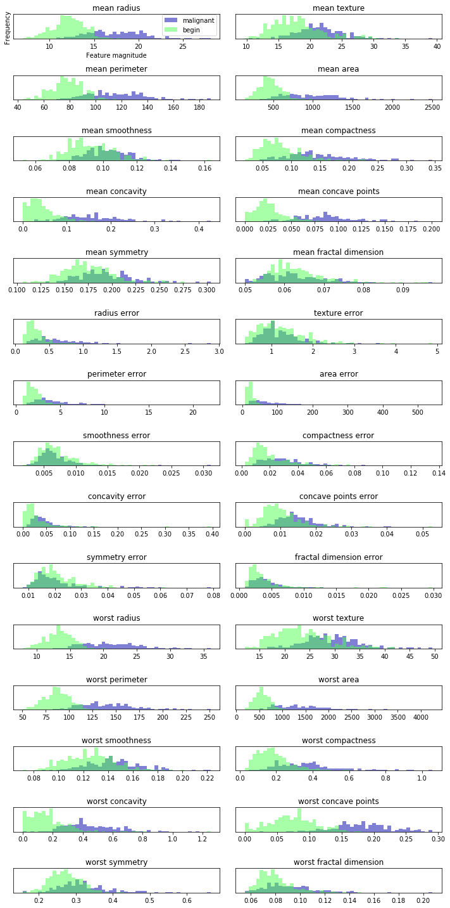


这里为每个特征创建一个直方图，计算具有某一特征的数据点在特定范围内（叫作bin）的出现频率。每张图都包含两个直方图一个是良性类别的所有点（蓝色），一个是恶性类别的所有点（红色）。这样我们可以了解每个特征在两个类别中的分布情况，也可以猜测哪些特征能够好地区分良性样本和恶性样本。例如“smoothness error”特征似乎没有什么信息量，因为两个直方图大部分都重叠在一起，而“worst concave points”特征看起来信息量相当大，因为两个直方图的交集很小。

在应用PCA之前，利用StandarScaler缩放数据，使每个特征的方差均为1。


```python
from sklearn.preprocessing import StandardScaler
scaler = StandardScaler()
scaler.fit(cancer.data)
X_scaled = scaler.transform(cancer.data)
```

学习并应用PCA变换与应用预处理变换一样简单。将PCA对象实例化，调用fit方法找到主成分，然后调用transform来旋转并降维。默认情况下，PCA仅旋转（并移动）数据，但保留所有的主成分。为了降低数据的维度，需要在创建PCA对象时指定想要保留的主成分个数。


```python
from sklearn.decomposition import PCA
# 保留数据前两个成分
pca = PCA(n_components=2)
#对数据拟合pca模型
pca.fit(X_scaled)
#将数据变换到前两个主成分的方向上
X_pca = pca.transform(X_scaled)
print("Origin shape:{}".format(str(X_scaled.shape)))
print("Reduced shape:{}".format(str(X_pca.shape)))
```

    Origin shape:(569, 30)
    Reduced shape:(569, 2)


```python
#对第一个第二个主成分作图，按类别着色
plt.figure(figsize=(8,8))
mglearn.discrete_scatter(X_pca[:,0],X_pca[:,1],cancer.target)
plt.legend(cancer.target_names,loc="best")
plt.gca().set_aspect("equal")
plt.xlabel("First principal component")
plt.ylabel("Second principal component")
```


    Text(0,0.5,'Second principal component')


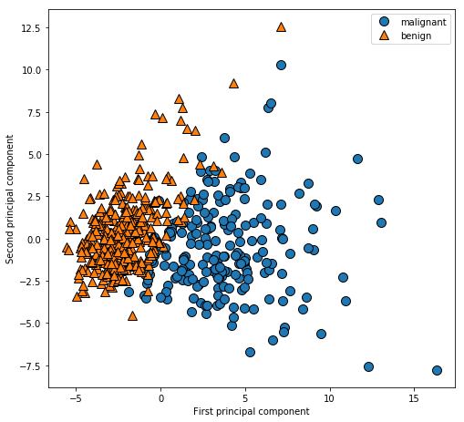


PCA是一种无监督方法，在寻找旋转方向时没有用到任何类别信息。PCA的一个缺点在于，通常**不容易对图中的两个轴做出解释**，主成分对应于原始数据中的方向，所以它们是原始特征的组合，但这些**组合往往非常复杂**。


```python
print("PCA component shape:{}".format(pca.components_.shape))
print("PCA components:\n{}".format(pca.components_))
```

    PCA component shape:(2, 30)
    PCA components:
    [[ 0.21890244  0.10372458  0.22753729  0.22099499  0.14258969  0.23928535
       0.25840048  0.26085376  0.13816696  0.06436335  0.20597878  0.01742803
       0.21132592  0.20286964  0.01453145  0.17039345  0.15358979  0.1834174
       0.04249842  0.10256832  0.22799663  0.10446933  0.23663968  0.22487053
       0.12795256  0.21009588  0.22876753  0.25088597  0.12290456  0.13178394]
     [-0.23385713 -0.05970609 -0.21518136 -0.23107671  0.18611302  0.15189161
       0.06016536 -0.0347675   0.19034877  0.36657547 -0.10555215  0.08997968
      -0.08945723 -0.15229263  0.20443045  0.2327159   0.19720728  0.13032156
       0.183848    0.28009203 -0.21986638 -0.0454673  -0.19987843 -0.21935186
       0.17230435  0.14359317  0.09796411 -0.00825724  0.14188335  0.27533947]]


```python
#用热力图将系数可视化
plt.matshow(pca.components_,cmap="viridis")
plt.yticks([0,1],["First component","Second component"])
plt.colorbar()
plt.xticks(range(len(cancer.feature_names)),cancer.feature_names,rotation=60,ha='left')
plt.xlabel("Feature")
plt.ylabel("Principal components")
```


    Text(0,0.5,'Principal components')


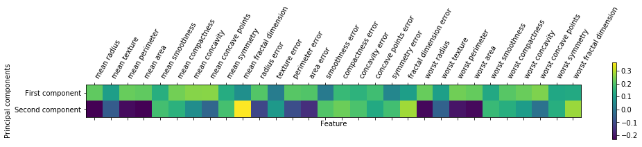


- 可以看到，在第一个主成分中，所有特征的符号相同（均为正，但前面我们提到过，箭头指向哪个方向无关紧要）。这意味着在所有特征之间存在普遍的相关性。如果一个测量值较大的话，其他的测量值可能也较大。
- 第二个主成分的符号有正有负，而且两个主成分包含所有30个特征。

**2、特征提取的特征脸**

 特征提取：**找到一种数据表示，比给定的原始表示更适合分析**。一个很好的应用实例就是图像，图像由像素组成，通常储存为红绿蓝（RGB）强度。

### 非负矩阵分解
非负矩阵分解（non-negative matrix factorization,NMF）是另一种无监督学习算法，其目的在于提取有用的特征。它的工作原理类似PCA，也可以用于降维。
- 与PCA相同点，试图将每个数据点写成一些分量的加权求和
- 与PCA不同点，PCA要的是正交分量，并且能够解释尽可能多的数据方差；而NMF中，希望分量和系数均为非负，希望分量和系数都大于0或等于0。
- 缺陷：这种方法只能应用于每个特征都是非负的数据，因为非负分量的非负求和不可能变为负值。
- 总结：与PCA相比，NMF得到的分量更容易解释，因为为负的分量可能会导致难以解释的抵消效应。


```python
mglearn.plots.plot_nmf_illustration()
```


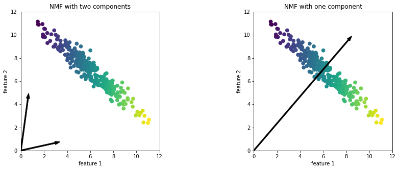


- 对于两个分量的NMF（左图所示），显然所有数据点都可以写成这两个分量的正数组合。如果有足够多的分量能够完美地重建数据（分量的个数与特征个数相同），那么算法会选择指向数据极值的方向。
- 如果仅使用一个分量，那么NMF会创建一个指向平均值的分量，因为指向这里可以对数据做出最好的解释。

### 用t-SNE进行流形学习
虽然PCA通常用于变换数据的首选方法，使能够用散点图将其可视化，但这一方法的性质（先旋转然后减少方向）限制了其有效性。有一类用于可视化的算法叫作**流形学习算法**，它允许进行更复杂的映射，用处也可以给出更好的可视化，其中特别有用的一个就是t-SNE算法。
- 流形学习算法主要用于可视化，因此很少用来生成两个以上的新特征。
- 流形学习对探索性数据分析是很有用的，但如果最终目标是监督学习的话，则很少用。
- 原理：找到数据的一个二维表示，尽可能地保持数据点之间的距离。t-SNE首先给出每个数据点的随机二维点表示，然后尝试让在原始特征空间中距离较近的点更加靠近，原始特征空间中相距较远的点更加远离。t-SNE重点关注距离较近的点，而不是保持距离较远的点之间的距离，它试图保存那些表示哪些点比较靠近的信息。


```python
from sklearn.datasets import load_digits
import matplotlib.pyplot as plt
digits = load_digits()
fig,axes = plt.subplots(2,5,figsize=(10,5),subplot_kw={"xticks":(),"yticks":()})
for ax,img in zip(axes.ravel(),digits.images):
    ax.imshow(img)
```


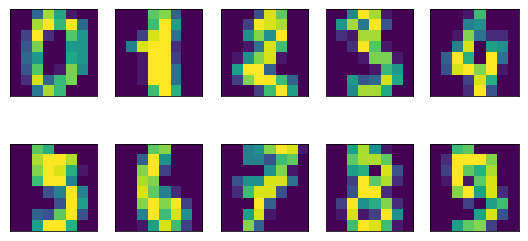


```python
from sklearn.decomposition import PCA
#用PCA将将到二维数据可视化
pca= PCA(n_components=2)
pca.fit(digits.data)
#将digits数据变换到前两个主成分的方向上
digits_pca = pca.transform(digits.data)
colors = ["#476A2A","#7851BB","#BD3430","#4A2D4E","#875525","#A83683","#4E655E","#853541","#3A3120","#535D8E"]
plt.figure(figsize=(10,10))
plt.xlim(digits_pca[:,0].min(),digits_pca[:,0].max())
plt.ylim(digits_pca[:,1].min(),digits_pca[:,1].max())
for i in range(len(digits.data)):
    #将数据实际绘制成文本，而不是散点
    plt.text(digits_pca[i,0],digits_pca[i,1],str(digits.target[i]),color = colors[digits.target[i]],fontdict={"weight":"bold","size":9})
plt.xlabel("First principal component")
plt.ylabel("Second principal component")
```


    Text(0,0.5,'Second principal component')


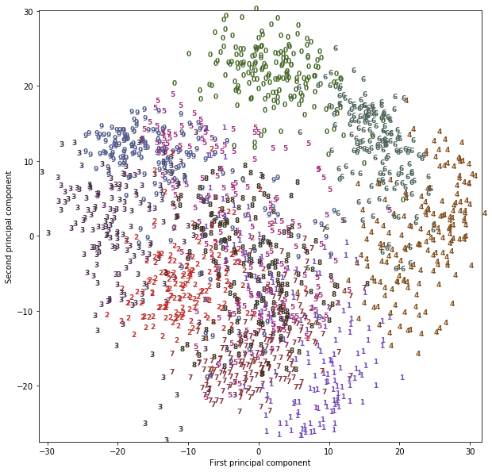


这里每个类别对应数字作为符号来显示每个类别的位置。利用前两个主成分可以将数字0、6和4相对较好的地分开，尽管仍有重叠。大部分其他数字都大量重叠在一起。


```python
#使用tsne变换数据
from sklearn.manifold import TSNE
tsne = TSNE(random_state=42)
digists_tsne = tsne.fit_transform(digits.data)
```


```python
plt.figure(figsize=(10,10))
plt.xlim(digists_tsne[:,0].min(),digists_tsne[:,0].max()+1)
plt.ylim(digists_tsne[:,1].min(),digists_tsne[:,1].max()+1)
for i in range(len(digits.data)):
    #将数据实际绘制成文本，而不是散点
    plt.text(digists_tsne[i,0],digists_tsne[i,1],str(digits.target[i]),color = colors[digits.target[i]],fontdict={"weight":"bold","size":9})
plt.xlabel("t-SNE feature 0")
plt.ylabel("t-SNE feature 1")
```


    Text(0,0.5,'t-SNE feature 1')


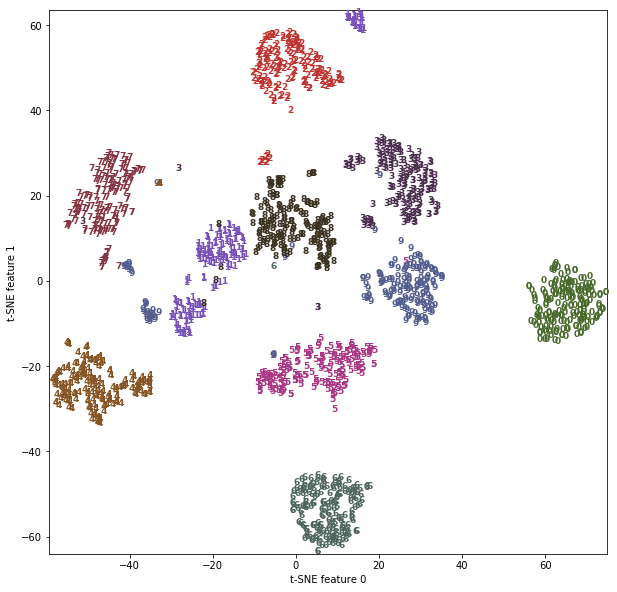


t-SNE的结果非常棒，多有类别都被明确分开。数字1和9被分成几块，但大多数类别都形成一个密集的组。

## 聚类
**聚类（clustering）**是将数据集划分成组的任务，这些组叫作簇（cluster）。
- 其目标是划分数据，使得一个簇内的数据点非常相似且不同簇内的数据点非常不同。
- 与分类算法相似，聚类算法为每个数据点分配（或预测）一个数字，表示这个点属于哪个簇。

### k均值聚类
k均值聚类是最简单也是最常用的聚类算法之一。它试图找到代表数据特定区域的簇中心。算法交替执行以下两个步骤：
- **将每个数据点分配给最近的簇中心，然后将每个簇中心设置为所分配的所有数据点的平均值。**
- **重复上面过程，如果簇的分配不再发生变化，那么算法结束。**


```python
import mglearn
mglearn.plots.plot_kmeans_algorithm()
```


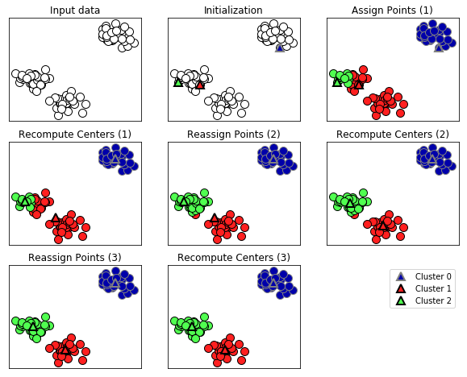


```python
mglearn.plots.plot_kmeans_boundaries()
```


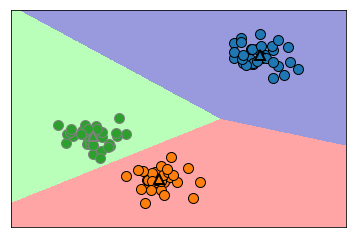


```python
from sklearn.datasets import make_blobs
from sklearn.cluster import KMeans

#生成模拟的二维数据
X,y = make_blobs(random_state=1)
#构建聚类模型
kmeans = KMeans(n_clusters=3)
kmeans.fit(X)
print("Cluster memberships:\n{}".format(kmeans.labels_))
```

    Cluster memberships:
    [1 0 0 0 2 2 2 0 1 1 0 0 2 1 2 2 2 1 0 0 2 0 2 1 0 2 2 1 1 2 1 1 2 1 0 2 0
     0 0 2 2 0 1 0 0 2 1 1 1 1 0 2 2 2 1 2 0 0 1 1 0 2 2 0 0 2 1 2 1 0 0 0 2 1
     1 0 2 2 1 0 1 0 0 2 1 1 1 1 0 1 2 1 1 0 0 2 2 1 2 1]


可以看到，聚类算法与分类算法有些类似，每个元素都有一个标签。但并不存在真实的标签，因此标签本身没有**先验意义**。而且每次运行聚类算法可能会得到不同的簇编号，原因在于初始化的随机性质。


```python
mglearn.discrete_scatter(X[:,0],X[:,1],kmeans.labels_,markers='o')
mglearn.discrete_scatter(kmeans.cluster_centers_[:,0],kmeans.cluster_centers_[:,1],[0,1,2],markers='^',markeredgewidth=2)
```


    [<matplotlib.lines.Line2D at 0x24431414470>,
     <matplotlib.lines.Line2D at 0x24431414400>,
     <matplotlib.lines.Line2D at 0x24431420a90>]


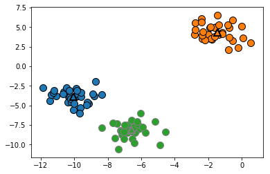


可以使用更多或更少的簇中心


```python
fig,axes = plt.subplots(1,2,figsize=(10,5))

#使用2个簇类中心
kmeans = KMeans(n_clusters=2)
kmeans.fit(X)
assignments = kmeans.labels_
mglearn.discrete_scatter(X[:,0],X[:,1],assignments,ax=axes[0])

#使用5个簇类中心
kmeans = KMeans(n_clusters=5)
kmeans.fit(X)
assignments = kmeans.labels_
mglearn.discrete_scatter(X[:,0],X[:,1],assignments,ax=axes[1])
```


    [<matplotlib.lines.Line2D at 0x24430f0d160>,
     <matplotlib.lines.Line2D at 0x24430f0d588>,
     <matplotlib.lines.Line2D at 0x24430f0da20>,
     <matplotlib.lines.Line2D at 0x24430f0de48>,
     <matplotlib.lines.Line2D at 0x24430ee12b0>]


**1.k均值的失败案例**

即使你指定给定数据集中簇的“正确”个数，k均值可能也不是总能找到它们。
- 每个簇仅由其中心定义，这意味着每个簇都是凸形。
- k均值只能找到相对简单的形状。
- k均值还假设所有簇在某种程度上具有相同的“直径”，它总是将簇之间的边界刚好画在簇中心的中间位置。


```python
x_varied,y_varied = make_blobs(n_samples=200,cluster_std=[1.0,2.5,0.5],random_state=170)
y_pred = KMeans(n_clusters=3,random_state=0).fit_predict(x_varied)
mglearn.discrete_scatter(x_varied[:,0],x_varied[:,1],y_pred)
plt.legend(["cluster 0","cluster 1","cluster 2"],loc="best")
plt.xlabel("Feature 0")
plt.ylabel("Feature 1")
```


    Text(0,0.5,'Feature 1')


图表显示，左下方的密集区域是第一个簇，右上方的密集区域是第二个，中间密度较小的区域是第三个。但事实上，簇0和簇1都包含一些远离簇中的其他点的点。k均值还假设所有方向对每个簇都同等重要。图表显示，数据中包含明确分开的三部分。但是这三部分被沿着对角线方向拉长。由于k均值仅考虑到最近簇中心的距离，所以它无法处理这种类型的数据：


```python
#生成一些随机分组数据
import numpy as np
X,y = make_blobs(random_state=170,n_samples=600)
rng = np.random.RandomState(74)

#变换数据使其拉长
transformation = rng.normal(size=(2,2))
X = np.dot(X,transformation)

#将数据聚类成3个簇
kmeans = KMeans(n_clusters=3)
kmeans.fit(X)
y_pred = kmeans.predict(X)

#画图
plt.scatter(X[:,0],X[:,1],c=y_pred,cmap=mglearn.cm3)
plt.scatter(kmeans.cluster_centers_[:,0],kmeans.cluster_centers_[:,1],marker='^',c=[0,1,2],s=100,linewidths=2,cmap=mglearn.cm3)
plt.xlabel("Feature 0")
plt.ylabel("Feature 1")
```


    Text(0,0.5,'Feature 1')


如果簇的形状更加复杂，那么k均值的表现也很差。


```python
#生成模拟的two_moons数据
from sklearn.datasets import make_moons
X,y = make_moons(n_samples=200,noise=0.05,random_state=0)

#将数据聚类成2个簇
kmeans = KMeans(n_clusters=2)
kmeans.fit(X)
y_pred = kmeans.predict(X)

#画出簇分配和簇中心
plt.scatter(X[:,0],X[:,1],c=y_pred,cmap=mglearn.cm2,s=60)
plt.scatter(kmeans.cluster_centers_[:,0],kmeans.cluster_centers_[:,1],marker='^',c=[mglearn.cm2(0),mglearn.cm2(1)],s=100,linewidths=2)
plt.xlabel("Feature 0")
plt.ylabel("Feature 1")
```


    Text(0,0.5,'Feature 1')


**2.矢量量化，或者将k均值看作分解**

虽然k均值是一种聚类算法，但在k均值和分解方法（比如之前讨论过的PCA和NMF）之间存在一些有趣的相似之处。
- PCA试图找到数据中方差最大的方向，二NMF试图找到累加的分量，这通常对应于数据的“极值”或“部分”。两种方法都试图将数据点表示为一些分量之和。
- k均值则尝试利用簇类中心来表示每个数据点，可以将其看作仅用一个分量来表示每个数据点，该分量有簇中心给出。这种观点将k均值看作是一种分解方法，其中每个点用单一分量来表示，这种观点被称为**矢量量化**。

利用k均值做矢量量化的一个有趣之处在于，可以用比输入维度更多的簇来对数据进行编码。让我们回到two_moons数据。利用PCA或NMF，对这个数据无能为力，因为它只有两个维度。使用PCA或NMF将其降到一维，将会完全破坏数据的结构。但通过对使用更多的簇中心，我们可以用k均值找到一种更具表现力的表示。


```python
X,y = make_moons(n_samples=200,noise=0.05,random_state=0)
kmeans=KMeans(n_clusters=10,random_state=0)
kmeans.fit(X)
y_pred = kmeans.predict(X)
plt.scatter(X[:,0],X[:,1],c=y_pred,s=60,cmap='Paired')
plt.scatter(kmeans.cluster_centers_[:,0],kmeans.cluster_centers_[:,1],s=60,marker='^',c=range(kmeans.n_clusters),linewidths=2,cmap='Paired')
plt.xlabel("Feature 0")
plt.ylabel("Feature 1")
print("Cluster memberships:\n{}".format(y_pred))
```

    Cluster memberships:
    [9 2 5 4 2 7 9 6 9 6 1 0 2 6 1 9 3 0 3 1 7 6 8 6 8 5 2 7 5 8 9 8 6 5 3 7 0
     9 4 5 0 1 3 5 2 8 9 1 5 6 1 0 7 4 6 3 3 6 3 8 0 4 2 9 6 4 8 2 8 4 0 4 0 5
     6 4 5 9 3 0 7 8 0 7 5 8 9 8 0 7 3 9 7 1 7 2 2 0 4 5 6 7 8 9 4 5 4 1 2 3 1
     8 8 4 9 2 3 7 0 9 9 1 5 8 5 1 9 5 6 7 9 1 4 0 6 2 6 4 7 9 5 5 3 8 1 9 5 6
     3 5 0 2 9 3 0 8 6 0 3 3 5 6 3 2 0 2 3 0 2 6 3 4 4 1 5 6 7 1 1 3 2 4 7 2 7
     3 8 6 4 1 4 3 9 9 5 1 7 5 8 2]


使用了10个簇中心，也就是说，现在每个点都被分配了0到9之间的一个数字。
- **我们可以将其看作10个分量表示的数据（10个新特征），只有表示该点对应簇中心的那个特征不为0，其他特征均为0**。利用这个10维表示，现在可以用线性模型来划分两个半月形，而利用原始的两个特征是不可能做到这一点的。
- 将到每个簇中心的距离作为特征，还可以得到一种表现力更强的数据表示。可以利用kmeans的transform方法来完成这一点。


```python
distance_features = kmeans.transform(X)
print("Distance feature shape:{}".format(distance_features.shape))
print("Distance features:\n{}".format(distance_features))
```

    Distance feature shape:(200, 10)
    Distance features:
    [[0.9220768  1.46553151 1.13956805 ... 1.16559918 1.03852189 0.23340263]
     [1.14159679 2.51721597 0.1199124  ... 0.70700803 2.20414144 0.98271691]
     [0.78786246 0.77354687 1.74914157 ... 1.97061341 0.71561277 0.94399739]
     ...
     [0.44639122 1.10631579 1.48991975 ... 1.79125448 1.03195812 0.81205971]
     [1.38951924 0.79790385 1.98056306 ... 1.97788956 0.23892095 1.05774337]
     [1.14920754 2.4536383  0.04506731 ... 0.57163262 2.11331394 0.88166689]]


- k均值是非常流行的聚类算法，因为它不仅相对容易理解和实现，而且运行速度也相对较快。k均值可以轻松扩张到大型数据集，scikit-learn甚至在MinBatchKMeans类中包含了一种更具可扩展性的变体，可以处理非常大的数据集。
- k均值的缺点之一在于，它**依赖随机初始化**，也就是说，算法的输出依赖于随机种子。默认情况下，scikit-learn用**10不同的随机初始化算法运行10次**，并返回最佳结果。k均值还有一个缺点，就是对**簇形状的假设的约束性较强**。而且还要求**指定所要寻找的簇的个数**（在现实世界的应用中可能并不知道这个数字）。

### 凝聚聚类
**凝集聚类（agglomerative clustering）**指的是许多基于相同原则构建的聚类算法，这一原则是：算法首先申明每个点是自己的簇，然后合并两个最相似的簇，直到满足某种停止准则为止。scikit-learn中实现的停止准则是簇的个数，因此相似的簇被合并，直到仅剩下指定个数的簇。还有一些链接（linkage）准则，规定如何度量“最相似的簇”。这种度量总是定义在两个现有的簇之间。scikit-learn中实现了一下三种选项。
- ward
    - 默认选项。ward挑选两个簇来合并，使得所有簇中的方差增加最小。这通常会得到大小差不多的相等的簇。
- average
    - average链接将簇中所有点之间平均距离最小的两个簇合并。
- complete
    - complete链接（也称为最大链接）将簇中点之间最大距离最小的两个簇合并。

ward适用于大多数数据集，在例子中将使用它。如果簇中的成员个数非常不同（比如其中一个比其他所有都大得多），那么average或complete可能效果更好。


```python
mglearn.plots.plot_agglomerative_algorithm()
```


最开始，每个点自成一簇。然后在每一个步骤中，相距最近的两个簇被合并。在前四个步骤中，选出两个单点簇并将其合成两点簇。在步骤5中，其中一个两点簇被扩张到三个点，以此类推。在步骤9中，只剩下3个簇。由于指定寻找3个簇，因此算法结束。

凝聚聚类对使用的简单三簇数据的效果如何。由于算法的工作原理，凝聚算法不能对新数据点做出预测。因此AgglomerativeClustering没有predict方法。为了构造模型并得到训练集上簇的成员关系，可以改用fit_predict方法。


```python
from sklearn.cluster import AgglomerativeClustering
X,y = make_blobs(random_state=1)
agg = AgglomerativeClustering(n_clusters=3)
assignment = agg.fit_predict(X)
mglearn.discrete_scatter(X[:,0],X[:,1],assignment)
plt.xlabel("Feature 0")
plt.ylabel("Feature 1")
```


    Text(0,0.5,'Feature 1')


上图可以看出，算法完美地完成了聚类。虽然凝聚聚类的scikit-learn实现需要你指定希望算法找到的簇的个数，但凝聚聚类方法为选择正确的个数提供了一些帮助。

**1.层次聚类与树状图**

凝聚聚类生成了所谓的**层次聚类（hierarchical clustering）**。聚类过程迭代进行，每个点都从一个单点簇变为属于最终的某个簇。每个中间步骤提供了数据的一种聚类（簇的个数也不相同）。有时候，同时，同时查看所有可能的聚类是有帮助的。


```python
mglearn.plots.plot_agglomerative()
```


虽然这种可视化为层次聚类提供了详细的视图，但它依赖于数据的二维性质，因此不能用于具有两个以上特征的数据集。但还有另一个将层次聚类可视化的工具，叫作**树状图**，它可以处理多维数据集。


```python
from scipy.cluster.hierarchy import dendrogram,ward
X,y = make_blobs(random_state=0,n_features=12)
linkage_array = ward(X)
dendrogram(linkage_array)
ax = plt.gca()
bounds = ax.get_xbound()
ax.plot(bounds,[7.25,7.25],'--',c='k')
ax.plot(bounds,[4,4],'--',c='k')
ax.text(bounds[1],7.25,'two clusters',va='center',fontdict={'size':15})
ax.text(bounds[1],4,'three cluster',va='center',fontdict={'size':15})
plt.xlabel("Sample index")
plt.ylabel("Cluster distance")
```


    Text(0,0.5,'Cluster distance')


不幸的是，凝聚聚类仍然无法分离像two_moons数据集这样复杂的形状。

### DBSCAN
另一个非常有用的聚类算法是DBSCAN（密度聚类）。
- 主要优点：它不需要用户**先验**地设置簇的个数，可以划分具有复杂形状的簇，还可以找出不属于任何簇的点。DBSCAN比凝聚聚类和k均值稍慢，但仍可以扩展到相对较大的数据集。
- 原理：识别特征空间的“拥挤”区域中的，在这些区域中许多数据点靠近在一起。这些区域被称为特征空间的密集（dense）区域。簇形成数据的密集区域，并由相对较空的区域分隔开。
- 点的类型：
    - 核心点：如果在一个给定数据点eps的距离内至少有min_samples个数据点，那么这个数据点就是核心样本。
    - 边界点：与核心点的距离在eps之内的点。
    - 噪声点：如果距起始点的距离在eps之内的数据点个数小雨min_samples,那么这个点被标记为噪声。
- 参数：
    - min_samples:一个区域内最小的数据点，可以判断是否是核心点。
    - eps:给点范围的大小。
- 详细原理：算法首先任意选取一个点，然后找到这个点的距离小于等于eps的所有的点。如果距起点的距离在eps之内的数据点个数小于min_samples，那么这个点被标记为噪声，也就是说它不属于任何簇。如果距离在eps之内的数据点大于min_samples，则这个点被标记为核心样本，并被分配一个新的簇标签。然后访问该点的所有邻居。如果它们还没有被分配一个簇，那么就将刚刚创建的新的簇标签分配给它们。如果它们是核心样本，那么就依次访问邻居，以此类推。簇逐渐增大，直到在簇的eps距离内没有更过的核心样本为止。然后选取另一个尚未被访问过的点，并重复相同的过程。


```python
from sklearn.cluster import DBSCAN
from sklearn.datasets import make_blobs
X,y = make_blobs(random_state=0,n_samples=12)
dbscan = DBSCAN()
clusters = dbscan.fit_predict(X)
print("Cluster menberships:\n{}".format(clusters))
```

    Cluster menberships:
    [-1 -1 -1 -1 -1 -1 -1 -1 -1 -1 -1 -1]


```python
import mglearn
mglearn.plots.plot_dbscan()
```

    min_samples: 2 eps: 1.000000  cluster: [-1  0  0 -1  0 -1  1  1  0  1 -1 -1]
    min_samples: 2 eps: 1.500000  cluster: [0 1 1 1 1 0 2 2 1 2 2 0]
    min_samples: 2 eps: 2.000000  cluster: [0 1 1 1 1 0 0 0 1 0 0 0]
    min_samples: 2 eps: 3.000000  cluster: [0 0 0 0 0 0 0 0 0 0 0 0]
    min_samples: 3 eps: 1.000000  cluster: [-1  0  0 -1  0 -1  1  1  0  1 -1 -1]
    min_samples: 3 eps: 1.500000  cluster: [0 1 1 1 1 0 2 2 1 2 2 0]
    min_samples: 3 eps: 2.000000  cluster: [0 1 1 1 1 0 0 0 1 0 0 0]
    min_samples: 3 eps: 3.000000  cluster: [0 0 0 0 0 0 0 0 0 0 0 0]
    min_samples: 5 eps: 1.000000  cluster: [-1 -1 -1 -1 -1 -1 -1 -1 -1 -1 -1 -1]
    min_samples: 5 eps: 1.500000  cluster: [-1  0  0  0  0 -1 -1 -1  0 -1 -1 -1]
    min_samples: 5 eps: 2.000000  cluster: [-1  0  0  0  0 -1 -1 -1  0 -1 -1 -1]
    min_samples: 5 eps: 3.000000  cluster: [0 0 0 0 0 0 0 0 0 0 0 0]


在这种图中，属于簇的点是实心的，而噪声点则显示为空心的。核心样本显示为较大的标记，而边界点则显示为较小的标记。
- 增大eps（在图中从左到右），更多的点会被包含在一个簇中。这让簇变大，但可能也会导致多个簇合并成一个。
- 增大min_samples（在图中从上到下），核心点会变得更少，更多的点被标记为噪声。
- 参数eps在某种程度上更加重要，因为它决定了点与点之间“接近”的含义。将eps设置得非常小，意味着没有点是核心样本，可能会导致所有点被标记为噪声。将eps设置得非常大，可能会导致所有点形成单个簇。
- 设置min_samples主要是为了判断稀疏区域的点被标记为异常值还是形成自己的簇。如果增大min_samples，任何一个包含少于min_samples个样本的簇现在将标记为噪声。
- 虽然DBSCAN不需要显示地设置簇的个数，但设置eps可以隐式地控制找到的簇的个数。使用StandScaler或MinMaxScaler对数据进行缩放之后，有时会更容易找到eps的较好取值，因为使用这些缩放技术将确保所有特征具有相似的范围。


```python
from sklearn.preprocessing import StandardScaler
import matplotlib.pyplot as plt
from sklearn.datasets import make_moons
X,y=make_moons(n_samples=200,noise=0.05,random_state=0)
scaler = StandardScaler()
X_scaler = scaler.fit(X).transform(X)
dbscan = DBSCAN()
clusters = dbscan.fit_predict(X_scaler)
plt.scatter(X_scaler[:,0],X_scaler[:,1],c=clusters,cmap=mglearn.cm2,s=60)
plt.xlabel("Feature 0")
plt.ylabel("Feature 1")
```


    Text(0,0.5,'Feature 1')


由于算法找到了我们想要的簇的个数（2个），因此参数设置得效果似乎很好。如果将eps减小到0.2（默认值为0.5），我们将会得到8个簇。将eps增大到0.7则会导致只有一个簇。在使用DBSCAN时，需要谨慎处理返回的簇分配。如果使用簇标签另一个数据进行索引，那么使用-1表示噪声可能会产生意料之外的结果。

### 聚类算法的对比与评估
在应用聚类算法时，其挑战之一就是很难评估一个算法的效果好坏，也很难比较不同算法的结果。在讨论完k均值、凝聚聚类和DBSCAN的算法之后，将对比各个算法在真实的数据集上比较它们。

**1.用真实值评估聚类**
- 调整rand指数（ARI）
- 归一化信息（NMI）
- 二者都给出了定量的度量，其最佳值为1,0表示不相关的聚类。


```python
from sklearn.metrics.cluster import adjusted_rand_score
from sklearn.cluster import KMeans,AgglomerativeClustering
X,y = make_moons(n_samples=200,noise=0.05,random_state=0)
import numpy as np
#将数据缩放成平均值0、方差为1
scaler = StandardScaler()
scaler.fit(X)
X_scaled = scaler.transform(X)
fig,axes = plt.subplots(1,4,figsize = (15,3),subplot_kw={"xticks":(),"yticks":()})

#列出要使用的算法
algorithms = [KMeans(n_clusters=2),AgglomerativeClustering(n_clusters=2),DBSCAN()]

#创建一个随机的簇分配，作为参考
random_state = np.random.RandomState(seed=0)
random_clusters = random_state.randint(low=0,high=2,size = len(X))

#绘制随机分配
axes[0].scatter(X_scaled[:,0],X_scaled[:,1],c=random_clusters,cmap=mglearn.cm3,s=60)
axes[0].set_title("Random assignment-ARI:{:.2f}".format(adjusted_rand_score(y,random_clusters)))

for ax,algorithm in zip(axes[1:],algorithms):
    #绘制簇分配和簇中心
    clusters = algorithm.fit_predict(X_scaled)
    ax.scatter(X_scaled[:,0],X_scaled[:,1],c=clusters,cmap = mglearn.cm3,s=60)
    ax.set_title("{}-ARI:{:.2F}".format(algorithm.__class__.__name__,adjusted_rand_score(y,clusters)))
```


调整rand指数给出了符合直觉的结果，随机簇分配的分数为0，而DBSCAN（完美地找到了期望中的类）的分数为1。

用这种方式评估聚类时，一个常见的错误是使用accuracy_score而不是adjust_rand_score、nromalized_mutual_info_score或其他聚类指标。使用精度的问题在于，它要求分配的簇类标签与真实值完全匹配。但簇类的标签本身毫无意义——唯一重要的是哪些点位于同一份簇中。


```python
from sklearn.metrics import accuracy_score

#这两点标签对应于相同的聚类
clusters1 = [0,0,1,1,0]
clusters2 = [1,1,0,0,1]
#精度为0，因为二者标签完全不同
print("Accuracy:{:.2f}".format(accuracy_score(clusters1,clusters2)))
#调整rand分数为1，因为二者聚类完全相同
print("ARI:{:.2f}".format(adjusted_rand_score(clusters1,clusters2)))
```

    Accuracy:0.00
    ARI:1.00


**2.在没有真实值的情况下评估聚类**

在实践中，使用诸如ARI之类的指标有一个很大的问题。在应用聚类算法时，通常没有真实值来比较结果。如果我们知道了数据的正确聚类，那么可以使用这一信息构建一个监督模型（比如分类器）。因此，使用类似ARI和NMI的指标通常仅有助与开发算法，但对评估应用是否成功没有帮助。

有一些聚类的评分指标不需要真实值，比如轮廓系数。但它们在实践中的效果并不好。轮廓分数计算一个簇的紧致度，其值越大越好，最高分数为1.虽然紧致的簇很好，但紧致度不允许复杂的形状。


```python
from sklearn.metrics.cluster import silhouette_score
X,y = make_moons(n_samples=200,noise=0.05,random_state=0)
import numpy as np
#将数据缩放成平均值0、方差为1
scaler = StandardScaler()
scaler.fit(X)
X_scaled = scaler.transform(X)
fig,axes = plt.subplots(1,4,figsize = (15,3),subplot_kw={"xticks":(),"yticks":()})

#列出要使用的算法
algorithms = [KMeans(n_clusters=2),AgglomerativeClustering(n_clusters=2),DBSCAN()]

#创建一个随机的簇分配，作为参考
random_state = np.random.RandomState(seed=0)
random_clusters = random_state.randint(low=0,high=2,size = len(X))

#绘制随机分配
axes[0].scatter(X_scaled[:,0],X_scaled[:,1],c=random_clusters,cmap=mglearn.cm3,s=60)
axes[0].set_title("Random assignment:{:.2f}".format(silhouette_score(X_scaled,random_clusters)))

for ax,algorithm in zip(axes[1:],algorithms):
    #绘制簇分配和簇中心
    clusters = algorithm.fit_predict(X_scaled)
    ax.scatter(X_scaled[:,0],X_scaled[:,1],c=clusters,cmap = mglearn.cm3,s=60)
    ax.set_title("{}:{:.2F}".format(algorithm.__class__.__name__,silhouette_score(X_scaled,clusters)))
```


如你所见，k均值的轮廓系数最高，尽管我们可能更喜欢DBSCAN的结果。语句评估聚类，稍好的策略是使用基于**鲁棒性**的聚类指标。即使我们得到一个鲁棒性很好的聚类或非常高的轮廓分数，但仍然不知道聚类中是否任何语义含义。

## 聚类方法小结
聚类的应用与评估是一个非常定性的过程，通常在数据分析的探索阶段很有帮助。三种聚类算法：k均值、DBSCAN和凝聚聚类。这三种算法都可以控制聚类的力度。k均值和凝聚聚类允许指定想要的簇的数量，而DBSCAN允许运用eps参数定义接近的程度，从而影响簇的大小。

- k均值：用簇的平均值来表示簇，可以被看作一种分解方法，每个数据点都由其簇的中心表示。
- DBSCAN：检测到没有分配任何簇的“噪声点”，还可以帮助自动判断簇的数量，允许簇具有复杂的形状，生成大小差别很大的簇，这可能是它的优点，有可能是缺点。
- 凝聚聚类：提供数据的可能划分的整个层次结构，可以通过树状图轻松查看。

# 数据表示与特征工程
到目前为止，一直假设数据是由浮点数组成的二维数组，其中每一列是描述数据点的**连续特征**。对于许多应用而言，数据的收集方式并不是这样。一种特别常见的特征类别就是**分类特征**，也叫**离散特征**。这种特征并不是数值。

对于某个特定应用来说，如何找到最佳数据表示，这个问题被称为**特征工程（feature engineering）**，它是数据科学家和机器学习从业者在尝试解决现实世界问题时的主要任务之一。用正确的方式表示数据，对监督模型性能的影响比所选择的精确参数还要大。

## 分类变量
使用网上的adult数据集，这个数据集描述的问题，属于分类任务，两个类别是收入是否高于50k。

### One-Hot编码（虚拟变量，哑变量）
到目前为止，表示**分类变量**最常用的方法就是使用**one-hot编码**或**N取一编码**，也叫虚拟变量。虚拟变量背后的思想是将一个分类变量替换成一个或多个新特征，新特征取值为0和1。将数据转换成分类变量的one-hot编码有两种方法：
- 使用pandas
- 使用scikit-leran


```python
import pandas as pd
from IPython.display import display

#文件中没有包含列名称的表头，因此我们传入header
#然后在“names”中显式地提供名称
data = pd.read_csv("data/adult.data",header=None,index_col=False,
                   names=["age","workclass","fnlwgt","education","education-num","marital-status","occupation","relationship",
                          "race","gender","capital-gain","capital-loss","hours-per-week","native-country","income"])
#为了简便，只选取其中几列
data = data[["age","workclass","education","gender","hours-per-week","occupation","income"]]
#ipython.display可以在jupyter notebook输出漂亮格式
display(data.head())
```


<div>
<style scoped>
    .dataframe tbody tr th:only-of-type {
        vertical-align: middle;
    }

    .dataframe tbody tr th {
        vertical-align: top;
    }

    .dataframe thead th {
        text-align: right;
    }
</style>
<table border="1" class="dataframe">
  <thead>
    <tr style="text-align: right;">
      <th></th>
      <th>age</th>
      <th>workclass</th>
      <th>education</th>
      <th>gender</th>
      <th>hours-per-week</th>
      <th>occupation</th>
      <th>income</th>
    </tr>
  </thead>
  <tbody>
    <tr>
      <th>0</th>
      <td>39</td>
      <td>State-gov</td>
      <td>Bachelors</td>
      <td>Male</td>
      <td>40</td>
      <td>Adm-clerical</td>
      <td>&lt;=50K</td>
    </tr>
    <tr>
      <th>1</th>
      <td>50</td>
      <td>Self-emp-not-inc</td>
      <td>Bachelors</td>
      <td>Male</td>
      <td>13</td>
      <td>Exec-managerial</td>
      <td>&lt;=50K</td>
    </tr>
    <tr>
      <th>2</th>
      <td>38</td>
      <td>Private</td>
      <td>HS-grad</td>
      <td>Male</td>
      <td>40</td>
      <td>Handlers-cleaners</td>
      <td>&lt;=50K</td>
    </tr>
    <tr>
      <th>3</th>
      <td>53</td>
      <td>Private</td>
      <td>11th</td>
      <td>Male</td>
      <td>40</td>
      <td>Handlers-cleaners</td>
      <td>&lt;=50K</td>
    </tr>
    <tr>
      <th>4</th>
      <td>28</td>
      <td>Private</td>
      <td>Bachelors</td>
      <td>Female</td>
      <td>40</td>
      <td>Prof-specialty</td>
      <td>&lt;=50K</td>
    </tr>
  </tbody>
</table>
</div>


**1.检查字符串编码的分类数据**

读取完这样的数据集之后，最好检查每一列是否包含有意义的分类数据。在处理人工输入的数据时，可能没有固定的类别，拼写和大小写也存在差异，因此，可能需要预处理。


```python
print(data.workclass.value_counts(),"\n")
print(data.education.value_counts(),"\n")
print(data.gender.value_counts(),"\n")
print(data.occupation.value_counts(),"\n")
```

     Private             22696
     Self-emp-not-inc     2541
     Local-gov            2093
     ?                    1836
     State-gov            1298
     Self-emp-inc         1116
     Federal-gov           960
     Without-pay            14
     Never-worked            7
    Name: workclass, dtype: int64

     HS-grad         10501
     Some-college     7291
     Bachelors        5355
     Masters          1723
     Assoc-voc        1382
     11th             1175
     Assoc-acdm       1067
     10th              933
     7th-8th           646
     Prof-school       576
     9th               514
     12th              433
     Doctorate         413
     5th-6th           333
     1st-4th           168
     Preschool          51
    Name: education, dtype: int64

     Male      21790
     Female    10771
    Name: gender, dtype: int64

     Prof-specialty       4140
     Craft-repair         4099
     Exec-managerial      4066
     Adm-clerical         3770
     Sales                3650
     Other-service        3295
     Machine-op-inspct    2002
     ?                    1843
     Transport-moving     1597
     Handlers-cleaners    1370
     Farming-fishing       994
     Tech-support          928
     Protective-serv       649
     Priv-house-serv       149
     Armed-Forces            9
    Name: occupation, dtype: int64


用pandas编码数据有一种非常简单的方法，就是使用**get_dunmmies**函数。get_dummies函数自动变换所有具有对象类型（比如字符串）的列或所有分类的列（这是pandas中的一个特殊概念）。**这里有一个缺点就是，pandas只会将非数字表示的列识别为分类变量，但是实际上，有的数字变量也是分类变量。**


```python
print("原特征:\n",list(data.columns),"\n")
data_dummies = pd.get_dummies(data)
print("经过编码后的编码\n,",list(data_dummies.columns))
```

    原特征:
     ['age', 'workclass', 'education', 'gender', 'hours-per-week', 'occupation', 'income']

    经过编码后的编码\, ['age', 'hours-per-week', 'workclass_ ?', 'workclass_ Federal-gov', 'workclass_ Local-gov', 'workclass_ Never-worked', 'workclass_ Private', 'workclass_ Self-emp-inc', 'workclass_ Self-emp-not-inc', 'workclass_ State-gov', 'workclass_ Without-pay', 'education_ 10th', 'education_ 11th', 'education_ 12th', 'education_ 1st-4th', 'education_ 5th-6th', 'education_ 7th-8th', 'education_ 9th', 'education_ Assoc-acdm', 'education_ Assoc-voc', 'education_ Bachelors', 'education_ Doctorate', 'education_ HS-grad', 'education_ Masters', 'education_ Preschool', 'education_ Prof-school', 'education_ Some-college', 'gender_ Female', 'gender_ Male', 'occupation_ ?', 'occupation_ Adm-clerical', 'occupation_ Armed-Forces', 'occupation_ Craft-repair', 'occupation_ Exec-managerial', 'occupation_ Farming-fishing', 'occupation_ Handlers-cleaners', 'occupation_ Machine-op-inspct', 'occupation_ Other-service', 'occupation_ Priv-house-serv', 'occupation_ Prof-specialty', 'occupation_ Protective-serv', 'occupation_ Sales', 'occupation_ Tech-support', 'occupation_ Transport-moving', 'income_ <=50K', 'income_ >50K']


```python
data_dummies.head(n=10)
```


<div>
<style scoped>
    .dataframe tbody tr th:only-of-type {
        vertical-align: middle;
    }

    .dataframe tbody tr th {
        vertical-align: top;
    }

    .dataframe thead th {
        text-align: right;
    }
</style>
<table border="1" class="dataframe">
  <thead>
    <tr style="text-align: right;">
      <th></th>
      <th>age</th>
      <th>hours-per-week</th>
      <th>workclass_ ?</th>
      <th>workclass_ Federal-gov</th>
      <th>workclass_ Local-gov</th>
      <th>workclass_ Never-worked</th>
      <th>workclass_ Private</th>
      <th>workclass_ Self-emp-inc</th>
      <th>workclass_ Self-emp-not-inc</th>
      <th>workclass_ State-gov</th>
      <th>...</th>
      <th>occupation_ Machine-op-inspct</th>
      <th>occupation_ Other-service</th>
      <th>occupation_ Priv-house-serv</th>
      <th>occupation_ Prof-specialty</th>
      <th>occupation_ Protective-serv</th>
      <th>occupation_ Sales</th>
      <th>occupation_ Tech-support</th>
      <th>occupation_ Transport-moving</th>
      <th>income_ &lt;=50K</th>
      <th>income_ &gt;50K</th>
    </tr>
  </thead>
  <tbody>
    <tr>
      <th>0</th>
      <td>39</td>
      <td>40</td>
      <td>0</td>
      <td>0</td>
      <td>0</td>
      <td>0</td>
      <td>0</td>
      <td>0</td>
      <td>0</td>
      <td>1</td>
      <td>...</td>
      <td>0</td>
      <td>0</td>
      <td>0</td>
      <td>0</td>
      <td>0</td>
      <td>0</td>
      <td>0</td>
      <td>0</td>
      <td>1</td>
      <td>0</td>
    </tr>
    <tr>
      <th>1</th>
      <td>50</td>
      <td>13</td>
      <td>0</td>
      <td>0</td>
      <td>0</td>
      <td>0</td>
      <td>0</td>
      <td>0</td>
      <td>1</td>
      <td>0</td>
      <td>...</td>
      <td>0</td>
      <td>0</td>
      <td>0</td>
      <td>0</td>
      <td>0</td>
      <td>0</td>
      <td>0</td>
      <td>0</td>
      <td>1</td>
      <td>0</td>
    </tr>
    <tr>
      <th>2</th>
      <td>38</td>
      <td>40</td>
      <td>0</td>
      <td>0</td>
      <td>0</td>
      <td>0</td>
      <td>1</td>
      <td>0</td>
      <td>0</td>
      <td>0</td>
      <td>...</td>
      <td>0</td>
      <td>0</td>
      <td>0</td>
      <td>0</td>
      <td>0</td>
      <td>0</td>
      <td>0</td>
      <td>0</td>
      <td>1</td>
      <td>0</td>
    </tr>
    <tr>
      <th>3</th>
      <td>53</td>
      <td>40</td>
      <td>0</td>
      <td>0</td>
      <td>0</td>
      <td>0</td>
      <td>1</td>
      <td>0</td>
      <td>0</td>
      <td>0</td>
      <td>...</td>
      <td>0</td>
      <td>0</td>
      <td>0</td>
      <td>0</td>
      <td>0</td>
      <td>0</td>
      <td>0</td>
      <td>0</td>
      <td>1</td>
      <td>0</td>
    </tr>
    <tr>
      <th>4</th>
      <td>28</td>
      <td>40</td>
      <td>0</td>
      <td>0</td>
      <td>0</td>
      <td>0</td>
      <td>1</td>
      <td>0</td>
      <td>0</td>
      <td>0</td>
      <td>...</td>
      <td>0</td>
      <td>0</td>
      <td>0</td>
      <td>1</td>
      <td>0</td>
      <td>0</td>
      <td>0</td>
      <td>0</td>
      <td>1</td>
      <td>0</td>
    </tr>
    <tr>
      <th>5</th>
      <td>37</td>
      <td>40</td>
      <td>0</td>
      <td>0</td>
      <td>0</td>
      <td>0</td>
      <td>1</td>
      <td>0</td>
      <td>0</td>
      <td>0</td>
      <td>...</td>
      <td>0</td>
      <td>0</td>
      <td>0</td>
      <td>0</td>
      <td>0</td>
      <td>0</td>
      <td>0</td>
      <td>0</td>
      <td>1</td>
      <td>0</td>
    </tr>
    <tr>
      <th>6</th>
      <td>49</td>
      <td>16</td>
      <td>0</td>
      <td>0</td>
      <td>0</td>
      <td>0</td>
      <td>1</td>
      <td>0</td>
      <td>0</td>
      <td>0</td>
      <td>...</td>
      <td>0</td>
      <td>1</td>
      <td>0</td>
      <td>0</td>
      <td>0</td>
      <td>0</td>
      <td>0</td>
      <td>0</td>
      <td>1</td>
      <td>0</td>
    </tr>
    <tr>
      <th>7</th>
      <td>52</td>
      <td>45</td>
      <td>0</td>
      <td>0</td>
      <td>0</td>
      <td>0</td>
      <td>0</td>
      <td>0</td>
      <td>1</td>
      <td>0</td>
      <td>...</td>
      <td>0</td>
      <td>0</td>
      <td>0</td>
      <td>0</td>
      <td>0</td>
      <td>0</td>
      <td>0</td>
      <td>0</td>
      <td>0</td>
      <td>1</td>
    </tr>
    <tr>
      <th>8</th>
      <td>31</td>
      <td>50</td>
      <td>0</td>
      <td>0</td>
      <td>0</td>
      <td>0</td>
      <td>1</td>
      <td>0</td>
      <td>0</td>
      <td>0</td>
      <td>...</td>
      <td>0</td>
      <td>0</td>
      <td>0</td>
      <td>1</td>
      <td>0</td>
      <td>0</td>
      <td>0</td>
      <td>0</td>
      <td>0</td>
      <td>1</td>
    </tr>
    <tr>
      <th>9</th>
      <td>42</td>
      <td>40</td>
      <td>0</td>
      <td>0</td>
      <td>0</td>
      <td>0</td>
      <td>1</td>
      <td>0</td>
      <td>0</td>
      <td>0</td>
      <td>...</td>
      <td>0</td>
      <td>0</td>
      <td>0</td>
      <td>0</td>
      <td>0</td>
      <td>0</td>
      <td>0</td>
      <td>0</td>
      <td>0</td>
      <td>1</td>
    </tr>
  </tbody>
</table>
<p>10 rows × 46 columns</p>
</div>


下面我们可以使用valuse属性将data_dummies数据框转换为NumPy数组，然后在其上训练一个机器学习模型。**在训练模型之前，注意把目标变量（现在是income列）从数据中分离出来**。将输出变量或输出变量的一些导出属性包含在特征表示中，这是构建监督机器学习模型时一个非常常见的错误。


```python
features = data_dummies.ix[:,"age":"occupation_ Transport-moving"]
x = features.values
y = data_dummies["income_ >50K"].values
print("x.shape:{} y.shape:{}".format(x.shape,y.shape) )
```

    x.shape:(32561, 44) y.shape:(32561,)


现在数据的表示方式可以被scikit-learn处理，我们可以像之前一样继续下一步：


```python
from sklearn.linear_model import LogisticRegression
from sklearn.model_selection import train_test_split
X_train,X_test,y_train,y_test = train_test_split(x,y,random_state=0)
logreg = LogisticRegression()
logreg.fit(X_train,y_train)
print("训练集分数:{:.2f},测试集分数:{:.2f}".format(logreg.score(X_train,y_train),logreg.score(X_test,y_test)))
```

    训练集分数:0.81,测试集分数:0.81


在这个例子中，**同时包含训练集数据和测试数据的数据框调用get_dummies.这一点很重要，可以确保训练集和测试集中的分类变量的表示方式相同。**

### 数字可以编码分类变量
在adult数据集的例子中，分类变量被编码为字符串。
- 可能会有拼写错误。
- 明确地将一个变量标记为分类变量。
- 无论是为了便于存储还是因为数据的收集方式，分类变量通常被编码为整数。

pandas的get_dunmmies函数将所有数字看作是连续的，不会为其创建虚拟变量。为了解决这个问题，可以使用scikit-learn的OneHotEncoder，指定哪些变量是连续的、哪些变量是离散的，也可以将数据框中的数值列转换为字符串。


```python
#创建一个DateFrame，包含一个整数特征和一个分类字符串特征
demo_df = pd.DataFrame({"Integer Feature":[0,1,2,1],"Categorical Feature":["socks","fox","socks","box"]})
display(demo_df)
```


<div>
<style scoped>
    .dataframe tbody tr th:only-of-type {
        vertical-align: middle;
    }

    .dataframe tbody tr th {
        vertical-align: top;
    }

    .dataframe thead th {
        text-align: right;
    }
</style>
<table border="1" class="dataframe">
  <thead>
    <tr style="text-align: right;">
      <th></th>
      <th>Categorical Feature</th>
      <th>Integer Feature</th>
    </tr>
  </thead>
  <tbody>
    <tr>
      <th>0</th>
      <td>socks</td>
      <td>0</td>
    </tr>
    <tr>
      <th>1</th>
      <td>fox</td>
      <td>1</td>
    </tr>
    <tr>
      <th>2</th>
      <td>socks</td>
      <td>2</td>
    </tr>
    <tr>
      <th>3</th>
      <td>box</td>
      <td>1</td>
    </tr>
  </tbody>
</table>
</div>


使用get_dummies只会编码字符串特征，不会改变整数特征


```python
pd.get_dummies(demo_df)
```


<div>
<style scoped>
    .dataframe tbody tr th:only-of-type {
        vertical-align: middle;
    }

    .dataframe tbody tr th {
        vertical-align: top;
    }

    .dataframe thead th {
        text-align: right;
    }
</style>
<table border="1" class="dataframe">
  <thead>
    <tr style="text-align: right;">
      <th></th>
      <th>Integer Feature</th>
      <th>Categorical Feature_box</th>
      <th>Categorical Feature_fox</th>
      <th>Categorical Feature_socks</th>
    </tr>
  </thead>
  <tbody>
    <tr>
      <th>0</th>
      <td>0</td>
      <td>0</td>
      <td>0</td>
      <td>1</td>
    </tr>
    <tr>
      <th>1</th>
      <td>1</td>
      <td>0</td>
      <td>1</td>
      <td>0</td>
    </tr>
    <tr>
      <th>2</th>
      <td>2</td>
      <td>0</td>
      <td>0</td>
      <td>1</td>
    </tr>
    <tr>
      <th>3</th>
      <td>1</td>
      <td>1</td>
      <td>0</td>
      <td>0</td>
    </tr>
  </tbody>
</table>
</div>


如果想要“Integer Feature”这一列创建虚拟变量，可以使用columns参数显式地给出想要编码的列。于是这两个特征都会被当作分类特征处理：


```python
demo_df["Integer Feature"] = demo_df["Integer Feature"].astype(str)
pd.get_dummies(demo_df,columns=['Integer Feature','Categorical Feature'])
```


<div>
<style scoped>
    .dataframe tbody tr th:only-of-type {
        vertical-align: middle;
    }

    .dataframe tbody tr th {
        vertical-align: top;
    }

    .dataframe thead th {
        text-align: right;
    }
</style>
<table border="1" class="dataframe">
  <thead>
    <tr style="text-align: right;">
      <th></th>
      <th>Integer Feature_0</th>
      <th>Integer Feature_1</th>
      <th>Integer Feature_2</th>
      <th>Categorical Feature_box</th>
      <th>Categorical Feature_fox</th>
      <th>Categorical Feature_socks</th>
    </tr>
  </thead>
  <tbody>
    <tr>
      <th>0</th>
      <td>1</td>
      <td>0</td>
      <td>0</td>
      <td>0</td>
      <td>0</td>
      <td>1</td>
    </tr>
    <tr>
      <th>1</th>
      <td>0</td>
      <td>1</td>
      <td>0</td>
      <td>0</td>
      <td>1</td>
      <td>0</td>
    </tr>
    <tr>
      <th>2</th>
      <td>0</td>
      <td>0</td>
      <td>1</td>
      <td>0</td>
      <td>0</td>
      <td>1</td>
    </tr>
    <tr>
      <th>3</th>
      <td>0</td>
      <td>1</td>
      <td>0</td>
      <td>1</td>
      <td>0</td>
      <td>0</td>
    </tr>
  </tbody>
</table>
</div>


## 分箱、离散化、模型与树
数据表示的最佳方法不仅取决于数据的语义，还取决于所使用的模型种类。线性模型与基于树的模型（比如决策树、梯度提升树和随机森林）是两种成员很多同时又非常常用的模型，它们在处理不同的特征表示时就具有非常不同的性质。


```python
from sklearn.linear_model import LinearRegression
from sklearn.tree import DecisionTreeRegressor
import mglearn
import numpy as np
import matplotlib.pyplot as plt
X,y = mglearn.datasets.make_wave(n_samples=100)
line = np.linspace(-3,3,1000,endpoint=False).reshape(-1,1)

reg = DecisionTreeRegressor(min_samples_split=3).fit(X,y)
plt.plot(line,reg.predict(line),label='decsion tree')

reg = LinearRegression().fit(X,y)
plt.plot(line,reg.predict(line),label="linear regression")

plt.plot(X[:,0],y,'o',c='k')
plt.ylabel("Regression output")
plt.xlabel("Input feature")
plt.legend(loc='best')
```


    <matplotlib.legend.Legend at 0x2470d877be0>


如上图所示，线性模型只能对线性关系模型建模，对于单个特征的情况就是直线。决策树可以构建更为复杂的数据模型，但这强烈依赖于数据表示。有一种方法可以让线性模型在连续数据上变得更加强大，就是使用**特征分箱（binning，也叫离散化）将其划分为多个特征**。


```python
#创建-3,3之间定义10个均匀分布的箱子
bins = np.linspace(-3,3,11)
print("bins:{}".format(bins))
```

    bins:[-3.  -2.4 -1.8 -1.2 -0.6  0.   0.6  1.2  1.8  2.4  3. ]


```python
which_bin = np.digitize(X,bins = bins)
print("\nDate points:\n{}",X[:5])
print("\nBin membership for data points :\n",which_bin[:5])
```


    Date points:
    {} [[-0.75275929]
     [ 2.70428584]
     [ 1.39196365]
     [ 0.59195091]
     [-2.06388816]]

    Bin membership for data points :
     [[ 4]
     [10]
     [ 8]
     [ 6]
     [ 2]]


要在这个数据上使用scikit-learn模型，利用preprocessing模块的OneHotEncoder将这个离散特征变换为one-hot编码。OneHotEncoder实现的编码与pandas.get_dummies相同，但目前它只适用于值为整数的分类编码。


```python
from sklearn.preprocessing import OneHotEncoder
#使用OneHotEncoder进行变换
encoder  = OneHotEncoder(sparse=False)
encoder.fit(which_bin)
X_binned = encoder.transform(which_bin)
print(X_binned[:5])
```

    [[0. 0. 0. 1. 0. 0. 0. 0. 0. 0.]
     [0. 0. 0. 0. 0. 0. 0. 0. 0. 1.]
     [0. 0. 0. 0. 0. 0. 0. 1. 0. 0.]
     [0. 0. 0. 0. 0. 1. 0. 0. 0. 0.]
     [0. 1. 0. 0. 0. 0. 0. 0. 0. 0.]]


由于指定了10个箱子，所以变换后的X_binned数据集现在包含10个特征


```python
print("X_binned.shape:{}".format(X_binned.shape))
```

    X_binned.shape:(100, 10)


```python
line_binned = encoder.transform(np.digitize(line,bins=bins))
reg=LinearRegression().fit(X_binned,y)
plt.plot(line,reg.predict(line_binned),label="linear regression binnned")
reg = DecisionTreeRegressor(min_samples_split=3).fit(X_binned,y)
plt.plot(line,reg.predict(line_binned),label="decision regression binnned")
plt.plot(X[:,0],y,'o',c='k')
plt.vlines(bins,-3,3,linewidth=1,alpha=.2)
plt.legend(loc="best")
plt.ylabel("Regression output")
plt.xlabel("Input feature")
```


    Text(0.5,0,'Input feature')


蓝色和橙色完全重合，说明线性回归模型和决策树做出来了完全相同的预测。对于每个箱子，二者都预测一个常数值。因为每个箱子内的特征是不变的，所以对于一个箱子内的所有点，任何模型都会预测相同的值。比较对特征进行分箱前后模型学到的内容，发现，线性模型变得更加灵活了，因为它对每个箱子具有不同的取值，而决策树模型的灵活性降低了。
- 分箱特征对基于树的模型通常不会产生更好的效果，因为这种模型可以学习在任何位置划分数据。
- 从某种意义上来看，决策树可以学习如何分箱对预测这些数据最为有用。
- 此外，决策树可以同时查看多个特征，而分箱通常针对的是单个特征。不过，线性模型的表现理在数据变换后得到了极大的提高。
- 对于特定的数据集，如果有充分的理由使用线性模型——比如数据集很大、维度很高，但有些特征与输出的关系是非线性的——那么分箱是提高建模能力的好方法。

## 交互特征与多项式特征
想要丰富特征表示，特别是对于线性模型而言，另一种方法是添加原始数据的交互特征和多项式特征。这种特征工程通常用于统计建模。


```python
X_combined = np.hstack([X,X_binned])
print(X_combined.shape)
```

    (100, 11)


```python
reg = LinearRegression().fit(X_combined,y)
line_combined = np.hstack([line,line_binned])
plt.plot(line,reg.predict(line_combined),label = "linear regression combined")
for bin in bins:
    plt.plot([bin,bin],[-3,3],':',c='k')
plt.legend(loc="best")
plt.ylabel("Regression output")
plt.xlabel("Input feature")
plt.plot(X[:,0],y,'o',c='k')
```


    [<matplotlib.lines.Line2D at 0x2470e730550>]


上图中，模型在每个箱子都学到一个偏移，还学到一个斜率。学到的斜率是向下的，并且在所有箱子中都相同——只有一个x轴特征，也就只有一个斜率。因为斜率在所有的箱子中是相同的，所有它似乎不是很有用。更希望每个箱子都有一个不同的斜率。可以添加交互特征或乘积特征，用来表示数据点所在的箱子以及数据点的x轴上的位置。这个特征是箱子指示符与原始特征的乘积。


```python
X_product  = np.hstack([X_binned,X*X_binned])
print(X_product[:5],X_product.shape)
```

    [[ 0.          0.          0.          1.          0.          0.
       0.          0.          0.          0.         -0.         -0.
      -0.         -0.75275929 -0.         -0.         -0.         -0.
      -0.         -0.        ]
     [ 0.          0.          0.          0.          0.          0.
       0.          0.          0.          1.          0.          0.
       0.          0.          0.          0.          0.          0.
       0.          2.70428584]
     [ 0.          0.          0.          0.          0.          0.
       0.          1.          0.          0.          0.          0.
       0.          0.          0.          0.          0.          1.39196365
       0.          0.        ]
     [ 0.          0.          0.          0.          0.          1.
       0.          0.          0.          0.          0.          0.
       0.          0.          0.          0.59195091  0.          0.
       0.          0.        ]
     [ 0.          1.          0.          0.          0.          0.
       0.          0.          0.          0.         -0.         -2.06388816
      -0.         -0.         -0.         -0.         -0.         -0.
      -0.         -0.        ]] (100, 20)


这个数据集现在有20个特征：数据点所在箱子的指示符与原始特征和箱子指示符的乘积。可以将乘积特征看作每个箱子x轴特征的单独副本。它在箱子内等于原始特征，在其他位置等于零。


```python
reg = LinearRegression().fit(X_product,y)
line_product = np.hstack([line_binned,line*line_binned])
plt.plot(line,reg.predict(line_product),label = "linear regression combined")
for bin in bins:
    plt.plot([bin,bin],[-3,3],':',c='k')
plt.legend(loc="best")
plt.ylabel("Regression output")
plt.xlabel("Input feature")
plt.plot(X[:,0],y,'o',c='k')
```


    [<matplotlib.lines.Line2D at 0x2470e2c0198>]


使用分箱是扩展连续特征的一种方法。另一种方法是使用原始特征的多项式。对于给定特征x，我们考虑x^2、x^3、x^3，等等。这在preprocessing模块的PolynomialFeatures中实现：


```python
from sklearn.preprocessing import PolynomialFeatures

poly = PolynomialFeatures(degree=10,include_bias=False)
poly.fit(X)
x_poly = poly.transform(X)
```

可以通过调用get_feature_names方法来获取特征的语义，给出每个特征的指数：


```python
print("Polynomial feature names:\n{}".format(poly.get_feature_names()))
```

    Polynomial feature names:
    ['x0', 'x0^2', 'x0^3', 'x0^4', 'x0^5', 'x0^6', 'x0^7', 'x0^8', 'x0^9', 'x0^10']


将多项式与线性回归模型一起使用，可以得到经典的多项式回归模型。


```python
reg = LinearRegression().fit(x_poly,y)
line_poly = poly.transform(line)
plt.plot(line,reg.predict(line_poly),label="polynomial linear regression")
plt.plot(X[:,0],y,'o',c='k')
plt.xlabel("Input feature")
plt.ylabel("Regression output")
plt.legend(loc="best")
```


    <matplotlib.legend.Legend at 0x2470e3c9240>


如上图所示，多项式特征在这个以一维数据上得到了非常平滑的拟合。但高次多项式在边界上或数据很少的区域可能有极端的表现。下面在原始数据上学到的核SVM模型，没有做任何变换


```python
from sklearn.svm import SVR
for gamma in [1,10]:
    svr = SVR(gamma=gamma).fit(X,y)
    plt.plot(line,svr.predict(line),label="SVR gamma={}".format(gamma))
plt.plot(X[:,0],y,'o',c='k')
plt.ylabel("Regression output")
plt.xlabel("Input output")
plt.legend(loc="best")
```


    <matplotlib.legend.Legend at 0x2470ebb3198>


使用更加复杂的模型（即核SVM）,我们能够学到一个与多项式回归的复杂度类似的预测结果，且不需要进行显示的特征变换。


```python
from sklearn.datasets import load_boston
from sklearn.model_selection import train_test_split
from sklearn.preprocessing import MinMaxScaler

#数据缩放
boston = load_boston()
X_train,X_test,y_train,y_test = train_test_split(boston.data,boston.target,random_state=0)
scaler = MinMaxScaler()
X_train_scaled = scaler.fit_transform(X_train)
X_test_scaled = scaler.transform(X_test)

#建立模型
poly = PolynomialFeatures(degree=2).fit(X_train_scaled)
X_train_poly = poly.transform(X_train_scaled)
X_test_poly = poly.transform(X_test_scaled)
print("x_train.shape:{}".format(X_train.shape))
print("X_train_poly.shape:{}".format(X_train_poly.shape))
```

    x_train.shape:(379, 13)
    X_train_poly.shape:(379, 105)


原始数据有13个特征，现在被扩展到105交互特征。这些新特征表示两个不同的原始特征之间所有可能的交互项，以及每个原始特征的评分。**这里degree=2的意思，我们需要有最多两个原始特征的乘积组成的所有特征。**


```python
print("交互项特征:\n{}".format(poly.get_feature_names()))
```

    交互项特征:
    ['1', 'x0', 'x1', 'x2', 'x3', 'x4', 'x5', 'x6', 'x7', 'x8', 'x9', 'x10', 'x11', 'x12', 'x0^2', 'x0 x1', 'x0 x2', 'x0 x3', 'x0 x4', 'x0 x5', 'x0 x6', 'x0 x7', 'x0 x8', 'x0 x9', 'x0 x10', 'x0 x11', 'x0 x12', 'x1^2', 'x1 x2', 'x1 x3', 'x1 x4', 'x1 x5', 'x1 x6', 'x1 x7', 'x1 x8', 'x1 x9', 'x1 x10', 'x1 x11', 'x1 x12', 'x2^2', 'x2 x3', 'x2 x4', 'x2 x5', 'x2 x6', 'x2 x7', 'x2 x8', 'x2 x9', 'x2 x10', 'x2 x11', 'x2 x12', 'x3^2', 'x3 x4', 'x3 x5', 'x3 x6', 'x3 x7', 'x3 x8', 'x3 x9', 'x3 x10', 'x3 x11', 'x3 x12', 'x4^2', 'x4 x5', 'x4 x6', 'x4 x7', 'x4 x8', 'x4 x9', 'x4 x10', 'x4 x11', 'x4 x12', 'x5^2', 'x5 x6', 'x5 x7', 'x5 x8', 'x5 x9', 'x5 x10', 'x5 x11', 'x5 x12', 'x6^2', 'x6 x7', 'x6 x8', 'x6 x9', 'x6 x10', 'x6 x11', 'x6 x12', 'x7^2', 'x7 x8', 'x7 x9', 'x7 x10', 'x7 x11', 'x7 x12', 'x8^2', 'x8 x9', 'x8 x10', 'x8 x11', 'x8 x12', 'x9^2', 'x9 x10', 'x9 x11', 'x9 x12', 'x10^2', 'x10 x11', 'x10 x12', 'x11^2', 'x11 x12', 'x12^2']


第一个新特征是常数特征，这里的名称是“1”。接下来的13个特征是原始特征（名称从x0到x12），然后是每个特征平方项以及两两特征组合。
则1+13+78+13=105


```python
from sklearn.linear_model import Ridge
ridge = Ridge().fit(X_train_scaled,y_train)
print("测试集得分无交互项:{:.3f}".format(ridge.score(X_test_scaled,y_test)))
ridge = Ridge().fit(X_train_poly,y_train)
print("测试集加入交互项：{:.3f}".format(ridge.score(X_test_poly,y_test)))
```

    测试集得分无交互项:0.621
    测试集加入交互项：0.753


显然，在使用Ridge，交互特征和多项式特征对性能有很大的提升。但如果使用更加复杂的模型（比如随机森林），情况会稍有不同：


```python
from sklearn.ensemble import RandomForestRegressor
rf = RandomForestRegressor(n_estimators=100).fit(X_train_scaled,y_train)
print("没有交互项得分:{:.3f}".format(rf.score(X_test_scaled,y_test)))
rf = RandomForestRegressor(n_estimators=100).fit(X_train_poly,y_train)
print("有交互项得分:{:.3f}".format(rf.score(X_test_poly,y_test)))
```

    没有交互项得分:0.803
    有交互项得分:0.798


可以看出，即使没有额外特征的特征，随机森林的性能也要优于Ridge。添加交互项特征和多项式特征实际上会略微降低其性能。

## 单变量非线性变换
刚刚看到，添加特征的评分或立方可以改进线性回归模型。其他变换通常也对变换某些特征有用，特别是应用数学变换，比如log、exp或sin。虽然基于树的模型只关注特征的顺序，但线性模型和神经网络依赖于每个特征的尺度和分布。如果在特征和目标之间存在非线性关系，那么建模就变得非常困难，特别是对于回归问题。log或exp函数可以帮助调节数据的相对比例，从而改进线性模型或神经网络的学习效果。

大部分模型都在每个特征（在回归问题中还包括目标值）大致遵循高斯分布时表现最好，也就是说，每个特征的直方图应该具有类似于熟悉的“钟形曲线”的曲线。使用诸如log和exp之类的变换并不稀奇，但却是实现这一点的简单又有效的方法。在一种特别常见的情况下，这样的变换非常有用，就是处理整数计数数据时。


```python
import numpy as np
rnd = np.random.RandomState(0)
X_org=rnd.normal(size=(1000,3))
w = rnd.normal(size=3)
x = rnd.poisson(10*np.exp(X_org))
y = np.dot(X_org,w)
```


```python
print("特征统计个数:\n{}".format(np.bincount(x[:,0])))
```

    特征统计个数:
    [28 38 68 48 61 59 45 56 37 40 35 34 36 26 23 26 27 21 23 23 18 21 10  9
     17  9  7 14 12  7  3  8  4  5  5  3  4  2  4  1  1  3  2  5  3  8  2  5
      2  1  2  3  3  2  2  3  3  0  1  2  1  0  0  3  1  0  0  0  1  3  0  1
      0  2  0  1  1  0  0  0  0  1  0  0  2  2  0  1  1  0  0  0  0  1  1  0
      0  0  0  0  0  0  1  0  0  0  0  0  1  1  0  0  1  0  0  0  0  0  0  0
      1  0  0  0  0  1  0  0  0  0  0  0  0  0  0  0  0  0  0  0  1]


```python
import matplotlib.pyplot as plt
bins = np.bincount(x[:,0])
plt.bar(range(len(bins)),bins,color='gray')
plt.ylabel("Number of feature")
plt.xlabel("Value")
```


    Text(0.5,0,'Value')


特征x[:,1]和x[:,2]具有类似的性质。这种类型的数值分布（许多较小的值和一些非常大的值）在实践中非常常见。但大多数线性模型无法很好地处理这种数据。


```python
from sklearn.model_selection import train_test_split
from sklearn.linear_model import Ridge
X_train,X_test,y_train,y_test = train_test_split(x,y,random_state = 0)
score = Ridge().fit(X_train,y_train).score(X_test,y_test)
print("test score:{:.3f}".format(score))
```

    test score:0.622


```python
X_train_log = np.log(X_train+1)
X_test_log = np.log(X_test+1)
plt.hist(X_test_log[:,0],bins=25,color='gray')
plt.ylabel("Number of appearances")
plt.xlabel("Value")
```


    Text(0.5,0,'Value')


```python
score = Ridge().fit(X_train_log,y_train).score(X_test_log,y_test)
print("Test score:{:.3}".format(score))
```

    Test score:0.875


为数据集和模型的所有组合寻找最佳变换，这在某种程度上是一门艺术。尝试预测技术（比如订单数量）是一项相当常见的任务，而且使用log（y+1）变换也往往有用。分箱、多项式和交互项都对模型在给定数据集上的性能有很大影响，对于复杂度较低的模型更是这样，比如线性模型和朴素贝叶斯模型。与之相反，基于树的模型通常能够自己发现重要的交互项，大多数情况下不需要显式地变换数据。其他模型，比如SVM、最近邻和神经网络，有时可能会从使用分箱、交互项或多项式中受益，但其效果通常不如线性模型那么明显。

## 自动化特征选择
有了这么多种创建新特征的方法，可能会想要增大数据的维度，使其远大于原始特征的数量。但是，添加更多特征会使所有模型变得更加复杂，从而增大过拟合的可能性。在添加新特征或处理一般的高维数据集时，最好将特征的数量减少到只包含最有用的那些特征，并删除其余特征。
- 单变量统计
- 基于模型的选择
- 迭代选择

这三种策略都是监督方法，即它们需要目标值拟合模型，我们需要将数据划分为训练集和测试集，并只在训练集上拟合特征选择。

### 单变量统计
在单变量统计中，计算每个特征和目标值之间的关系是否存在统计显著性，然后选择具有最高置信度的特征。对于分类问题，这也被称为反差分析。这些测试的一个关键性质就是它们单变量，即它们只单独考虑每个特征。因此，如果一个特征只有在与另外一个特征合并时才具有信息量，那么这个特征将被舍弃。单变量测试的计算速度通常很快，并且不需要构建模型。另一方面，它们完全独立于可能在特征选择之后应用的模型。

在scikit-learn中使用单变量特征选择，需要选择一项测试：
- 对分类问题通常是f_classif(默认值）。
- 对回归问题通常是f_regression。
- 然后基于测试中确定的p值来选择一种舍弃特征的方法。

计算阈值的方法各有不同，最简单的是SelectKBest和SelectPercentile
- selectKbest：选择固定数量的k个特征。
- selecpercentile：选择固定百分比的特征。


```python
from sklearn.datasets import load_breast_cancer
from sklearn.feature_selection import SelectPercentile
from sklearn.model_selection import train_test_split
cancer = load_breast_cancer()
rng = np.random.RandomState(42)
noise = rng.normal(size=(len(cancer.data),50))
X_w_nosie = np.hstack([cancer.data,noise])

X_train,X_test,y_train,y_test= train_test_split(X_w_nosie,cancer.target,random_state = 0,test_size=.5)
select = SelectPercentile(percentile=50)
select.fit(X_train,y_train)
X_train_selected = select.transform(X_train)
print("原始训练集形状:{}".format(X_train.shape))
print("特征选择后的形状:{}".format(X_train_selected.shape))
```

    原始训练集形状:(284, 80)
    特征选择后的形状:(284, 40)


```python
mask = select.get_support()
print(mask)
plt.matshow(mask.reshape(1,-1),cmap='gray_r')
plt.xlabel("Sample index")
```

    [ True  True  True  True  True  True  True  True  True False  True False
      True  True  True  True  True  True False False  True  True  True  True
      True  True  True  True  True  True False False False  True False  True
     False False  True False False False False  True False False  True False
     False  True False  True False False False False False False  True False
      True False False False False  True False  True False False False False
      True  True False  True False False False False]


    Text(0.5,0,'Sample index')


```python
from sklearn.linear_model import LogisticRegression

X_test_selected = select.transform(X_test)
lr = LogisticRegression()
lr.fit(X_train,y_train)
print("无特征选择:{:.3f}".format(lr.score(X_test,y_test)))
lr.fit(X_train_selected,y_train)
print("特征选择:{:.3f}".format(lr.score(X_test_selected,y_test)))
```

    无特征选择:0.930
    特征选择:0.940


删除噪声特征可以提高性能，即使丢失了某些原始特征。在真实数据上的结果要更加复杂。不过，如果特征量太大以至于无法构建模型，或者你怀疑许多特征完全没有信息量，那么单变量特征选择还是非常有用的。

### 基于模型的特征选择
基于模型的特征选择使用一个监督机器学习模型来判断每个特征的重要性，并且仅保留最重要的特征。用于特征选择的监督模型不需要与用于最终监督建模的模型相同。特征选择模型需要为每个特征提供某种重要性度量，以便于这个度量对特征进行排序。
- 决策树和记忆决策树的模型提供了feature_importance_属性，可以直接编码每个特征的重要性。
- 线性模型系数的绝对值也可以用于表示特征的重要性。

**与单变量选择不同，基于模型的选择同时考虑所有特征，因此可以获取交互项（如果模型能够获取它们的话）。**如果使用基于模型的特征选择，需要使用SelectFromMode变换器。


```python
from sklearn.feature_selection import SelectFromModel
from sklearn.ensemble import RandomForestClassifier
select = SelectFromModel(RandomForestClassifier(n_estimators=100,random_state=42),threshold="median")
```

SelectFromModel类选择出重要性度量（由监督模型提供）大于给定阈值的所有特征。为了得到可以与单变量特征选择进行对比的结果，使用中位数作为阈值，这样就可以选择一般特征。


```python
select.fit(X_train,y_train)
X_train_l1 = select.transform(X_train)
print("X_train.shape:{}".format(X_train.shape),X_train.shape)
print("X_train_l1.shape:{}".format(X_train_l1.shape))
```

    X_train.shape:(284, 80) (284, 80)
    X_train_l1.shape:(284, 40)


```python
mask = select.get_support()
plt.matshow(mask.reshape(1,-1),cmap='gray_r')
plt.xlabel("Sample index")
```


    Text(0.5,0,'Sample index')


这次，除了两个原始特征，其他原始特征都被选中。由于我们指定选择40个特征，所以也选择了一些噪声特征。


```python
X_test_l1 = select.transform(X_test)
score = LogisticRegression().fit(X_train_l1,y_train).score(X_test_l1,y_test)
print("Test score:{:.4f}".format(score))
```

    Test score:0.9509


利用更好的特征选择，性能也得到了提高。

### 迭代特征选择
在单变量测试中，没有使用模型，而在基于模型的选择中，使用了单个模型来选择特征。在迭代特征选择中，建辉构建一系列模型，每个模型都你用不同数量的特征。有两种基本方法：
- 开始时没有特征，然后逐个添加特征，直到满足某个终止条件
- 从所有特征开始，然后逐个删除特征，直到满足某个终止条件。

由于构建一系列模型，所以这些方法的计算成本要比前面讨论过的方法更高。其中一种特殊方法是**递归特征消除(rfe)**，它从所有特征开始构建模型，并根据模型舍弃最不重要的特征，然后使用除被舍弃特征之外的所有特征来构建一个新模型。如此继续，直到仅剩下预设数量的特征，正如模型的选择所做的那样。


```python
from sklearn.feature_selection import RFE
select = RFE(RandomForestClassifier(n_estimators=300,random_state=42),n_features_to_select=40)
select.fit(X_train,y_train)
mask = select.get_support()
plt.matshow(mask.reshape(1,-1),cmap='gray_r')
plt.xlabel("Sample index")
```


    Text(0.5,0,'Sample index')


与单变量选择和基于模型的选择相比，迭代特征选择的结果更好。


```python
X_train_rfe = select.transform(X_train)
X_test_rfe = select.transform(X_test)
score = LogisticRegression().fit(X_train_rfe,y_train).score(X_test_rfe,y_test)
print("Test score:{}".format(score))
```

    Test score:0.9543859649122807


这里，在RFE内部使用的随机森林的性能，与在所选特征上训练一个logistic回归模型得到的性能相同。换句话说，只要我们选择了正确的特征，线性模型表现与随机森林一样好。

## 利用专家知识
对于特定应用来说，在特征工程中通常可以利用专家知识。虽然在许多情况下，机器学习的目的是避免创建一组专家设计的规则，但这并不意味着应该舍弃该应用或该领域的先验知识。通常来说，领域专家可以帮组找出有用的特征，其信息数量比根据原始表示要大得多。

## 小结与展望
强调了使用适合机器学习算法的数据表示方式的重要性，例如one-hot编码过的分类变量。通过特征工程生成新特征的重要性，以及利用专家知识从数据中创建导出特征的可能性。特别是线性模型，可能会从分箱、添加多项式和交互项而生成的新特征中大大受益。对于更加复杂的非线性（比如随机森林和SVM），在无需显示扩展特征空间的前提下就可以学习更加复杂的任务。在实践中，所使用的特征（以及特征与方法之间的匹配）通常是机器学习方法表现良好的最重要的因素。

# 模型评估与改进
到目前为止，为了评估我们的监督模型，我们使用train_test_splist函数将数据集划分为训练集和测试集，在训练集上调用fit方法来构建模型，并且在测试集上用score方法来评估这个模型——对于分类问题而言，就是计算正确分类的样本所占的比例。


```python
from sklearn.datasets import make_blobs
from sklearn.linear_model import LogisticRegression
from sklearn.model_selection import train_test_split

X,y = make_blobs(random_state=0)
X_train,X_test,y_train,y_test = train_test_split(X,y,random_state=0)
lr = LogisticRegression().fit(X_train,y_train)
print("测试集得分:{:.3f}".format(lr.score(X_test,y_test)))
```

    测试集得分:0.880


之所以划分为训练集和测试集，是因为要到度量模型对前所未见的数据的泛化能力。对模型在训练集上的拟合效果不感兴趣，而是想知道模型对于训练过程中呢没有见过的数据的预测能力。

## 交叉验证
**交叉验证（cross-validation）**是一种评估泛化性能的统计学方法，他比单词划分训练集和测试集的方法更加稳定、全面。在交叉验证中，数据被多次划分，并且需要训练多个模型。最常用的交叉验证是**k折交叉验证**，其中k是由用户指定的数字，通常取5或10。


```python
import mglearn
mglearn.plots.plot_cross_validation()
```

    C:\Users\GoFisher\AppData\Roaming\Python\Python36\site-packages\matplotlib\pyplot.py:2790: MatplotlibDeprecationWarning: The *bottom* kwarg to `barh` is deprecated use *y* instead. Support for *bottom* will be removed in Matplotlib 3.0
      ret = ax.barh(*args, **kwargs)


### scikit-learn中的交叉验证
scikit-learn是利用model_selection模块中的cross_val_score函数来实现交叉验证。
- cross_val_score函数的参数是我们想要**评估的模型、训练数据与真实标签。**


```python
from sklearn.model_selection import cross_val_score
from sklearn.datasets import load_iris
iris = load_iris()
logreg = LogisticRegression()
scores = cross_val_score(logreg,iris.data,iris.target)
print("3折交叉验证情况下的模型测试得分:{}".format(scores))
```

    3折交叉验证情况下的模型测试得分:[0.96078431 0.92156863 0.95833333]


```python
scores = cross_val_score(logreg,iris.data,iris.target,cv=5)
print("3折交叉验证情况下的模型测试得分:{}".format(scores))
print("5折交叉验证情况下的模型平均测试得分:{:.3f}".format(scores.mean()))
```

    3折交叉验证情况下的模型测试得分:[1.         0.96666667 0.93333333 0.9        1.        ]
    5折交叉验证情况下的模型平均测试得分:0.960


可以从交叉验证平均值中得出结论，预计模型的平均精度约为96%。观察5折交叉验证得到的所有5个精度值，还可以发现，折与折之间的精度有较大的变化，范围从100%到90%精度。这可能意味着模型强烈依赖于某个折用于训练，但也可能只是因为数据集的数据量太小。

### 交叉验证的优点
- train_test_split对数据进行随机划分，可能出现所有容易划分的数据点划入训练集，而难以区分的点划入测试集，这样容易导致最终的模型的效果并不是很好；交叉验证保证每个样例刚好在测试集中出现一次：每个样例位于一个折中，而每个折都在测试集中出现一次。因此，模型需要对数据集中所有样本的泛化能力都很好，才能让所有的交叉验证得分都很高。
- 对数据进行多次划分，还可以提供模型对训练集选择的敏感性信息。根据每个折的得分成绩，可知模型应用于新数据时在最坏情况和最好情况下的可能表现。
- 数据的使用更加高效。在比例划分数据时候，只有75%数据用于训练，25%数据用于评估，使用5交叉验证时，在每次迭代中我们可以使用80%的数据来拟合模型。

交叉验证的主要缺点：
- 增加啦计算成本

**重要：交叉验证不是一种构建可应用于新数据的模型的方法。交叉验证不会返回一个模型。在调用cross_val_score时，内部会构建多个模型，但交叉验证的目的只是评估给定算法在特定数据集上训练后的泛化能力好坏。**

### 分层k折交叉验证和其他策略
将数据集划分为k折时，从数据的前k分之一开始划分，这可能并不总是一个好主意。


```python
print("Iris label:{}".format(iris.target))
```

    Iris label:[0 0 0 0 0 0 0 0 0 0 0 0 0 0 0 0 0 0 0 0 0 0 0 0 0 0 0 0 0 0 0 0 0 0 0 0 0
     0 0 0 0 0 0 0 0 0 0 0 0 0 1 1 1 1 1 1 1 1 1 1 1 1 1 1 1 1 1 1 1 1 1 1 1 1
     1 1 1 1 1 1 1 1 1 1 1 1 1 1 1 1 1 1 1 1 1 1 1 1 1 1 2 2 2 2 2 2 2 2 2 2 2
     2 2 2 2 2 2 2 2 2 2 2 2 2 2 2 2 2 2 2 2 2 2 2 2 2 2 2 2 2 2 2 2 2 2 2 2 2
     2 2]


上面的结果所示，数据的前三分之一是类别0，中间三分之一是类别1，最后三分之一是类别2。如果直接使用3折的交叉验证，每个类都会被划分成一折，对模型的训练没有帮助，可能得到好多精度为0。

简单的k折策略在这里失效了，所以scikit-learn在分类问题中不使用这种策略，而是使用**分层k折交叉验证**。
- **在分层交叉验证中，划分数据，使每个折中类别之间的比例与整个数据集中的比例相同。**


```python
mglearn.plots.plot_stratified_cross_validation()
```

    D:\foreign\Python\py_version\Anaconda3.5\lib\site-packages\mglearn\plot_cross_validation.py:121: MatplotlibDeprecationWarning: The *bottom* kwarg to `barh` is deprecated use *y* instead. Support for *bottom* will be removed in Matplotlib 3.0
      color=colors, hatch="//", edgecolor='k', align='edge')
    D:\foreign\Python\py_version\Anaconda3.5\lib\site-packages\mglearn\plot_cross_validation.py:125: MatplotlibDeprecationWarning: The *bottom* kwarg to `barh` is deprecated use *y* instead. Support for *bottom* will be removed in Matplotlib 3.0
      color="w", edgecolor='k', align='edge')
    D:\foreign\Python\py_version\Anaconda3.5\lib\site-packages\mglearn\plot_cross_validation.py:158: MatplotlibDeprecationWarning: The *bottom* kwarg to `barh` is deprecated use *y* instead. Support for *bottom* will be removed in Matplotlib 3.0
      height=.6, color="grey", hatch="//", edgecolor='k', align='edge')
    D:\foreign\Python\py_version\Anaconda3.5\lib\site-packages\mglearn\plot_cross_validation.py:163: MatplotlibDeprecationWarning: The *bottom* kwarg to `barh` is deprecated use *y* instead. Support for *bottom* will be removed in Matplotlib 3.0
      hatch="//", edgecolor='k', align='edge')
    D:\foreign\Python\py_version\Anaconda3.5\lib\site-packages\mglearn\plot_cross_validation.py:167: MatplotlibDeprecationWarning: The *bottom* kwarg to `barh` is deprecated use *y* instead. Support for *bottom* will be removed in Matplotlib 3.0
      edgecolor='k', align='edge')
    D:\foreign\Python\py_version\Anaconda3.5\lib\site-packages\mglearn\plot_cross_validation.py:171: MatplotlibDeprecationWarning: The *bottom* kwarg to `barh` is deprecated use *y* instead. Support for *bottom* will be removed in Matplotlib 3.0
      align='edge')
    D:\foreign\Python\py_version\Anaconda3.5\lib\site-packages\mglearn\plot_cross_validation.py:175: MatplotlibDeprecationWarning: The *bottom* kwarg to `barh` is deprecated use *y* instead. Support for *bottom* will be removed in Matplotlib 3.0
      color="w", edgecolor='k', align='edge')


使用分层k折交叉验证而不是k折交叉验证来评估一个分类器，这通常是一个好主意，因为它**可以对泛化性能做出更可靠的估计。**在只有10%的样本属于类别B的情况下，如果使用标准k折交叉验证，很可能某个折中只包含类别A的样本。利用这个折作为测试集的话，无法给出分类器整体性能的信息。

对于回归问题，scikit-learn默认使用标准k折交叉验证。也可以尝试让每个折表示回归目标的不同取值，但这并不是一种常用的策略，也会让大多数用户感到意外。

**1.对交叉验证的更多控制**

利用cv参数来调节cross_val_score所使用的折数。但scikit-learn允许提供一个**交叉验证分离器**作为cv参数，来对数据划分过程进行更精细的控制。


```python
from sklearn.model_selection import KFold
kfold = KFold(n_splits=5)
print("Cross-validation scores:\n{}".format(cross_val_score(logreg,iris.data,iris.target,cv=kfold)))
```

    Cross-validation scores:
    [1.         0.93333333 0.43333333 0.96666667 0.43333333]


```python
kfold = KFold(n_splits=3)
print("Cross-validation scores:\n{}".format(cross_val_score(logreg,iris.data,iris.target,cv=kfold)))
```

    Cross-validation scores:
    [0. 0. 0.]


iris数据集中每个折对应一个类别，因此学不到任何内容。解决这个问题的另一种方法是将数据打乱来代替分层，以打乱样本按标签排序。可以通过将KFold的**shuffle参数**设为True来是实现这一点。如果我们将数据打乱，那么还需要固定**random_state**以获得可重复的打乱结果。否则，每次运行cross_val_score将会得到不同的结果，因为每次使用的是不同的划分。


```python
# 打乱数据集的交叉验证
kfold = KFold(n_splits=3,shuffle=True,random_state=0)
print("Cross-validation scores:\n{}".format(cross_val_score(logreg,iris.data,iris.target,cv=kfold)))
```

    Cross-validation scores:
    [0.9  0.96 0.96]


```python
# 分层交叉验证
from sklearn.model_selection import StratifiedKFold
skf = StratifiedKFold(n_splits=3)
print("Cross-validation scores:\n{}".format(cross_val_score(logreg,iris.data,iris.target,cv=skf)))
```

    Cross-validation scores:
    [0.96078431 0.92156863 0.95833333]


**2.留一法交叉验证**
另外一种常用的交叉验证方法是**留一法（leave-one-out）**。可以将留一法交叉验证看作是每折只包含单个样本的k折交叉验证。对于每次划分，选择单个数据点作为测试集。这种方法可能非常耗时，特别是对于大型的数据集来说，但在小型的数据集上有时可以给出更好的估计结果。


```python
from sklearn.model_selection import LeaveOneOut
loo = LeaveOneOut()
scores = cross_val_score(logreg,iris.data,iris.target,cv=loo)
print("Number of cv iterations:",len(scores))
print("Number of cv scores:",scores)
print("Cross-validation scores:\n{}".format(scores.mean()))
```

    Number of cv iterations: 150
    Number of cv scores: [1. 1. 1. 1. 1. 1. 1. 1. 1. 1. 1. 1. 1. 1. 1. 1. 1. 1. 1. 1. 1. 1. 1. 1.
     1. 1. 1. 1. 1. 1. 1. 1. 1. 1. 1. 1. 1. 1. 1. 1. 1. 1. 1. 1. 1. 1. 1. 1.
     1. 1. 1. 1. 1. 1. 1. 1. 1. 1. 1. 1. 1. 1. 1. 1. 1. 1. 0. 1. 1. 1. 0. 1.
     1. 1. 1. 1. 1. 1. 1. 1. 1. 1. 1. 0. 0. 0. 1. 1. 1. 1. 1. 1. 1. 1. 1. 1.
     1. 1. 1. 1. 1. 1. 1. 1. 1. 1. 1. 1. 1. 1. 1. 1. 1. 1. 1. 1. 1. 1. 1. 1.
     1. 1. 1. 1. 1. 1. 1. 1. 1. 0. 1. 1. 1. 0. 1. 1. 1. 1. 1. 1. 1. 1. 1. 1.
     1. 1. 1. 1. 1. 1.]
    Cross-validation scores:
    0.9533333333333334


**3.打乱划分交叉验证**

另一种非常灵活的交叉验证策略是**打乱划分交叉验证**。在打乱划分交叉验证中，每次划分为训练集取样train_size个点，为测试取样test_size个点。将这一划分方法重复n_iter次。下图显示是对包含十个点的数据集运行4词迭代划分，每次的训练集包含5个点，测试集包含2个点（可以将train+size和test_size设为整数来表示这两个集合的绝对大小，也可以设为浮点数来表示占整个数据集的比例。）


```python
mglearn.plots.plot_shuffle_split()
```

    D:\foreign\Python\py_version\Anaconda3.5\lib\site-packages\mglearn\plot_cross_validation.py:85: MatplotlibDeprecationWarning: The *bottom* kwarg to `barh` is deprecated use *y* instead. Support for *bottom* will be removed in Matplotlib 3.0
      hatch="//", edgecolor='k', align='edge')


```python
from sklearn.model_selection import ShuffleSplit
shuffle_split = ShuffleSplit(test_size=.5,train_size=.5,n_splits=10)
scores = cross_val_score(logreg,iris.data,iris.target,cv=shuffle_split)
print("Cross-validation scores:\n{}".format(scores))
```

    Cross-validation scores:
    [0.97333333 0.98666667 0.86666667 0.98666667 0.97333333 0.93333333
     0.94666667 0.96       1.         0.94666667]


打乱划分交叉验证可以在训练集和测试集大小之外独立控制迭代次数，这有时候很有帮助的。它还允许在每次迭代中仅使用部分数据，这可以通过设置train_size和test_size之和不等于1来实现。用这种方法对数据进行二次采样可能对大型数据上的试验很有用。

**4.分组交叉验证**

 另一种非常常见的交叉验证适用于数据中的分组高度相关时。比如你想构建一个从人脸图片中识别情感的系统，并且收集了100个人的照片的数据集，其中每个人都进行了多次拍摄，分别展示了不同的情感。目标是构建一个分类器，能够正确识别未包含在数据中的人的情感。可以使用默认的分层交叉验证来度量分类器的性能。但是这样的话，同一个人的照片可能会同时出现在训练集和测试集中。对于分类而言，检测训练集中出现过的人类情感比全新的人脸要容易得多。因此，为了准确评估模型对新的人脸的泛化能力，必须确保训练集和测试集中包含不同人的图像。

 实现这一点，可以使用GroupKFold,它以groups数组作为参数，可以用来说明照片中对应的是哪个人。这里的groups数组表示数据中的分组，在创建训练集和测试集的时候不应该将其分开，也不应该与类别标签弄混。数据分组的这种例子常见于医疗应用，你可能拥有来自同一名病人的多个样本，但想要将其泛化到新的病人。同样，在语音识别领域，你的数据集中可能包含同一名发言人的多条记录，但希望能够识别新的发言人的讲话。


```python
from sklearn.model_selection import GroupKFold
X,y = make_blobs(n_samples=12,random_state=0)
groups = [0,0,0,1,1,1,1,2,2,3,3,3]
scores = cross_val_score(logreg,X,y,groups,cv=GroupKFold(n_splits=3))
print("cross-validation scores:{}".format(scores))
```

    cross-validation scores:[0.75       0.8        0.66666667]


```python
mglearn.plots.plot_group_kfold()
```

    D:\foreign\Python\py_version\Anaconda3.5\lib\site-packages\mglearn\plot_cross_validation.py:33: MatplotlibDeprecationWarning: The *bottom* kwarg to `barh` is deprecated use *y* instead. Support for *bottom* will be removed in Matplotlib 3.0
      hatch="//", edgecolor="k", align='edge')
    D:\foreign\Python\py_version\Anaconda3.5\lib\site-packages\mglearn\plot_cross_validation.py:39: MatplotlibDeprecationWarning: The *bottom* kwarg to `barh` is deprecated use *y* instead. Support for *bottom* will be removed in Matplotlib 3.0
      color="w", edgecolor='k', align="edge")


标准的KFold、StratifiedKFlod和GroupKFold是目前最常用的集中。

## 网格搜索
知道了评估一个模型的泛化能力，下面通过调参来提升模型的泛化性能。在尝试调参之前，重要的是理解参数的含义。找到一个模型的重要参数（提供最佳泛化性能的参数）的取值是一项棘手的任务，但对于几乎所有模型和数据集来说都是必要的。其中最常用的方法就是**网格搜索（grid searsh）**，它主要是尝试我们关心的参数的所有可能组合。

### 简单网格搜索
实现一个简单的网格搜索，在2个参数上使用for循环，对每种参数组合分别训练并评估一个分类器。


```python
from sklearn.svm import SVC
from sklearn.datasets import load_iris
from sklearn.model_selection import train_test_split
iris = load_iris()
X_train,X_test,y_train,y_test =train_test_split(iris.data,iris.target,random_state =0)
print("Size of training set:{} size of test srt:{}".format(X_train.shape[0],X_test.shape[0]))

best_score = 0
for gamma in [0.001,0.01,0.1,1,10,100]:
    for C in [0.001,0.01,0.1,1,10,100]:
        svm = SVC(gamma=gamma,C=C)
        svm.fit(X_train,y_train)
        score = svm.score(X_test,y_test)
        if score >best_score:
            best_score = score
            best_patameters = {"C":C,"gamma":gamma}
print("best score:{:.3f}".format(best_score))
print("best parameters:{}".format(best_patameters))
```

    Size of training set:112 size of test srt:38
    best score:0.974
    best parameters:{'C': 100, 'gamma': 0.001}


### 参数过拟合的风险与验证集
找到了一个在数据集上精度上达到97%的模型。然而，这种说法可能过于乐观了（或者是错误的），其原因如下:我们尝试了许多不同的参数，并选择了在测试集上精度最高的那个，但这个精度不一定能推广到新数据上。**由于我们使用测试数据进行调参，所以不能再它来评估模型的好坏。**最开始需要将数据划分为训练集和测试集也是这个原因。**需要一个独立的数据集来评估，一个在创建模型时没有用到的数据集。**


```python
import mglearn
mglearn.plots.plot_threefold_split()
```


- **验证集：确定最佳参数**
- **训练集：构建模型**
- **测试集：验证模型或者评估模型**


```python
X_trainval,X_test,y_trainval,y_test =train_test_split(iris.data,iris.target,random_state =0)
X_train,X_valid,y_train,y_valid = train_test_split(X_trainval,y_trainval,random_state = 1)
print("Size of training set:{} Size of valid set:{} size of test set:{}".format(X_train.shape[0],X_valid.shape[0],X_test.shape[0]))

best_score = 0
for gamma in [0.001,0.01,0.1,1,10,100]:
    for C in [0.001,0.01,0.1,1,10,100]:
        svm = SVC(gamma=gamma,C=C)
        svm.fit(X_train,y_train)
        score = svm.score(X_valid,y_valid)
        if score >best_score:
            best_score = score
            best_patameters = {"C":C,"gamma":gamma}
#在训练集+验证集上重新构建一个模型，并在测试集上进行评估
svm = SVC(**best_patameters)
svm.fit(X_trainval,y_trainval)
test_score = svm.score(X_test,y_test)                                                                                   
print("best score on validation set :{:.3f}".format(best_score))
print("best parameters:{}".format(best_patameters))
print("best set score with best parameters:{:.3f}".format(test_score))
```

    Size of training set:84 Size of valid set:28 size of test set:38
    best score on validation set :0.964
    best parameters:{'C': 10, 'gamma': 0.001}
    best set score with best parameters:0.921


验证集上的最高分数是96%，这比之前略低，可能是因为我们使用了更少的数据来训练模型（现在X_train更少，因为对数据集进行两次划分）。但测试集上的分数（这个分数实际放映了模型的泛化能力）更低，为92%。因此，只能声称对92%的新数据正确分类，而不是之前的97%。

**训练集、验证集和测试集之间的区别是对于在实践中应用机器学习方法至关重要。**任何根据测试集精度所做的选择都会将测试集的信息“泄漏”到模型中。因此，保留一个单独的测试集是很重要的，它仅用于最终评估。**好的做法是利用训练集和验证集的组合完成所有探索性分析与模型选择，并保留测试集用于最终评估——即使对于探索性可视化也是如此**。严格来说，在测试集上对不止一个模型进行评估并选择更好的那个，将会导致对模型精度过于乐观的估计。

### 带交叉验证的网格搜索
虽然数据划分为训练集、验证集和测试集的方法是可行的，也相对常用，**但这种方法对数据的划分相当敏感**。从上面结果来看网格搜索选择‘C’：10，‘gamma’:0.001作为最佳参数，而前面的代码输出结果不一样。为了得到对泛化性能的更好估计，可以使用交叉验证来评估每种参数组合的性能，而不是仅将数据单次划分为训练集与验证集。


```python
from sklearn.model_selection import cross_val_score
for gamma in [0.001,0.01,0.1,1,10,100]:
    for C in [0.001,0.01,0.1,1,10,100]:
        svm = SVC(gamma=gamma,C=C)
        #执行交叉验证
        score = cross_val_score(svm,X_trainval,y_trainval,cv=5)
        score = score.mean()
        if score >best_score:
            best_score = score
            best_patameters = {"C":C,"gamma":gamma}
#在训练集+验证集上重新构建一个模型，并在测试集上进行评估
svm = SVC(**best_patameters)
svm.fit(X_trainval,y_trainval)
test_score = svm.score(X_test,y_test)                                                                                   
print("best score on validation set :{:.3f}".format(best_score))
print("best parameters:{}".format(best_patameters))
print("best set score with best parameters:{:.3f}".format(test_score))
```

    best score on validation set :0.973
    best parameters:{'C': 100, 'gamma': 0.01}
    best set score with best parameters:0.974


要想使用5折交叉验证对C和gamma特定取值的SVM的精度进行评估，需要训练36×5=180个模型。可以想象，使用交叉验证的主要缺点是**训练所有这些模型所需花费的时间。**


```python
mglearn.plots.plot_cross_val_selection()
```

    D:\foreign\Python\py_version\Anaconda3.5\lib\site-packages\sklearn\utils\deprecation.py:122: FutureWarning: You are accessing a training score ('mean_train_score'), which will not be available by default any more in 0.21. If you need training scores, please set return_train_score=True
      warnings.warn(*warn_args, **warn_kwargs)
    D:\foreign\Python\py_version\Anaconda3.5\lib\site-packages\sklearn\utils\deprecation.py:122: FutureWarning: You are accessing a training score ('split0_train_score'), which will not be available by default any more in 0.21. If you need training scores, please set return_train_score=True
      warnings.warn(*warn_args, **warn_kwargs)
    D:\foreign\Python\py_version\Anaconda3.5\lib\site-packages\sklearn\utils\deprecation.py:122: FutureWarning: You are accessing a training score ('split1_train_score'), which will not be available by default any more in 0.21. If you need training scores, please set return_train_score=True
      warnings.warn(*warn_args, **warn_kwargs)
    D:\foreign\Python\py_version\Anaconda3.5\lib\site-packages\sklearn\utils\deprecation.py:122: FutureWarning: You are accessing a training score ('split2_train_score'), which will not be available by default any more in 0.21. If you need training scores, please set return_train_score=True
      warnings.warn(*warn_args, **warn_kwargs)
    D:\foreign\Python\py_version\Anaconda3.5\lib\site-packages\sklearn\utils\deprecation.py:122: FutureWarning: You are accessing a training score ('split3_train_score'), which will not be available by default any more in 0.21. If you need training scores, please set return_train_score=True
      warnings.warn(*warn_args, **warn_kwargs)
    D:\foreign\Python\py_version\Anaconda3.5\lib\site-packages\sklearn\utils\deprecation.py:122: FutureWarning: You are accessing a training score ('split4_train_score'), which will not be available by default any more in 0.21. If you need training scores, please set return_train_score=True
      warnings.warn(*warn_args, **warn_kwargs)
    D:\foreign\Python\py_version\Anaconda3.5\lib\site-packages\sklearn\utils\deprecation.py:122: FutureWarning: You are accessing a training score ('std_train_score'), which will not be available by default any more in 0.21. If you need training scores, please set return_train_score=True
      warnings.warn(*warn_args, **warn_kwargs)


对于每种参数设置，需要计算5个精度值，交叉验证的每次划分都要计算一个精度值。然后，对每种参数设置计算平均验证精度。最后，选择验证精度最高的参数用圆圈标记。

交叉验证时在特定数据集上对给定算法进行评估的一种方法。**但它通常与网格搜索等参数搜索方法结合使用。因此，许多人使用交叉验证这一术语来通俗地指代带交叉验证的网格搜索。**


```python
mglearn.plots.plot_grid_search_overview()
```


由于带交叉验证的网格搜素是一种常用的调参方法，因此scikit-learn提供了GridsearchCV，它以估计器的形式实现了这种方法。要使用GridSearshCV类，首先需要要用一个字典指定要搜索的参数。然后GridSearshCV会执行所有必要的模型拟合。字典的键是我们要调节的参数名称，字典的键是我们想要尝试的参数设置。如果C和gamma想尝试的取值，可以将其转化为下面的字典:


```python
from sklearn.model_selection import GridSearchCV
param_grid = {"C":[0.001,0.01,0.1,1,10,100],"gamma":[0.001,0.01,0.1,1,10,100]}
X_train,X_test,y_train,y_test =train_test_split(iris.data,iris.target,random_state =0)
grid_searsh = GridSearchCV(SVC(),param_grid,cv=5)
grid_searsh.fit(X_train,y_train)
print("Test set score:{:.3f}".format(grid_searsh.score(X_test,y_test)))
```

    Test set score:0.974


利用交叉验证选择参数，实际上找到了一个在测试集上精度为97.4%的模型。**重要的是，我们没有使用测试集来选择参数**。找到的参数保存在best\_params_属性中，而交叉验证最佳精度（对于这种参数设置，不同划分的平均精度）保存在best\_score_中。


```python
print("Best paraments:{}".format(grid_searsh.best_params_))
print("Best cross-validation score:{:.4f}".format(grid_searsh.best_score_))
```

    Best paraments:{'C': 100, 'gamma': 0.01}
    Best cross-validation score:0.9732


**注意：**不要将best_score_与模型在测试集上调用score方法计算得到的泛化性能弄混。使用
- score方法（或者对predict方法的输出进行评估）采用的是**在整个测试集上的训练**的模型。
- best\_score_属性保存的是交叉验证的平均精度，是在**训练集上进行交叉验证得到的**。


```python
#查看模型的最佳参数设置
print("Best estimator:\n{}".format(grid_searsh.best_estimator_))
```

    Best estimator:
    SVC(C=100, cache_size=200, class_weight=None, coef0=0.0,
      decision_function_shape='ovr', degree=3, gamma=0.01, kernel='rbf',
      max_iter=-1, probability=False, random_state=None, shrinking=True,
      tol=0.001, verbose=False)


**1.分析交叉验证的结构**

将交叉验证的结果可视化通常有助于理解模型泛化能力对所搜索参数的依赖关系。网格搜索的结果可以在cv\_results_属性中找到，它是一个字典，其中保存了搜索的所有内容。


```python
import pandas as pd
#转换为dataframe（数据框）
results = pd.DataFrame(grid_searsh.cv_results_)
display(results.head())
```

    D:\foreign\Python\py_version\Anaconda3.5\lib\site-packages\sklearn\utils\deprecation.py:122: FutureWarning: You are accessing a training score ('mean_train_score'), which will not be available by default any more in 0.21. If you need training scores, please set return_train_score=True
      warnings.warn(*warn_args, **warn_kwargs)
    D:\foreign\Python\py_version\Anaconda3.5\lib\site-packages\sklearn\utils\deprecation.py:122: FutureWarning: You are accessing a training score ('split0_train_score'), which will not be available by default any more in 0.21. If you need training scores, please set return_train_score=True
      warnings.warn(*warn_args, **warn_kwargs)
    D:\foreign\Python\py_version\Anaconda3.5\lib\site-packages\sklearn\utils\deprecation.py:122: FutureWarning: You are accessing a training score ('split1_train_score'), which will not be available by default any more in 0.21. If you need training scores, please set return_train_score=True
      warnings.warn(*warn_args, **warn_kwargs)
    D:\foreign\Python\py_version\Anaconda3.5\lib\site-packages\sklearn\utils\deprecation.py:122: FutureWarning: You are accessing a training score ('split2_train_score'), which will not be available by default any more in 0.21. If you need training scores, please set return_train_score=True
      warnings.warn(*warn_args, **warn_kwargs)
    D:\foreign\Python\py_version\Anaconda3.5\lib\site-packages\sklearn\utils\deprecation.py:122: FutureWarning: You are accessing a training score ('split3_train_score'), which will not be available by default any more in 0.21. If you need training scores, please set return_train_score=True
      warnings.warn(*warn_args, **warn_kwargs)
    D:\foreign\Python\py_version\Anaconda3.5\lib\site-packages\sklearn\utils\deprecation.py:122: FutureWarning: You are accessing a training score ('split4_train_score'), which will not be available by default any more in 0.21. If you need training scores, please set return_train_score=True
      warnings.warn(*warn_args, **warn_kwargs)
    D:\foreign\Python\py_version\Anaconda3.5\lib\site-packages\sklearn\utils\deprecation.py:122: FutureWarning: You are accessing a training score ('std_train_score'), which will not be available by default any more in 0.21. If you need training scores, please set return_train_score=True
      warnings.warn(*warn_args, **warn_kwargs)


<div>
<style scoped>
    .dataframe tbody tr th:only-of-type {
        vertical-align: middle;
    }

    .dataframe tbody tr th {
        vertical-align: top;
    }

    .dataframe thead th {
        text-align: right;
    }
</style>
<table border="1" class="dataframe">
  <thead>
    <tr style="text-align: right;">
      <th></th>
      <th>mean_fit_time</th>
      <th>mean_score_time</th>
      <th>mean_test_score</th>
      <th>mean_train_score</th>
      <th>param_C</th>
      <th>param_gamma</th>
      <th>params</th>
      <th>rank_test_score</th>
      <th>split0_test_score</th>
      <th>split0_train_score</th>
      <th>...</th>
      <th>split2_test_score</th>
      <th>split2_train_score</th>
      <th>split3_test_score</th>
      <th>split3_train_score</th>
      <th>split4_test_score</th>
      <th>split4_train_score</th>
      <th>std_fit_time</th>
      <th>std_score_time</th>
      <th>std_test_score</th>
      <th>std_train_score</th>
    </tr>
  </thead>
  <tbody>
    <tr>
      <th>0</th>
      <td>0.000901</td>
      <td>0.0004</td>
      <td>0.366071</td>
      <td>0.366079</td>
      <td>0.001</td>
      <td>0.001</td>
      <td>{'C': 0.001, 'gamma': 0.001}</td>
      <td>22</td>
      <td>0.375</td>
      <td>0.363636</td>
      <td>...</td>
      <td>0.363636</td>
      <td>0.366667</td>
      <td>0.363636</td>
      <td>0.366667</td>
      <td>0.380952</td>
      <td>0.362637</td>
      <td>0.000200</td>
      <td>0.000200</td>
      <td>0.011371</td>
      <td>0.002852</td>
    </tr>
    <tr>
      <th>1</th>
      <td>0.000600</td>
      <td>0.0001</td>
      <td>0.366071</td>
      <td>0.366079</td>
      <td>0.001</td>
      <td>0.01</td>
      <td>{'C': 0.001, 'gamma': 0.01}</td>
      <td>22</td>
      <td>0.375</td>
      <td>0.363636</td>
      <td>...</td>
      <td>0.363636</td>
      <td>0.366667</td>
      <td>0.363636</td>
      <td>0.366667</td>
      <td>0.380952</td>
      <td>0.362637</td>
      <td>0.000200</td>
      <td>0.000200</td>
      <td>0.011371</td>
      <td>0.002852</td>
    </tr>
    <tr>
      <th>2</th>
      <td>0.000701</td>
      <td>0.0003</td>
      <td>0.366071</td>
      <td>0.366079</td>
      <td>0.001</td>
      <td>0.1</td>
      <td>{'C': 0.001, 'gamma': 0.1}</td>
      <td>22</td>
      <td>0.375</td>
      <td>0.363636</td>
      <td>...</td>
      <td>0.363636</td>
      <td>0.366667</td>
      <td>0.363636</td>
      <td>0.366667</td>
      <td>0.380952</td>
      <td>0.362637</td>
      <td>0.000245</td>
      <td>0.000245</td>
      <td>0.011371</td>
      <td>0.002852</td>
    </tr>
    <tr>
      <th>3</th>
      <td>0.000801</td>
      <td>0.0003</td>
      <td>0.366071</td>
      <td>0.366079</td>
      <td>0.001</td>
      <td>1</td>
      <td>{'C': 0.001, 'gamma': 1}</td>
      <td>22</td>
      <td>0.375</td>
      <td>0.363636</td>
      <td>...</td>
      <td>0.363636</td>
      <td>0.366667</td>
      <td>0.363636</td>
      <td>0.366667</td>
      <td>0.380952</td>
      <td>0.362637</td>
      <td>0.000245</td>
      <td>0.000245</td>
      <td>0.011371</td>
      <td>0.002852</td>
    </tr>
    <tr>
      <th>4</th>
      <td>0.000901</td>
      <td>0.0004</td>
      <td>0.366071</td>
      <td>0.366079</td>
      <td>0.001</td>
      <td>10</td>
      <td>{'C': 0.001, 'gamma': 10}</td>
      <td>22</td>
      <td>0.375</td>
      <td>0.363636</td>
      <td>...</td>
      <td>0.363636</td>
      <td>0.366667</td>
      <td>0.363636</td>
      <td>0.366667</td>
      <td>0.380952</td>
      <td>0.362637</td>
      <td>0.000200</td>
      <td>0.000200</td>
      <td>0.011371</td>
      <td>0.002852</td>
    </tr>
  </tbody>
</table>
<p>5 rows × 22 columns</p>
</div>


results中每一行对应一种特定的参数设置。对于每种参数设置，交叉验证所有划分的结果都被记录下来，所有划分的平均值和标准查也被记录下来。


```python
import numpy as np
scores = np.array(results.mean_test_score).reshape(6,6)
#对交叉验证平均分数作图
mglearn.tools.heatmap(scores,xlabel='gamma',xticklabels=param_grid['gamma'],ylabel='C',yticklabels=param_grid['C'],cmap='viridis')
```


    <matplotlib.collections.PolyCollection at 0x22093d8cfd0>


由上图可知：
- 调节的参数对于获得良好的性能非常重要。这两个参数都很重要，因为调节它们可以将精度从40%提高到96%。
- 选择的参数范围中也可以看到输出发送了显著的变化。
- 参数的范围要足够大：每个参数的最佳值不能位于图像的边界上。

**2.在非网格的空间中搜索**

在某些情况下，尝试所有参数的所有组合并不是一个好主意。例如，svc有一个kernel参数，根据所选择的kernel，凄然参数也是与之相关的。
- 如果kernel='linear',那么模型时线性的，只会用到C参数。
- 如果kernel='rbf',则需要C和gamma两个参数。

在这种情况下，搜索C、gamma和kernel所有可能组合没有意义。为了处理这种“条件”参数，GridSearshCV的param_grid可以是字典组成的列表。列表中的每个字典可扩展为一个独立的网格。


```python
param_grid = [{"kernel":['rbf'],'C':[0.001,0.01,0.10,100],'gamma':[0.001,0.01,0.10,100]},{"kernel":['rbf'],'C':[0.001,0.01,0.10,100]}]

print("List of grids:\n{}".format(param_grid))
```

    List of grids:
    [{'kernel': ['rbf'], 'C': [0.001, 0.01, 0.1, 100], 'gamma': [0.001, 0.01, 0.1, 100]}, {'kernel': ['rbf'], 'C': [0.001, 0.01, 0.1, 100]}]


```python
from sklearn.model_selection import GridSearchCV
grid_search = GridSearchCV(SVC(),param_grid,cv=5)
grid_search.fit(X_train,y_train)
print("Best paramenters:{}".format(grid_search.best_params_))
print("Best cross-value score:{:.2f}".format(grid_search.best_score_))
```

    Best paramenters:{'C': 100, 'gamma': 0.01, 'kernel': 'rbf'}
    Best cross-value score:0.97


```python
import pandas as pd
results = pd.DataFrame(grid_search.cv_results_)
display(results.T)
```

    D:\foreign\Python\py_version\Anaconda3.5\lib\site-packages\sklearn\utils\deprecation.py:122: FutureWarning: You are accessing a training score ('mean_train_score'), which will not be available by default any more in 0.21. If you need training scores, please set return_train_score=True
      warnings.warn(*warn_args, **warn_kwargs)
    D:\foreign\Python\py_version\Anaconda3.5\lib\site-packages\sklearn\utils\deprecation.py:122: FutureWarning: You are accessing a training score ('split0_train_score'), which will not be available by default any more in 0.21. If you need training scores, please set return_train_score=True
      warnings.warn(*warn_args, **warn_kwargs)
    D:\foreign\Python\py_version\Anaconda3.5\lib\site-packages\sklearn\utils\deprecation.py:122: FutureWarning: You are accessing a training score ('split1_train_score'), which will not be available by default any more in 0.21. If you need training scores, please set return_train_score=True
      warnings.warn(*warn_args, **warn_kwargs)
    D:\foreign\Python\py_version\Anaconda3.5\lib\site-packages\sklearn\utils\deprecation.py:122: FutureWarning: You are accessing a training score ('split2_train_score'), which will not be available by default any more in 0.21. If you need training scores, please set return_train_score=True
      warnings.warn(*warn_args, **warn_kwargs)
    D:\foreign\Python\py_version\Anaconda3.5\lib\site-packages\sklearn\utils\deprecation.py:122: FutureWarning: You are accessing a training score ('split3_train_score'), which will not be available by default any more in 0.21. If you need training scores, please set return_train_score=True
      warnings.warn(*warn_args, **warn_kwargs)
    D:\foreign\Python\py_version\Anaconda3.5\lib\site-packages\sklearn\utils\deprecation.py:122: FutureWarning: You are accessing a training score ('split4_train_score'), which will not be available by default any more in 0.21. If you need training scores, please set return_train_score=True
      warnings.warn(*warn_args, **warn_kwargs)
    D:\foreign\Python\py_version\Anaconda3.5\lib\site-packages\sklearn\utils\deprecation.py:122: FutureWarning: You are accessing a training score ('std_train_score'), which will not be available by default any more in 0.21. If you need training scores, please set return_train_score=True
      warnings.warn(*warn_args, **warn_kwargs)


<div>
<style scoped>
    .dataframe tbody tr th:only-of-type {
        vertical-align: middle;
    }

    .dataframe tbody tr th {
        vertical-align: top;
    }

    .dataframe thead th {
        text-align: right;
    }
</style>
<table border="1" class="dataframe">
  <thead>
    <tr style="text-align: right;">
      <th></th>
      <th>0</th>
      <th>1</th>
      <th>2</th>
      <th>3</th>
      <th>4</th>
      <th>5</th>
      <th>6</th>
      <th>7</th>
      <th>8</th>
      <th>9</th>
      <th>10</th>
      <th>11</th>
      <th>12</th>
      <th>13</th>
      <th>14</th>
      <th>15</th>
      <th>16</th>
      <th>17</th>
      <th>18</th>
      <th>19</th>
    </tr>
  </thead>
  <tbody>
    <tr>
      <th>mean_fit_time</th>
      <td>0.00119858</td>
      <td>0.00110116</td>
      <td>0.000901127</td>
      <td>0.00120177</td>
      <td>0.000800276</td>
      <td>0.000600481</td>
      <td>0.000900602</td>
      <td>0.00110054</td>
      <td>0.000700569</td>
      <td>0.000600529</td>
      <td>0.000500393</td>
      <td>0.000900316</td>
      <td>0.000400209</td>
      <td>0.000700712</td>
      <td>0.000500774</td>
      <td>0.00130043</td>
      <td>0.000800467</td>
      <td>0.000600433</td>
      <td>0.000800419</td>
      <td>0.000700617</td>
    </tr>
    <tr>
      <th>mean_score_time</th>
      <td>0.000503826</td>
      <td>0.000400352</td>
      <td>0.000299978</td>
      <td>0.000399065</td>
      <td>0.000300121</td>
      <td>0.000300169</td>
      <td>0.000300169</td>
      <td>0.000500584</td>
      <td>0.000400019</td>
      <td>0.000300169</td>
      <td>0.000400782</td>
      <td>0.000399876</td>
      <td>0.000200176</td>
      <td>0.000200033</td>
      <td>0.000200176</td>
      <td>0.000400925</td>
      <td>0.00010004</td>
      <td>0.000300312</td>
      <td>0.000300217</td>
      <td>0.00010004</td>
    </tr>
    <tr>
      <th>mean_test_score</th>
      <td>0.366071</td>
      <td>0.366071</td>
      <td>0.366071</td>
      <td>0.366071</td>
      <td>0.366071</td>
      <td>0.366071</td>
      <td>0.366071</td>
      <td>0.366071</td>
      <td>0.366071</td>
      <td>0.696429</td>
      <td>0.919643</td>
      <td>0.366071</td>
      <td>0.964286</td>
      <td>0.973214</td>
      <td>0.955357</td>
      <td>0.5625</td>
      <td>0.366071</td>
      <td>0.366071</td>
      <td>0.955357</td>
      <td>0.946429</td>
    </tr>
    <tr>
      <th>mean_train_score</th>
      <td>0.366079</td>
      <td>0.366079</td>
      <td>0.366079</td>
      <td>0.366079</td>
      <td>0.366079</td>
      <td>0.366079</td>
      <td>0.366079</td>
      <td>0.366079</td>
      <td>0.366079</td>
      <td>0.696424</td>
      <td>0.919744</td>
      <td>0.366079</td>
      <td>0.977676</td>
      <td>0.984368</td>
      <td>0.988788</td>
      <td>1</td>
      <td>0.366079</td>
      <td>0.366079</td>
      <td>0.946536</td>
      <td>0.993258</td>
    </tr>
    <tr>
      <th>param_C</th>
      <td>0.001</td>
      <td>0.001</td>
      <td>0.001</td>
      <td>0.001</td>
      <td>0.01</td>
      <td>0.01</td>
      <td>0.01</td>
      <td>0.01</td>
      <td>0.1</td>
      <td>0.1</td>
      <td>0.1</td>
      <td>0.1</td>
      <td>100</td>
      <td>100</td>
      <td>100</td>
      <td>100</td>
      <td>0.001</td>
      <td>0.01</td>
      <td>0.1</td>
      <td>100</td>
    </tr>
    <tr>
      <th>param_gamma</th>
      <td>0.001</td>
      <td>0.01</td>
      <td>0.1</td>
      <td>100</td>
      <td>0.001</td>
      <td>0.01</td>
      <td>0.1</td>
      <td>100</td>
      <td>0.001</td>
      <td>0.01</td>
      <td>0.1</td>
      <td>100</td>
      <td>0.001</td>
      <td>0.01</td>
      <td>0.1</td>
      <td>100</td>
      <td>NaN</td>
      <td>NaN</td>
      <td>NaN</td>
      <td>NaN</td>
    </tr>
    <tr>
      <th>param_kernel</th>
      <td>rbf</td>
      <td>rbf</td>
      <td>rbf</td>
      <td>rbf</td>
      <td>rbf</td>
      <td>rbf</td>
      <td>rbf</td>
      <td>rbf</td>
      <td>rbf</td>
      <td>rbf</td>
      <td>rbf</td>
      <td>rbf</td>
      <td>rbf</td>
      <td>rbf</td>
      <td>rbf</td>
      <td>rbf</td>
      <td>rbf</td>
      <td>rbf</td>
      <td>rbf</td>
      <td>rbf</td>
    </tr>
    <tr>
      <th>params</th>
      <td>{'C': 0.001, 'gamma': 0.001, 'kernel': 'rbf'}</td>
      <td>{'C': 0.001, 'gamma': 0.01, 'kernel': 'rbf'}</td>
      <td>{'C': 0.001, 'gamma': 0.1, 'kernel': 'rbf'}</td>
      <td>{'C': 0.001, 'gamma': 100, 'kernel': 'rbf'}</td>
      <td>{'C': 0.01, 'gamma': 0.001, 'kernel': 'rbf'}</td>
      <td>{'C': 0.01, 'gamma': 0.01, 'kernel': 'rbf'}</td>
      <td>{'C': 0.01, 'gamma': 0.1, 'kernel': 'rbf'}</td>
      <td>{'C': 0.01, 'gamma': 100, 'kernel': 'rbf'}</td>
      <td>{'C': 0.1, 'gamma': 0.001, 'kernel': 'rbf'}</td>
      <td>{'C': 0.1, 'gamma': 0.01, 'kernel': 'rbf'}</td>
      <td>{'C': 0.1, 'gamma': 0.1, 'kernel': 'rbf'}</td>
      <td>{'C': 0.1, 'gamma': 100, 'kernel': 'rbf'}</td>
      <td>{'C': 100, 'gamma': 0.001, 'kernel': 'rbf'}</td>
      <td>{'C': 100, 'gamma': 0.01, 'kernel': 'rbf'}</td>
      <td>{'C': 100, 'gamma': 0.1, 'kernel': 'rbf'}</td>
      <td>{'C': 100, 'gamma': 100, 'kernel': 'rbf'}</td>
      <td>{'C': 0.001, 'kernel': 'rbf'}</td>
      <td>{'C': 0.01, 'kernel': 'rbf'}</td>
      <td>{'C': 0.1, 'kernel': 'rbf'}</td>
      <td>{'C': 100, 'kernel': 'rbf'}</td>
    </tr>
    <tr>
      <th>rank_test_score</th>
      <td>9</td>
      <td>9</td>
      <td>9</td>
      <td>9</td>
      <td>9</td>
      <td>9</td>
      <td>9</td>
      <td>9</td>
      <td>9</td>
      <td>7</td>
      <td>6</td>
      <td>9</td>
      <td>2</td>
      <td>1</td>
      <td>3</td>
      <td>8</td>
      <td>9</td>
      <td>9</td>
      <td>3</td>
      <td>5</td>
    </tr>
    <tr>
      <th>split0_test_score</th>
      <td>0.375</td>
      <td>0.375</td>
      <td>0.375</td>
      <td>0.375</td>
      <td>0.375</td>
      <td>0.375</td>
      <td>0.375</td>
      <td>0.375</td>
      <td>0.375</td>
      <td>0.708333</td>
      <td>0.916667</td>
      <td>0.375</td>
      <td>1</td>
      <td>1</td>
      <td>0.958333</td>
      <td>0.541667</td>
      <td>0.375</td>
      <td>0.375</td>
      <td>0.958333</td>
      <td>0.958333</td>
    </tr>
    <tr>
      <th>split0_train_score</th>
      <td>0.363636</td>
      <td>0.363636</td>
      <td>0.363636</td>
      <td>0.363636</td>
      <td>0.363636</td>
      <td>0.363636</td>
      <td>0.363636</td>
      <td>0.363636</td>
      <td>0.363636</td>
      <td>0.693182</td>
      <td>0.943182</td>
      <td>0.363636</td>
      <td>0.977273</td>
      <td>0.988636</td>
      <td>0.988636</td>
      <td>1</td>
      <td>0.363636</td>
      <td>0.363636</td>
      <td>0.954545</td>
      <td>0.988636</td>
    </tr>
    <tr>
      <th>split1_test_score</th>
      <td>0.347826</td>
      <td>0.347826</td>
      <td>0.347826</td>
      <td>0.347826</td>
      <td>0.347826</td>
      <td>0.347826</td>
      <td>0.347826</td>
      <td>0.347826</td>
      <td>0.347826</td>
      <td>0.695652</td>
      <td>0.913043</td>
      <td>0.347826</td>
      <td>0.956522</td>
      <td>0.956522</td>
      <td>1</td>
      <td>0.478261</td>
      <td>0.347826</td>
      <td>0.347826</td>
      <td>0.913043</td>
      <td>0.956522</td>
    </tr>
    <tr>
      <th>split1_train_score</th>
      <td>0.370787</td>
      <td>0.370787</td>
      <td>0.370787</td>
      <td>0.370787</td>
      <td>0.370787</td>
      <td>0.370787</td>
      <td>0.370787</td>
      <td>0.370787</td>
      <td>0.370787</td>
      <td>0.696629</td>
      <td>0.932584</td>
      <td>0.370787</td>
      <td>0.977528</td>
      <td>0.977528</td>
      <td>0.977528</td>
      <td>1</td>
      <td>0.370787</td>
      <td>0.370787</td>
      <td>0.955056</td>
      <td>0.988764</td>
    </tr>
    <tr>
      <th>split2_test_score</th>
      <td>0.363636</td>
      <td>0.363636</td>
      <td>0.363636</td>
      <td>0.363636</td>
      <td>0.363636</td>
      <td>0.363636</td>
      <td>0.363636</td>
      <td>0.363636</td>
      <td>0.363636</td>
      <td>0.681818</td>
      <td>1</td>
      <td>0.363636</td>
      <td>1</td>
      <td>1</td>
      <td>1</td>
      <td>0.590909</td>
      <td>0.363636</td>
      <td>0.363636</td>
      <td>1</td>
      <td>1</td>
    </tr>
    <tr>
      <th>split2_train_score</th>
      <td>0.366667</td>
      <td>0.366667</td>
      <td>0.366667</td>
      <td>0.366667</td>
      <td>0.366667</td>
      <td>0.366667</td>
      <td>0.366667</td>
      <td>0.366667</td>
      <td>0.366667</td>
      <td>0.7</td>
      <td>0.9</td>
      <td>0.366667</td>
      <td>0.966667</td>
      <td>0.977778</td>
      <td>0.977778</td>
      <td>1</td>
      <td>0.366667</td>
      <td>0.366667</td>
      <td>0.944444</td>
      <td>0.988889</td>
    </tr>
    <tr>
      <th>split3_test_score</th>
      <td>0.363636</td>
      <td>0.363636</td>
      <td>0.363636</td>
      <td>0.363636</td>
      <td>0.363636</td>
      <td>0.363636</td>
      <td>0.363636</td>
      <td>0.363636</td>
      <td>0.363636</td>
      <td>0.681818</td>
      <td>0.863636</td>
      <td>0.363636</td>
      <td>0.909091</td>
      <td>0.954545</td>
      <td>0.863636</td>
      <td>0.590909</td>
      <td>0.363636</td>
      <td>0.363636</td>
      <td>0.909091</td>
      <td>0.863636</td>
    </tr>
    <tr>
      <th>split3_train_score</th>
      <td>0.366667</td>
      <td>0.366667</td>
      <td>0.366667</td>
      <td>0.366667</td>
      <td>0.366667</td>
      <td>0.366667</td>
      <td>0.366667</td>
      <td>0.366667</td>
      <td>0.366667</td>
      <td>0.7</td>
      <td>0.888889</td>
      <td>0.366667</td>
      <td>0.988889</td>
      <td>0.988889</td>
      <td>1</td>
      <td>1</td>
      <td>0.366667</td>
      <td>0.366667</td>
      <td>0.955556</td>
      <td>1</td>
    </tr>
    <tr>
      <th>split4_test_score</th>
      <td>0.380952</td>
      <td>0.380952</td>
      <td>0.380952</td>
      <td>0.380952</td>
      <td>0.380952</td>
      <td>0.380952</td>
      <td>0.380952</td>
      <td>0.380952</td>
      <td>0.380952</td>
      <td>0.714286</td>
      <td>0.904762</td>
      <td>0.380952</td>
      <td>0.952381</td>
      <td>0.952381</td>
      <td>0.952381</td>
      <td>0.619048</td>
      <td>0.380952</td>
      <td>0.380952</td>
      <td>1</td>
      <td>0.952381</td>
    </tr>
    <tr>
      <th>split4_train_score</th>
      <td>0.362637</td>
      <td>0.362637</td>
      <td>0.362637</td>
      <td>0.362637</td>
      <td>0.362637</td>
      <td>0.362637</td>
      <td>0.362637</td>
      <td>0.362637</td>
      <td>0.362637</td>
      <td>0.692308</td>
      <td>0.934066</td>
      <td>0.362637</td>
      <td>0.978022</td>
      <td>0.989011</td>
      <td>1</td>
      <td>1</td>
      <td>0.362637</td>
      <td>0.362637</td>
      <td>0.923077</td>
      <td>1</td>
    </tr>
    <tr>
      <th>std_fit_time</th>
      <td>0.000247529</td>
      <td>0.000200083</td>
      <td>0.000200106</td>
      <td>0.000246431</td>
      <td>0.000244912</td>
      <td>0.0002002</td>
      <td>0.000374317</td>
      <td>0.000200272</td>
      <td>0.00024501</td>
      <td>0.000200057</td>
      <td>3.16298e-07</td>
      <td>0.000200177</td>
      <td>0.000200105</td>
      <td>0.000244796</td>
      <td>4.67203e-07</td>
      <td>0.000400531</td>
      <td>0.00024497</td>
      <td>0.000200105</td>
      <td>0.000244834</td>
      <td>0.000245165</td>
    </tr>
    <tr>
      <th>std_score_time</th>
      <td>6.73742e-06</td>
      <td>0.000200176</td>
      <td>0.000244931</td>
      <td>0.000199536</td>
      <td>0.000245048</td>
      <td>0.000245087</td>
      <td>0.000245087</td>
      <td>0.000316733</td>
      <td>0.00020001</td>
      <td>0.000245087</td>
      <td>0.000200393</td>
      <td>0.000199939</td>
      <td>0.000245165</td>
      <td>0.00024499</td>
      <td>0.000245165</td>
      <td>0.000200465</td>
      <td>0.000200081</td>
      <td>0.000245204</td>
      <td>0.000245126</td>
      <td>0.000200081</td>
    </tr>
    <tr>
      <th>std_test_score</th>
      <td>0.0113708</td>
      <td>0.0113708</td>
      <td>0.0113708</td>
      <td>0.0113708</td>
      <td>0.0113708</td>
      <td>0.0113708</td>
      <td>0.0113708</td>
      <td>0.0113708</td>
      <td>0.0113708</td>
      <td>0.0131963</td>
      <td>0.0440102</td>
      <td>0.0113708</td>
      <td>0.0340769</td>
      <td>0.0223995</td>
      <td>0.0495662</td>
      <td>0.0496678</td>
      <td>0.0113708</td>
      <td>0.0113708</td>
      <td>0.0394362</td>
      <td>0.0443632</td>
    </tr>
    <tr>
      <th>std_train_score</th>
      <td>0.00285176</td>
      <td>0.00285176</td>
      <td>0.00285176</td>
      <td>0.00285176</td>
      <td>0.00285176</td>
      <td>0.00285176</td>
      <td>0.00285176</td>
      <td>0.00285176</td>
      <td>0.00285176</td>
      <td>0.00325802</td>
      <td>0.0212659</td>
      <td>0.00285176</td>
      <td>0.00703191</td>
      <td>0.00548507</td>
      <td>0.00999451</td>
      <td>0</td>
      <td>0.00285176</td>
      <td>0.00285176</td>
      <td>0.0124322</td>
      <td>0.00550551</td>
    </tr>
  </tbody>
</table>
</div>


**3.使用不同的交叉验证策略进行网格搜索**

与cross\_val_score类似，GridSearshCV对分类问题默认使用分层k折交叉验证，对回归问题默认使用k折交叉验证。但是，可以传入任何交叉验证分离器作为GridSearshCV的cv参数。特征地，如果只想将数据单次划分为训练集个验证集，可以使用ShuffSplit或StratifedShuffleSplit，并设置n_iter=1。

**（1）嵌套交叉验证**

在前面的例子中，先介绍了将数据单次划分为训练集、验证集与测试集，然后介绍了先将数据划分训练集和测试集，再在训练集上进行交叉验证。但前面在使用GridSearchCV时，仍然将数据单次划分为训练集和测试集，这可能会导致结果不稳定，也过于依赖于数据的此次划分。可以再深入一点，不是只将原始数据一次划分为训练集和测试集，而是使用交叉验证进行多次划分，这就是所谓的**嵌套交叉验证**。

在嵌套交叉中，有一个外层循环，遍历将数据划分为训练集和测试集的所有划分。对于每种划分都运行一次网格搜索（对于外层循环的每种划分可能会得到不同的最佳参数）。然后，对于每种外层划分，利用最佳参数设置计算得到测试集分数。


```python
from sklearn.model_selection import cross_val_score
scores = cross_val_score(GridSearchCV(SVC(),param_grid,cv=5),iris.data,iris.target,cv=5)
print("Cross-validation scores:",scores)
print("Mean cross-validation score:",scores.mean())
```

    Cross-validation scores: [0.96666667 1.         0.96666667 0.96666667 1.        ]
    Mean cross-validation score: 0.9800000000000001


**(2)交叉验证与网格搜索并行**

虽然在许多参数上运行网格搜索和在大型数据集上运行网格搜索的计算了可能很大，但令人尴尬的是，这些计算都是并行的。这也就是说，在一种交叉验证划分下使用特定参数设置来构建一个模型，与利用其他参数的模型时完全独立的。这使得网格搜索与交叉验证成为多个CPU内核或集群上并行化的理想选择。可以将n_jobs参数设置为你想使用的CPU内核数量，从而在GridSearchCV和cross_val_score中使用多个核。可以设置n_jobs=-1来使用所有可用的内核。

## 评估指标与评分
到目前位置，我们使用**精度（正确分类的样本所占的比例）来评估分类性能**，使用**R评分来评估回归性能**。但是，总结监督模型在给定数据集上的表现有多种方法，这两个指标只是其中两种。在实践中，这些评估指标可能不适用于你的应用。在选择模型与调参时，选择正确的指标时很重要的。

### 牢记最终目标
- 在实践中，通常不仅对精确的预测感兴趣，还希望将这些预测结果用于更大的决策过程。在选择机器学习指标之前，应该考虑高级目标，这通常称为商业影响。
- 高级目标可能是避免交通事故或者减少入院人数，也可能是吸引更多的网站用户或者让用户在你的商店中花更多的钱。
- 在选择模型或调参时，应该选择对商业指标具有最大正面影响的模型或参数值。

下面将首先讨论**二分类这一重要特例的指标，然后转向多分类问题，最后讨论回归问题**。

### 二分类指标
二分类可能是实践中最常见的机器学习应用，也是概念最简单的应用。但是，即使是评估这个简单任务也仍有一些注意事项。**通常会说正类和反类，而正类是我们要寻找的类。**

**1.错误类型**

通常来说，精度并不是很好地度量预测性能，因为我们所错误的数量并不包含我们感兴趣的所有信息。想象一个应用，利用自动化测试来筛查癌症的早期发现。如果测试结果为阴性，那么认为患者是健康的，而如果测试结果为阳性，患者则需要接受额外的筛查。

- 一种可能的错误是健康的患者被诊断为阳性，导致需要进行额外的测试。这给患者带来了一些额外的费用支出和不便（可能还会精神上的痛苦)。**错误的阳性预测**叫作**假正例（false positive）**，在统计学中被称为**第一类错误**。
- 另一种可能的错误是患病的人被诊断为阴性，因而不会接受进一步的检查和治疗。未诊断出的癌症可能导致严重的健康问题，甚至可能致命。这种类型的错误（**错误的阴性预测**）叫作**假反例（false negative）**，在统计学上被称为**第二类错误**。

我们依然沿用“假正例”和“假反例”的说法，因为它们的含义更加明确，也更好记。在癌症诊断的例子中，显然，**我们希望尽量避免假反例，而假正例可以被看作是小麻烦**。

**2.不平衡数据集**

如果在两个类别中，一个类别的的出现次数比另一个多很多，那么错误类型将发挥重要作用。这在实践中十分常见，一个很好的例子是点击（click-through）预测。我们可能需要要向用户展示100非广告或文章，他们才会找到足够有趣的内容来点击查看。这样就会得到一个数据集，其中每99个“未点击”的数据才有1个“已点击”的数据点。换句话说，99%的样本属于“未点击”类别。

这种一个类别比另一个类别出现次数多很多的数据集，通常叫作**不平衡数据集（imbalance dataset）**或者**具有不平衡类别的数据集（dataset with imbalance classes）**。在实际当中，不平衡数据才是常态，而数据中感兴趣事件的次数相同会相似的情况十分罕见。

要想对这种不平衡数据的预测性能能进行量化，精度并不是一种合适的度量。我们希望在选择模型方面能够提供更好指导的其他指标，可以告诉我们，**一个模型比“最常见”预测或随机预测要好多少**。

**3.混淆矩阵**

对于二分类问题的评估结果，一种最全面的表示方法是使用**淆矩阵（confusion matrix）**。
- 混淆矩阵主对角线上的元素对应于正确的分类，而其他元素组告诉我们一个类别中有多少样本被错误地划分到其他类别中。


```python
import mglearn
mglearn.plots.plot_confusion_matrix_illustration()
```


- TP：真正例
- TF：真假例
- FP：假正例
- FT：假反例


```python
mglearn.plots.plot_binary_confusion_matrix()
```


总结混淆矩阵还有集中方法，其中最常见的就是准确率、召回率和F值。

- 准确率：度量的是被预测为正例的样本中有多少是真正的正例：P = TP/(TP+FP)。
- 召回率：度量的是正类样本中有多少被预测为正类：R = TP/(FN+TP)。
- F值：虽然准确率和召回率是非常重要的度量，但是仅查看二者之一无法提供完整的图景。将两种度量进行汇总的一种方法是F值，它是准确率与召回率的调和平均：F=2\*(precision\*recall)/(precision+recall)，同时考虑了准确率和召回率，所以它对于不平衡的二分类数据集来说是一种比精度更好的度量。

**4.考虑不确定性**

混淆矩阵和分类报告为一组特定的预测提供了非常详细的分析。但是，预测本身已经丢弃了模型中包含的大量信息。正如第2章所讨论的那样，大多数分类器都提供了一个decision_function或predict_proba方法来评估预测的不确定度。预测可以被看作以某个固定点作为decision_function或predcit_proba输出的阈值——在二分类问题中，使用0作为决策函数的阈值，0.5作为predict_proba的阈值。


```python
from mglearn.datasets import make_blobs
from sklearn.model_selection import train_test_split
from sklearn.svm import SVC
X,y = make_blobs(n_samples=(400,50),centers=2,cluster_std=[7.0,2],random_state=22)
X_train,X_test,y_train,y_test = train_test_split(X,y,random_state=0)
svc = SVC(gamma=.05).fit(X_train,y_train)
```


```python
mglearn.plots.plot_decision_threshold()
```


```python
#使用分类报告评估两个类别的准确率与召回率
from sklearn.metrics import classification_report,f1_score
print(classification_report(y_test,svc.predict(X_test)))
print(f1_score(y_test,svc.predict(X_test)))
```

                 precision    recall  f1-score   support

              0       0.97      0.89      0.93       104
              1       0.35      0.67      0.46         9

    avg / total       0.92      0.88      0.89       113

    0.46153846153846156


对于类别1，得到了一个相当低的准确率，而召回率则令人失望。由于0要大的多，所以分类器将重点放在将类别0分类正确，而不是较小的类别1。假设在我们的应用中，类别1具有高召回率更加重要，即**愿意冒险判定更多的假正例（FP）,换取更多的真正例（TP），这会提高类别1的召回率：R=TP/(FN+TP)因为FN的个数会减少**。通过控制默认**decision_function值大于0将被化为类别1，如果希望更多的点华为类别1，所有需要减小阈值**。


```python
y_pred_lower_threshold =svc.decision_function(X_test) > -.8
```


```python
print(classification_report(y_test,y_pred_lower_threshold))
```

                 precision    recall  f1-score   support

              0       1.00      0.82      0.90       104
              1       0.32      1.00      0.49         9

    avg / total       0.95      0.83      0.87       113


类别1的召回率增大，准确率减少。现在我们将更大的空间区域划为类别1。如果认为准确率比召回率更重要，或者反过来，或者数据严重不平衡，那么改变决策阈值是得到更好结果是最简单方法。由于decision_function的取值可能在任意范围，所以很难提供关于如何选取阈值的经验法则。

**如果设置了阈值，那么要小心不要在测试集上这么做。与其他任何参数一样，在测试集上设置决策阈值可能会得到过于乐观的结果。可以使用验证集或交叉验证来代替。**

**5.准确率-召回率曲线**

对分类器设置要求（比如90%的召回率）通常被称为设置工作点，在业务中固定工作点通常有助于客户或组织内的其他小组提供性能保证。在开发新模型时，通常不完全清楚工作点在哪里。因此，为了更好理解建模问题，很有启发性的做法是，**同时**查看所有可能的阈值或准确率和召回率的所有可能折中。


```python
from sklearn.metrics import precision_recall_curve

datas = precision_recall_curve(y_test,svc.decision_function(X_test))
```

precision_recall_curve函数返回一个列表，包含按顺序的所有可能阈值（在决策函数中出现的所有值）对应的准确率和召回率，这样就可以绘制一条曲线。


```python
datas
```


    (array([0.32142857, 0.2962963 , 0.30769231, 0.32      , 0.33333333,
            0.34782609, 0.36363636, 0.38095238, 0.4       , 0.36842105,
            0.33333333, 0.35294118, 0.375     , 0.4       , 0.42857143,
            0.38461538, 0.41666667, 0.45454545, 0.4       , 0.44444444,
            0.5       , 0.57142857, 0.66666667, 0.6       , 0.5       ,
            0.66666667, 0.5       , 1.        , 1.        ]),
     array([1.        , 0.88888889, 0.88888889, 0.88888889, 0.88888889,
            0.88888889, 0.88888889, 0.88888889, 0.88888889, 0.77777778,
            0.66666667, 0.66666667, 0.66666667, 0.66666667, 0.66666667,
            0.55555556, 0.55555556, 0.55555556, 0.44444444, 0.44444444,
            0.44444444, 0.44444444, 0.44444444, 0.33333333, 0.22222222,
            0.22222222, 0.11111111, 0.11111111, 0.        ]),
     array([-0.7512563 , -0.58749402, -0.48739733, -0.44364565, -0.40435353,
            -0.28965335, -0.24173165, -0.19257469, -0.17852475, -0.16644845,
            -0.1601932 ,  0.08620484,  0.14630375,  0.19153373,  0.36988055,
             0.52008479,  0.5230006 ,  0.53195462,  0.63212214,  0.74430046,
             0.87212596,  0.88002558,  0.88395198,  0.97789353,  1.00010384,
             1.07030762,  1.08436417,  1.25059991]))


```python
import numpy as np
import matplotlib.pyplot as plt
X,y = make_blobs(n_samples=(4000,500),centers=2,cluster_std=[7.0,2],random_state=22)
X_train,X_test,y_train,y_test = train_test_split(X,y,random_state=0)
svc = SVC(gamma=.05).fit(X_train,y_train)
precision,recall,thresholds = precision_recall_curve(y_test,svc.decision_function(X_test))

#找到最接近0的阈值
close_zero = np.argmin(np.abs(thresholds))
plt.plot(precision[close_zero],recall[close_zero],'o',markersize =10,label= 'threshold zero',fillstyle='none',c='k',mew=2)
plt.plot(precision,recall,label="precision recall curve" )
plt.ylabel("Recall")
plt.xlabel("Precision")
plt.legend(loc='best')
```


    <matplotlib.legend.Legend at 0x1d3f8c7c550>


- 曲线越靠近右上角，则分类器越好。右上角的点表示对于同一个阈值，准确率和召回率都很高。
- 曲线从左上角开始，这里对应于非常低的阈值，将所有样本都划为正类。提高阈值可以让曲线向准确率更高的方向移动，但同时召回率降低。
- 继续增大阈值，大多数被划为正类的点都是真正例，此时准确率很高，但召回率更低。随着准确率的升高，模型就能够保持较高的召回率，则模型越好。

进一步观察曲线，可以发现，利用这个模型可以得到约为0.5的准确率，同时保持很高的召回率。如果我们想要提高准确率，那么就必须牺牲很多召回率。**换句话说，曲线左侧相对平坦，说明在准确率提高的同时召回率没有下降很多。当准确率大于0.5之后，准确率每增加一点都会导致召回率下降许多。**


```python
from sklearn.ensemble import RandomForestClassifier
rf = RandomForestClassifier(n_estimators=100,random_state=0,max_features=2)
rf.fit(X_train,y_train)

precision_rf,recall_rf,thresholds_rf = precision_recall_curve(y_test,rf.predict_proba(X_test)[:,1])
plt.plot(precision,recall,label='svc')
plt.plot(precision[close_zero],recall[close_zero],'o',markersize =10,label= 'threshold zero',fillstyle='none',c='k',mew=2)
plt.plot(precision_rf,recall_rf,label='rf')
close_default_rf =np.argmin(np.abs(thresholds_rf-0.5))
plt.plot(precision_rf[close_default_rf],recall_rf[close_default_rf],'^',markersize =10,label= 'threshold 0.5 rf',fillstyle='none',c='k',mew=2)
plt.ylabel("Recall")
plt.xlabel("Precision")
plt.legend(loc='best')
```


    <matplotlib.legend.Legend at 0x1d3f9d34cc0>


从这张对比图中可以看出，随机森林在极值处（要求很高的准确率或者很高的召回率）的表现更好。在中间位置SVM表现更好。如果我们只查看F值分数来比较二者的总体性能，那么可能就会遗漏这些细节。F值只反映啦准确率-召回率曲线上的一个点，即默认阈值对应的那个点。


```python
print("f_score of random forest:{:.3f}".format(f1_score(y_test,rf.predict(X_test))))
print("f_score svm:{:.3f}".format(f1_score(y_test,svc.predict(X_test))))
```

    f_score of random forest:0.610
    f_score svm:0.656


比较这两条准确率-召回率曲线，可以为我们提供大量详细的信息，但这是一个相当麻烦的过程。对于自动化模型对比，可能希望总结曲线中包含的信息，而不限于某个特定的阈值或工作点。

**总结准确率-召回率的一种方法就是计算该曲线下的积分或面积，也叫作平均准确率。**


```python
from sklearn.metrics import average_precision_score
ap_rf = average_precision_score(y_test,rf.predict_proba(X_test)[:,1])
ap_svc = average_precision_score(y_test,svc.decision_function(X_test))
print("Average precision of random forest:{:.3f}".format(ap_rf))
print("Average precision of random forest:{:.3f}".format(ap_svc))
```

    Average precision of random forest:0.660
    Average precision of random forest:0.666


**6.受试者工作特征（ROC）与AUC**

 还有一种常用的工具可以分析不同阈值的分类器行为：受试者工作特征曲线（receiver operating characteristics curve）,简称为ROC曲线（ROC curve）。与准确率-召回率曲线类似，ROC曲线考虑了给定分类器的所有可能的阈值，但它显示的是假正例率（fasle positive rate，FPR）和真正例（true positive rate，TPR），而不是报告准确率和召回率。
 - 真正例率与召回率相同:TPR = TP/(TP+FN)
 - 假正例率是假正例占所有反类样本的比例：FPR=FP/(FP+TN)


```python
from sklearn.metrics import roc_curve
fpr,tpr,thresholds = roc_curve(y_test,svc.decision_function(X_test))
plt.plot(fpr,tpr,label='ROC curve')
plt.ylabel("FPR")
plt.xlabel("TRP(recall)")
close_zero = np.argmin(np.abs(thresholds))
plt.plot(fpr[close_zero],tpr[close_zero],'o',markersize =10,label= 'threshold zero',fillstyle='none',c='k',mew=2)
plt.legend(loc=4)
```


    <matplotlib.legend.Legend at 0x1d3f9dc31d0>


对于ROC曲线，理想的曲线要靠近左上角：希望分类器的召回率很高，同时保持假正例率很低。从曲线中可以看出，与默认阈值0相比，可以得到明显更高的召回率（约0.9），而FPR仅稍有增加。最接近左上角的点可能是比默认选择更好的工作点。同样注意，不应该在测试集上选择阈值，二十应该在单独的验证集上选择。


```python
from sklearn.metrics import roc_curve
from sklearn.metrics import roc_curve
fpr_rf,tpr_rf,thresholds_rf = roc_curve(y_test,rf.predict_proba(X_test)[:,1])
plt.plot(fpr,tpr,label='ROC curve SVC')
plt.plot(fpr_rf,tpr_rf,label='ROC curve RF')
plt.ylabel("FPR")
plt.xlabel("TRP(recall)")
plt.plot(fpr[close_zero],tpr[close_zero],'o',markersize =10,label= 'threshold zero',fillstyle='none',c='k',mew=2)
close_zero = np.argmin(np.abs(thresholds_rf-0.5))
plt.plot(fpr_rf[close_zero],tpr_rf[close_zero],'^',markersize =10,label= 'threshold zero',fillstyle='none',c='k',mew=2)
plt.legend(loc=4)
```


    <matplotlib.legend.Legend at 0x1d3fa01b438>


与准确率-召回率曲线一样，通常希望使用一个数字来总结ROC曲线，即**曲线下的面积\[通常被称为AUC(area under the curve)\]，这里的曲线指的就是ROC曲线**。


```python
from sklearn.metrics import roc_auc_score
rf_auc = roc_auc_score(y_test,rf.predict_proba(X_test)[:,1])
svc_auc = roc_auc_score(y_test,svc.decision_function(X_test))
print("AUC for Random Forest:{:.3f}".format(rf_auc))
print("AUC for SVC:{:.3f}".format(svc_auc))
```

    AUC for Random Forest:0.937
    AUC for SVC:0.916


利用AUC分数来比较随机森林和SVM，发现随机森林的表现比SVM要略好一些。由于平均准确率是从0到1的曲线下的面积，所有平均准确率总是返回一个0到1之间的值。随机预测得到的AUC总是等于0.5，无论数据集中的类别多么不平衡。对于不平衡的分类问题来说，AUC是一个比精度好得多的指标。AUC可以被解释为评估正例样本的排名。它等价于从正类样本中随机挑选一个点，由分类器给出的分数比从反类样本中随机挑选一个点的分数更高的概率。

强烈建议在不平衡数据集上评估模型时使用AUC。但是，AUC没有使用默认阈值，因此，为了从高AUC的模型中得到有用的分类结果，可能还需要调节决策阈值。

### 多分类指标
多分类问题的所有指标基本上都来自于二分类指标，但是要对所有类别进行平均。多分类的精度被定义为正确分类的样本所占的比例。**同样，如果类别不平衡的，精度并不是很好的评估度量。**想象一个三分类问题，其中85%的数据点属于类别A，10%属于类别B,5%属于类别C。在这个数据集上85%的精度说明了什么？一般来说，多分类结果比二分类结果更加难以理解。除了**精度**，常用的工具具有**混淆矩阵**和**分类报告**。


```python
from sklearn.datasets import load_digits
from sklearn.metrics import accuracy_score
from sklearn.metrics import confusion_matrix
from sklearn.linear_model import LogisticRegression
from sklearn.model_selection import train_test_split
digits = load_digits()
X_train,X_test,y_train,y_test = train_test_split(digits.data,digits.target,random_state=0)
lr = LogisticRegression().fit(X_train,y_train)
pred = lr.predict(X_test)
print("Accuracy:{:.3f}".format(accuracy_score(y_test,pred)))
print("Confusion matrix:\n{}".format(confusion_matrix(y_test,pred)))
```

    Accuracy:0.953
    Confusion matrix:
    [[37  0  0  0  0  0  0  0  0  0]
     [ 0 39  0  0  0  0  2  0  2  0]
     [ 0  0 41  3  0  0  0  0  0  0]
     [ 0  0  1 43  0  0  0  0  0  1]
     [ 0  0  0  0 38  0  0  0  0  0]
     [ 0  1  0  0  0 47  0  0  0  0]
     [ 0  0  0  0  0  0 52  0  0  0]
     [ 0  1  0  1  1  0  0 45  0  0]
     [ 0  3  1  0  0  0  0  0 43  1]
     [ 0  0  0  1  0  1  0  0  1 44]]


```python
import mglearn
scores_image=mglearn.tools.heatmap(confusion_matrix(y_test,pred),xlabel='predicted label',ylabel='True label',xticklabels=digits.target_names,yticklabels=digits.target_names,cmap=plt.cm.gray_r,fmt='%d')
plt.title("Confusion matrix")
plt.gca().invert_yaxis()
```


```python
print(classification_report(y_test,pred))
```

                 precision    recall  f1-score   support

              0       1.00      1.00      1.00        37
              1       0.89      0.91      0.90        43
              2       0.95      0.93      0.94        44
              3       0.90      0.96      0.92        45
              4       0.97      1.00      0.99        38
              5       0.98      0.98      0.98        48
              6       0.96      1.00      0.98        52
              7       1.00      0.94      0.97        48
              8       0.93      0.90      0.91        48
              9       0.96      0.94      0.95        47

    avg / total       0.95      0.95      0.95       450


对于多分类问题中的不平衡数据集，最常用的指标就是多分类版的F值。多分类F值背后的想法是，对每个类别计算一个二分类F值，其中该类别是正类，其他所有类别组成反类。然后，使用以下策略之一对这些类别F值进行平均。

- “宏”平均：计算未加权的按类别F值。它对所有类别给出相同的权重，无论类别中的样本量大小。
- “加权”平均：以每个类别的支持作为权重计算按类别F值的平均值。分类报告中给出的就是这个值。
- “微”平均：计算所有类别中假正例、假反例和真正例的总数，然后利用这些计数来计算准确率、召回率和F值。

如果你对每个样本等同看待，那么推荐使用“微”平均F值；如果你对每个类别等同看待，那么推荐使用“宏”平均F值。


```python
print("Micro average f1 score:{:.3f}".format(f1_score(y_test,pred,average="micro")))
print("Macro average f1 score:{:.3f}".format(f1_score(y_test,pred,average="macro")))   
```

    Micro average f1 score:0.953
    Macro average f1 score:0.954


### 回归指标
对回归问题可以像分类问题一样进行详细评估，例如，对目标值估计过高与目标值估计过低进行对比分析。但是，对于我们见过的大多数应用来说，使用**默认R平方**足够了，它由所有回归器的score方法给出。**业务决策有时是根据均方误差或平均绝对误差做出的，这可能会鼓励使用这些指标来调节模型。**但是一般来说，认为R平方是评估回归模型的更直观的指标。

### 在模型选择中使用评估指标
通常希望，在使用GridSearchCV或cross_val_score进行模型选择时能够使用AUC等指标。幸运的是，scikit-learn提供了一种非常简单的实现方法，就是scoring参数，它可以同时用于GridSearchCV或cross_val_score。只需提供一个字符串，用于描述想要使用的评估指标。


```python
from sklearn.model_selection import cross_val_score
from sklearn.svm import SVC
#分类问题的默认评分是精度
print("default scoring:{}".format(cross_val_score(SVC(),digits.data,digits.target==9)))
explicit_accuracy=cross_val_score(SVC(),digits.data,digits.target==9,scoring="accuracy")
print("Explicit accuracy scoring:{}".format(explicit_accuracy))
roc_auc=cross_val_score(SVC(),digits.data,digits.target==9,scoring="roc_auc")
print("AUC scoring{}".format(roc_auc))
```

    default scoring:[0.89983306 0.89983306 0.89983306]
    Explicit accuracy scoring:[0.89983306 0.89983306 0.89983306]
    AUC scoring[0.99372294 0.98957947 0.99594929]


类似地，可以改变GriSearchCV中用于选择最佳参数的指标：


```python
from sklearn.model_selection import GridSearchCV
from sklearn.metrics import roc_auc_score
X_train,X_test,y_train,y_test=train_test_split(digits.data,digits.target==9,random_state=0)
# 给出了不太好的网格来说明
param_grid={"gamma":[0.0001,0.01,0.1,1,10]}

#使用默认的精度
grid=GridSearchCV(SVC(),param_grid=param_grid)
grid.fit(X_train,y_train)
print("Grid-Search with accuracy")
print("Best parameters",grid.best_params_)
print("Best cross-validation score(accuracy):{:.3f}".format(grid.best_score_))
print("Test set AUC:{:.3f}".format(roc_auc_score(y_test,grid.decision_function(X_test))))
print("Test set accuracy:{:.3f}".format(grid.score(X_test,y_test)))
```

    Grid-Search with accuracy
    Best parameters {'gamma': 0.0001}
    Best cross-validation score(accuracy):0.970
    Test set AUC:0.992
    Test set accuracy:0.973


```python
grid=GridSearchCV(SVC(),param_grid=param_grid,scoring="roc_auc")
grid.fit(X_train,y_train)
print("Grid-Search with AUC")
print("Best parameters",grid.best_params_)
print("Best cross-validation score(accuracy):{:.3f}".format(grid.best_score_))
print("Test set AUC:{:.3f}".format(roc_auc_score(y_test,grid.decision_function(X_test))))
print("Test set accuracy:{:.3f}".format(grid.score(X_test,y_test)))
```

    Grid-Search with AUC
    Best parameters {'gamma': 0.01}
    Best cross-validation score(accuracy):0.997
    Test set AUC:1.000
    Test set accuracy:1.000


在使用精度时，选择的参数是gamma=0.0001，而使用AUC时选择的参数是gamma=0.01。在两种情况下，交叉验证精度与测试集精度是一致的。但是，使用AUC找到的参数设置，对应的AUC更高，设置对应的精度也更高。

对于分类问题，scoring参数最重要的取值：
- accuracy(默认值)
- roc_auc(ROC曲线下方的面积)
- average_precision(准确率-召回率下方的面积)
- f1值
- f1_macro
- f1_micro
- f1_weighted

对于回归问题，最常用的取值：
- r^2
- mean_squared_error(均分误差)
- mean_absolute_error(平均绝对误差)


```python
from sklearn.metrics.scorer import SCORERS
print("可用得分的参数:\n{}".format(sorted(SCORERS.keys())))
```

    可用得分的参数:
    ['accuracy', 'adjusted_mutual_info_score', 'adjusted_rand_score', 'average_precision', 'completeness_score', 'explained_variance', 'f1', 'f1_macro', 'f1_micro', 'f1_samples', 'f1_weighted', 'fowlkes_mallows_score', 'homogeneity_score', 'log_loss', 'mean_absolute_error', 'mean_squared_error', 'median_absolute_error', 'mutual_info_score', 'neg_log_loss', 'neg_mean_absolute_error', 'neg_mean_squared_error', 'neg_mean_squared_log_error', 'neg_median_absolute_error', 'normalized_mutual_info_score', 'precision', 'precision_macro', 'precision_micro', 'precision_samples', 'precision_weighted', 'r2', 'recall', 'recall_macro', 'recall_micro', 'recall_samples', 'recall_weighted', 'roc_auc', 'v_measure_score']


## 小结与展望
- 交叉验证或者使用测试集可以评估一个机器学习模型未来的表示。但是，如果使用测试集或交叉验证来选择模型或选择模型参数，那么我们就“用完”测试数据，而使用相同的数据来评估模型未来的表现将会得到过于乐观的估计。因此，需要将数据集划分为训练数据、验证数据与测试数据：
    - 训练集用于模型构建
    - 验证集用于选择模型与参数
    - 测试集用于评估模型
    - 用**叉验证来代替每一次简单的划分**。最常用的形式是**训练/测试**划分用于评估，然后对**测试集使用交叉验证来选择模型与参数**。

- 机器学习任务的最终目标很少是构建一个高精度的模型。一定要确定你用于模型评估与选择的指标能够很好地替代模型的实际用途。在实际当中，分类问题很好会遇到平衡的类别，假正例和假反例也通常具有非常不同的后果。一定要了解这些后果，并选择相应的评估指标。

# 算法链与管道
对于许多机器学习算法，提供的特定数据表示非常重要。**首先对数据进行缩放，然后手动合并特征，再利用无监督机器学习来学习特征**。因此，大多数机器学习应用不仅需要应用单个算法，而且还**需要将许多不同处理步骤和机器学习模型链接一起**。下面例子中，实现了划分数据、计算最小值和最大值、缩放数据与训练SVM：


```python
from sklearn.svm import SVC
from sklearn.datasets import load_breast_cancer
from sklearn.model_selection import train_test_split
from sklearn.preprocessing import MinMaxScaler

#加载并划分数据
cancer =  load_breast_cancer()
X_train,X_test,y_train,y_test = train_test_split(cancer.data,cancer.target,random_state=0)

#计算数据的最小值和最大值
scaler = MinMaxScaler().fit(X_train)
#对数据进行缩放
X_train_scaled = scaler.transform(X_train)
#在缩放后的训练数据集上学习
svm = SVC()
svm.fit(X_train_scaled,y_train)
#对测试集数据进行缩放，并计算缩放后的数据的分数
X_test_scaled = scaler.transform(X_test)
print("Test accuracy score:{:.3f}".format(svm.score(X_test_scaled,y_test)))
```

    Test accuracy score:0.951


## 用预处理进行参数选择


```python
from sklearn.model_selection import GridSearchCV
param_grid = {"C":[0.001,0.01,0.1,1,10,100],"gamma":[0.001,0.01,0.1,1,10,100]}
grid = GridSearchCV(SVC(),param_grid=param_grid,cv=5)
grid.fit(X_train_scaled,y_train)
print("Best cross-validation accuracy:{:.3f}".format(grid.best_score_))
print("Best set score:{:.3f}".format(grid.score(X_test_scaled,y_test)))
print("Best parameters:",grid.best_params_)
```

    Best cross-validation accuracy:0.981
    Best set score:0.972
    Best parameters: {'C': 1, 'gamma': 1}


这里利用缩放后的数据对SVC参数进行网格搜索。但是，上面的代码中有一个不易察觉的陷阱。在缩放数据时，使用了训练集中的所有数据来找到训练的方法。然后，使用缩放后的训练数据运行带交叉验证的网格搜索。对于交叉验证中的每次划分，原始训练集的一部分被划分为训练部分，另一部分被划分为测试部分。测试部分用于度量在训练部分上所训练的模型在新数据上的表现。**但是，在缩放数据时已经使用过测试部分中所包含的信息。交叉验证每次划分的测试部分都是训练集的一部分，使用这个训练集的信息来找到数据的正确缩放。**

**对于模型来说，这些数据与新数据看起来截然不同。**如果观察新数据（比如测试集中的数据），那么这些数据并没有用于对训练数据进行缩放，其最大值和最小值也可能与训练数据不同。下图显示了交叉验证与最终评估这连个过程中数据处理的不同之处。


```python
import mglearn
mglearn.plots.plot_improper_processing()
```


对于建模过程，交叉验证中的无法正确地反映新数据的特征。**这将导致在交叉验证过程中得到过于乐观的结果，并可能会导致选择次优的参数。
**
为了解决这个问题，在交叉验证过程中，应该在任何与处理之前完成数据集的划分。任何从数据集中提取信息的处理过程都应该仅应用于数据记得训练部分，因此，任何**交叉验证都应该位于处理过程的“最外层循环”。**

## 构建管道
如何使用Pipeline类来表示在使用MinMaxScaler缩放数据之后再训练一个SVM的工作流程。


```python
#首先，构建一个由步骤列表组成的管道对象。每个步骤都是一个元组，其中包含一个名称和一个估计器的实例
from sklearn.pipeline import Pipeline
pipe = Pipeline([("sccler",MinMaxScaler()),("svm",SVC())])

#这里pipe.fit首先对第一个步骤调用dit，然后使用该数据器对训练数据进行变换，最后用缩放后的数据来拟合SVM。
pipe.fit(X_train,y_train)
print("Test score:{:.3f}".format(pipe.score(X_test,y_test)))
```

    Test score:0.951


如果对管道调用score方法，则首先使用缩放器对测试数据进行变换，然后利用缩放后的测试数据对SVM调用score方法。这个结果与我们开始代码得到的结果一致。利用管道：
- **减少了“预处理+分类”过程所需要的代码量**。
- **使用管道的主要优点在于，可以在cross_val_score或GridSearchCV中使用这个估计器**。

## 在网格搜索中使用管道


```python
# svm__C和svm__gamma
param_grid = {"svm__C":[0.001,0.01,0.1,1,10,100],"svm__gamma":[0.001,0.01,0.1,1,10,100]}
grid = GridSearchCV(pipe,param_grid=param_grid,cv=5)
grid.fit(X_train,y_train)
print("Best cross-validation accuracy:{:.3f}".format(grid.best_score_))
print("Best set score:{:.3f}".format(grid.score(X_test,y_test)))
print("Best parameters:",grid.best_params_)
```

    Best cross-validation accuracy:0.981
    Best set score:0.972
    Best parameters: {'svm__C': 1, 'svm__gamma': 1}


```python
mglearn.plots.plot_proper_processing()
```


在交叉验证中，信息泄漏的影响大小取决于预处理步骤的性质。使用测试部分来估计数据的范围，通常不会产生可怕的影响，但在特征提取和特征选择中使用测试部分，则会导致结果的显著差异。

  ## 通用的管道接口
PipeLine类不但可用于处理和分类，实际上还可以将任意数量的估计器连接在一起。例如，可以构建一个包含特征提取、特征选择、缩放和分类的管道，总共4个步骤。同样，最后一步可以用回归或聚类代替分类。对于管道中估计器的唯一要求就是，**除了最后一步之外的所有步骤都需要具有transform方法，这样他们可以生成新的数据表示，以供下一个步骤使用**。

**在调用Pipeline.fit的过程中，管道内部依次对每个步骤调用fit和transform，其输入是前一个步骤中transform方法的输出。对于管道中的最后一步，则仅调用fit**。

### 用make_pipeline方便地创建管道
利用上述语法创建管道有时有点麻烦，通常不需要为每一个步骤提供用户指定的名称。有一个很方便的函数make_pipeline，可以创建管道并根据每个步骤所属的类为其自动命名。


```python
from sklearn.pipeline import make_pipeline
#标准语法
pipe_long = Pipeline([("scler",MinMaxScaler()),("svm",SVC(C=100))])
#缩写语法
pipe_short= make_pipeline(MinMaxScaler(),SVC(C=100))
```


```python
print("Pipeline steps:\n{}".format(pipe_short.steps))
```

    Pipeline steps:
    [('minmaxscaler', MinMaxScaler(copy=True, feature_range=(0, 1))), ('svc', SVC(C=100, cache_size=200, class_weight=None, coef0=0.0,
      decision_function_shape='ovr', degree=3, gamma='auto', kernel='rbf',
      max_iter=-1, probability=False, random_state=None, shrinking=True,
      tol=0.001, verbose=False))]


一般来说，步骤名称只是类名称的小写版本。如果多个步骤属于同一个类，则会附加一个数字。

## 小结
Pipeline是一种通用工具，可以将机器学习工作流程中的多个处理步骤连接在一起。现实世界中的机器学习应用很少仅涉及模型的单独使用，而是需要一系列处理步骤。使用管道可以将多个步骤封装为单个Python对象，这个对象具有我们熟悉的scikit-learn接口fit、predict、transform。特别是使用交叉验证进行模型评估与使用网格搜索进行参数选择时，使用Pipeline类来包括所有处理步骤对正确的评估至关重要。利用Pipeline类还可以让代码更加简洁，并减少不用pipeline类构建处理链时可能会犯的错误（比如忘记将所有变换器应用于测试集，或者应用顺序错误）的可能性。选择特征提取、预处理和模型的正确组合，这在某种程度上是一门艺术，通常需要一些试错。但是有了管道，这种“尝试”多个不同的处理步骤是非常简单的。在进行试验时，要小心不要将处理过程复杂化，并且一定要评估一些模型中每个组件是否必要。
