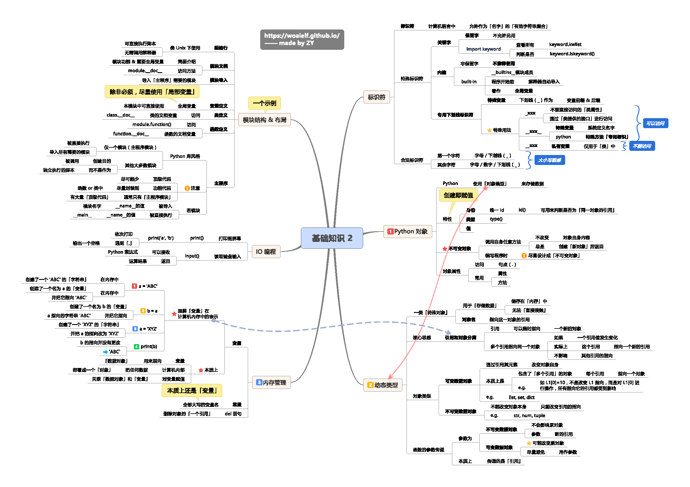

## 基础知识框架图

  
 
## 1.基础知识点
- ### 标识符规则
    - 标识符只能由字母、下划线和数字组成，且数字不能开头。
    - 标识符区分大小写
- ### 命名规则
    - 小驼峰式命名法（lower camel case）： 第一个单词以小写字母开始；第二个单词的首字母大写，例如：myName、aDog
    - 大驼峰式命名法（upper camel case）： 每一个单字的首字母都采用大写字母，例如：FirstName、LastName
    - 程序员中还有一种命名法比较流行，就是用下划线“_”来连接所有的单词，比如send_buf
- ### 查看系统关键字
    - import keyword  
    - keyword.kwlist
